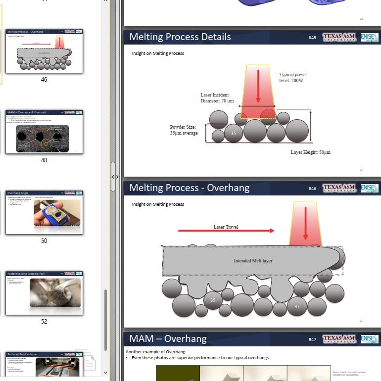

## Deferred Topics. 

This is a page for set-aside items. In this OpenLab repository we cover preferred methods, tools, and strategies that are working continually.  But several topics have seen past trials, are partially explored, or set-aside technologies for later adoption.  These are valuable topics but I'll set them apart in this "deferred" page since they have a lower priority for sharing.

## Additive
_Additive manufacturing is highly integrated in the lab but we have advanced from studying the manufacturing processes to implementing selected methods in specific ways. Consider this section a "deep dive" for readers to collect knowledge._

**Additive Manufacturing** (AM). These slides come from my presentation to an international gathering in Saint Etienne, France in 2019.  ENISE university hosted a 3D printing "summer school" with several speakers and I presented on practical applications for additive manufacturing.
The knowledge up to this point came from about 4 years in FDM printing and 2 years in Metal printing.  My role at Texas A&M included support for undergraduate projects in functional mechatronics devices, and graduate researchers projects in metal sintering, ablating, and melting.

Below, you'll find four slides for a preview of the polymer additive manufacturing tips.  These focus on ABS polymer as the preferred material.  With ABS we gain sun & UV tolerance, wicking and bonding with CA glue, compatibility with OTS pvc parts, and toughness over PLA & PETG.

* 
* 
* 
* 

## Automation
Methods of automation come from industrial side and embedded side.  Embedded automation consists of familiar projects like Arduino circuits.  Industrial automation consists of machines with higher power, more often fixed in place, and usually with wired communication.  These are rarely found together as of 2020, and we want to change that. 

**Blended Automation**
Blended automation or Industry 4.0 are appropriate terms for this category.  For Blended automation we will blend the simple off-the-shelf circuits with the traditional industrial systems for automation, like in Manufacturing plants. This topic deserves a great deal of documentation, but let's start with existing content from 2021.  The video below demonstrates a combination of embedded and industrial automation systems.  As I document further in the OpenLab, it will look more like the video over time.  You should see the piecewise elements (relays, IoT devices, etc) explained until this video is easy to understand from the ground up.

<iframe width="700" src="https://www.youtube.com/embed/30GM4m-Lyec" title="Program a PLC with Conveyor, Arduino and Industrial Robot" frameborder="0" allow="accelerometer; autoplay; clipboard-write; encrypted-media; gyroscope; picture-in-picture; web-share" referrerpolicy="strict-origin-when-cross-origin" allowfullscreen></iframe>

### MOLLE
Molle is a set of standardized configurations for portable gear, frequently found in military equipment. (new to me in 2024, not yet integrated but highly useful & standard). Embedded in the MOLLE standards are 99 great ways to solve our lab arrangements, and I have started exploring integration as of 2025 January. It's encouraged for community members to discover along with me, how we can use these interfaces (clips, straps, grids, hooks) to solve problems with lab organization.  I have implemented only a little bit of this into the Lab as of today, but it will continue for many years.

Here's the kit I purchased on Amazon first: [molle accessory kit](https://amzn.to/4iDgNov)

_Image of one MOLLE equipment set I purchase on Amazon, November '24_
- 
- 
- 

**Metal Additive** is much more complex than it appears.  When it comes to building with powdered metal, I've documented the top failure modes which designers need to know about.  See video below.
<iframe width="1250" src="https://www.youtube.com/embed/bq_6DYyZPBQ" title="Failure Causes in Metal Additive Manufacturing" frameborder="0" allow="accelerometer; autoplay; clipboard-write; encrypted-media; gyroscope; picture-in-picture; web-share" referrerpolicy="strict-origin-when-cross-origin" allowfullscreen></iframe>

[Slides - AM Practical Applications, 2019](https://github.com/davidmalawey/openLab/blob/c622927094335e10a5a4ff06f1d90047ed1be2ec/docs/2019_AdditiveManufacturingSlides.pdf)
* 56 slides
* methods for design geometry
* postprocessing
* materials selections
* failure modes for metal printing
* brainstorm for viable parts in metal

**Video Topics**
* [Overhanging features](https://youtu.be/ASQhkQ3SuuQ)
* [Small Holes & channels](https://youtu.be/Ve3OObkF8Hw)
* [Recovering Build Plates](https://youtu.be/kYEdeZyIMgU)
* [Selective Sintering at TAMU, 2018 intro](https://youtu.be/eJIVCVCjwCI)
