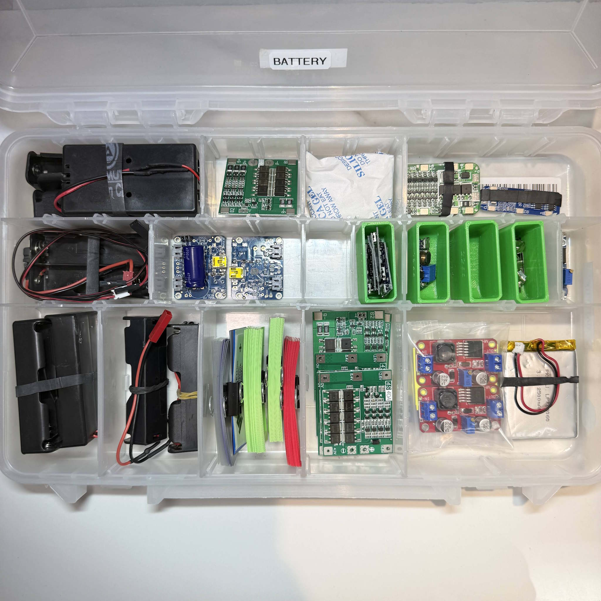
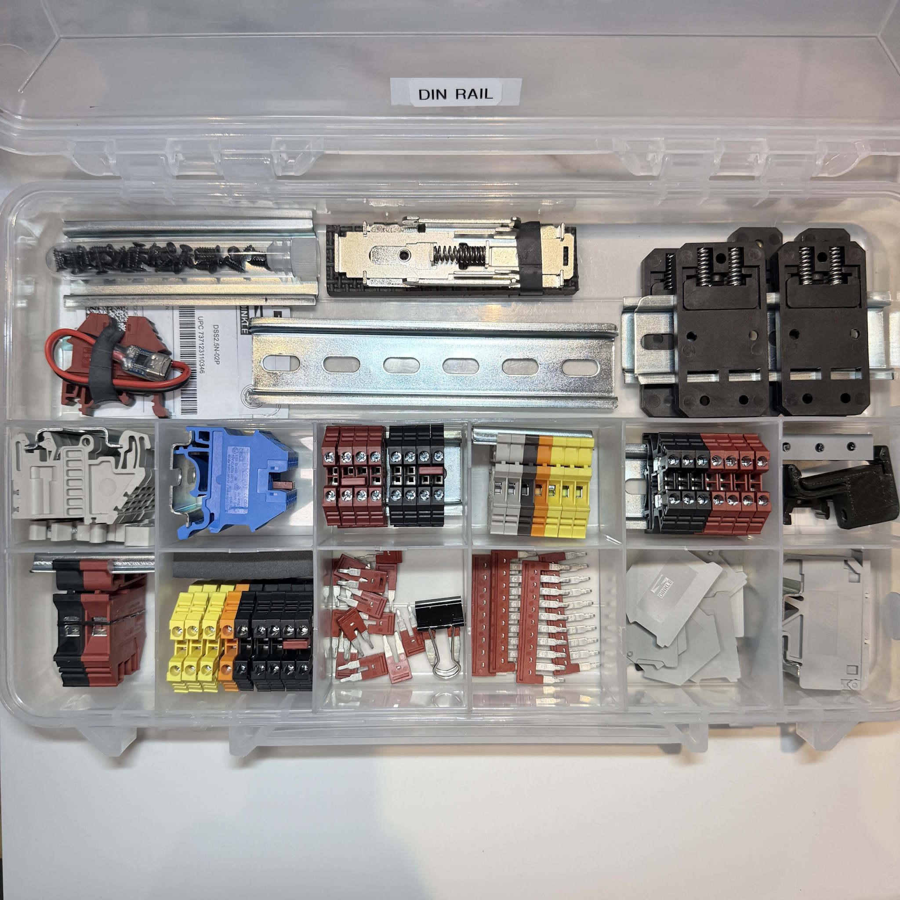
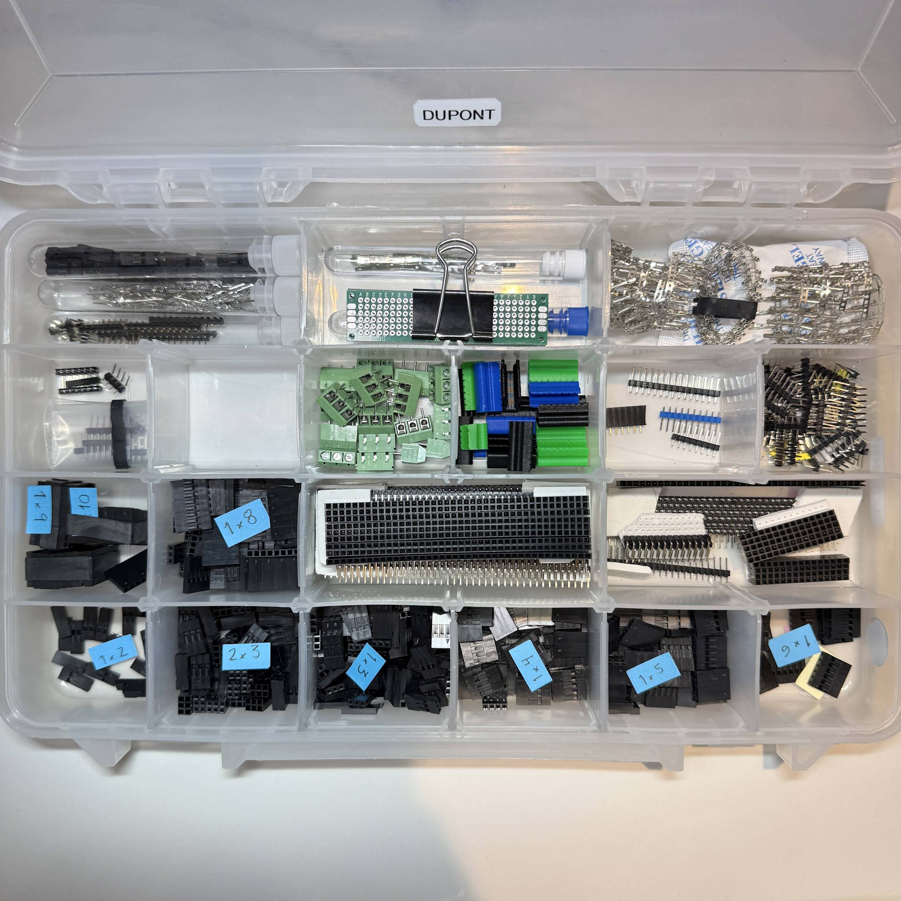
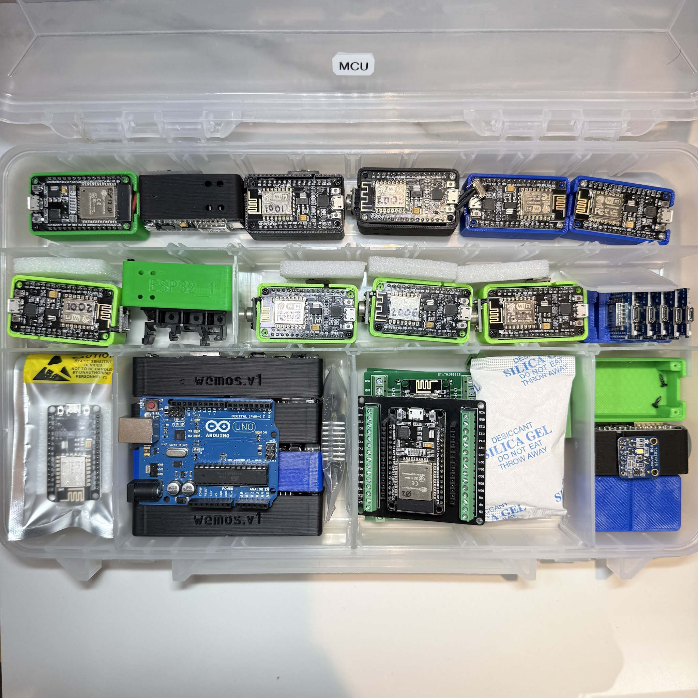
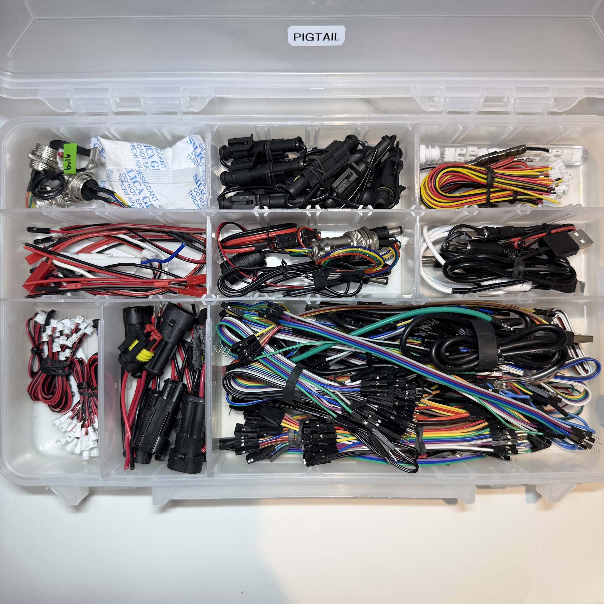
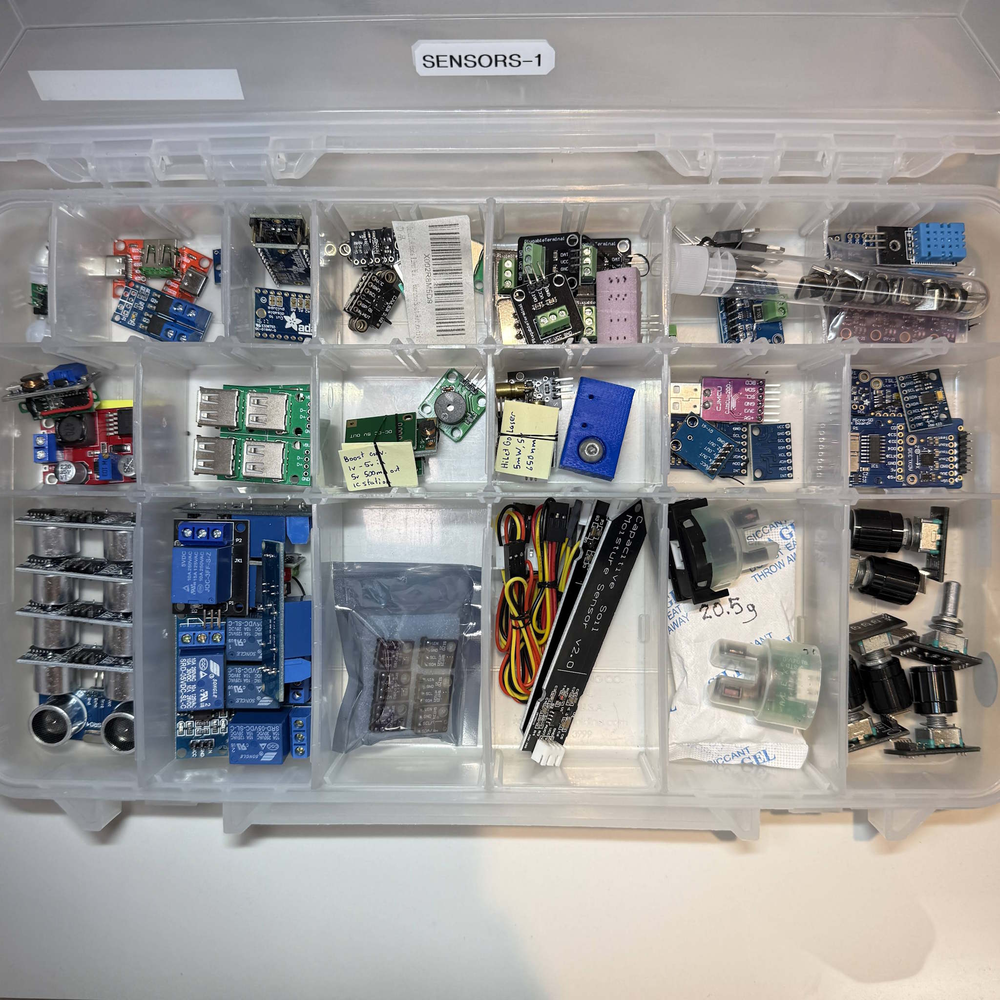
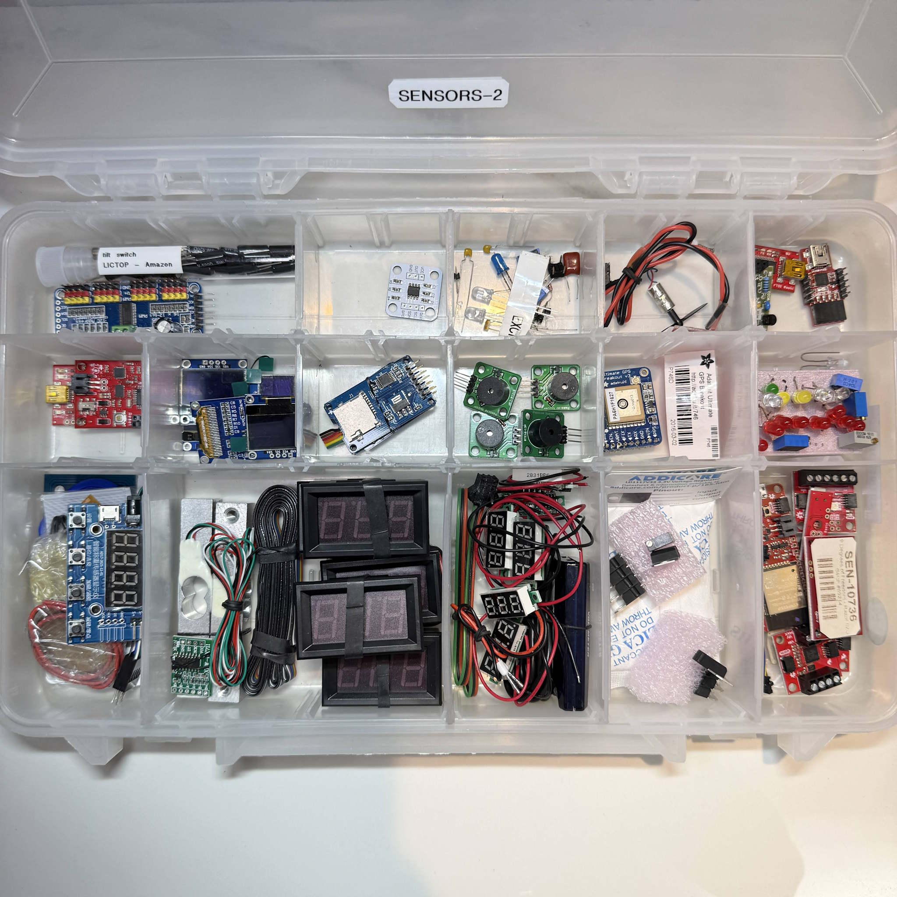
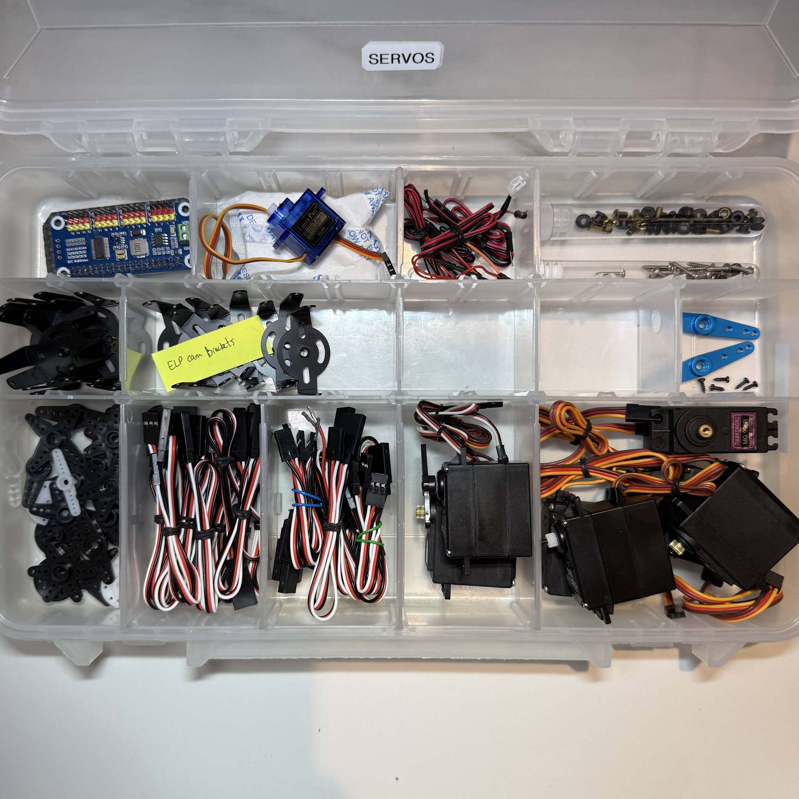
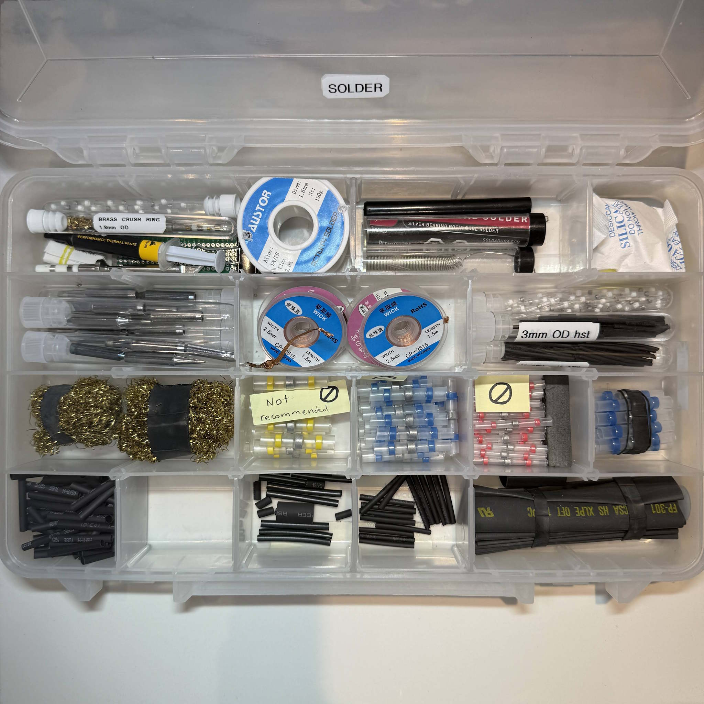

This page will introduce the key electronics that drive our electronics range of this multidisciplinary lab.

## Key Devices
The devices listed here are among the world's most popular devices for studying and implementing hands-on electronics projects.
Having past examples tested and wired together in projects, these devices will each be found in a functional example project between 2026 and 2027.

| Device                | Type              | subcategory | Model            | Diagram            |
| --------------------- | ----------------- | ----------- | ---------------- | ------------------ |
| ESP8266               | microcontrollers  | digital     | ESP8266          | :white_check_mark: |
| ESP32                 | microcontrollers  | digital     | ESP32            | :white_check_mark: |
| ESPWROOM              | microcontrollers  | digital     | ESPWROOM         | :white_check_mark: |
| soil moisture         | sensor, analog    | analog      | LM393            | :white_check_mark: |
| buzzer, 4kHz          | sensor, analog    | analog      | T1438-TWT-R      | :white_check_mark: |
| IR motion             | sensor, analog    | analog      | AM312            | :white_check_mark: |
| micro limit switch    | sensor, analog    | analog      | KW12-3           | :white_check_mark: |
| float switch          | sensor, analog    | analog      | ZP4510           | :white_check_mark: |
| temp-humidity SHT31   | sensor, digital   | digital     | SHT31            | :white_check_mark: |
| ambient light         | sensor, digital   | digital     | TLS2591          | :white_check_mark: |
| thermistor            | sensor, digital   | digital     | DS18B20          | :white_check_mark: |
| thermistor breakout   | sensor, digital   | digital     | DS18B20 BREAKOUT | :white_check_mark: |
| sd card reader        | sensor, digital   | digital     | adafruit'        | :white_check_mark: |
| stepper driver        | actuator, digital | digital     | DRV8825          | :white_check_mark: |
| step drv expansion    | actuator, digital | digital     | A4988 Stable 42  | :white_check_mark: |
| addressable LED strip | actuator, digital | digital     | WS2811           | :white_check_mark: |
| flow sensor           | sensor            | digital     | digiten FL-608   | :white_check_mark: |
| infrared temperature  | sensor            | digital     | MLX90614         | :x:                |
| ToF Laser Ranging     | sensor            | digital     | VL53L0X          | :x:                |
| ultrasonic distance   | sensor            | digital     | HC-SR04          | :x:                |
| accelerometer         | sensor            | digital     | MPU-6050         | :x:                |
| load cell module      | sensor            | digital     | HX711            | :x:                |

In order to maintain focus on content about the lab itself, we won't dive into details about the circuits and learning modules in this repository.  Details will be built into individual documented projects, each being open-source and having the same quality level of explanations, images, diagrams, and open documentation as presented here in the OpenLab Project.

## Supplies

_The electronics projects & prototypes are built up from these main supplies, each with a category and a bin label. Let's start with the key points for the photos below._

1) 🔋💡Learning Electronics: Today i’ve arranged the electronics of OpenLab for photographs to display the 9 most important bins.  The components you see here are the range of parts you’ll handle if you spent 5 years continually trying out new electronics projects and retaining the most useful parts.  
2) 🎛️How is it organized? The bins each define a category where parts of one family reside, usually grouped by an action-based category.  The MCU box is ready when you need to choose an MCU and begin a project.  The Soldering box has spare supplies that populate the soldering bench.  The sensors bin is where I reach to gather the right sensor module for a circuit.  
3) This grouping helps in 3 ways:
- ⏰ TIME SAVING when we take an action in the lab, it’s supported by just one box like “gather the dupont pins to build my cables” so we don’t need 6 drawers of parts for one action.
- 📋 INVENTORY or parts ordering: when we need to order a part, just one box can inform us if the inventory ran out, or if a related part will fulfill the need.
- 📦 OVERFLOW avoidance:  this selection of parts categories contains 1000 little decisions that create space for inbound inventory without needing more bins.  All these boxes have survived 3~8 years without a change of labels.  We continually order more parts but we don’t outgrow the space because the category is defined by a limited set of needs.  Only the sensors box ran out of space so far, and I’m proud of that!
4) 📺What’s coming next?  You can see based on these boxes the wider scope of OpenLab which I did not yet cover with videos.  What will we learn on David’s youtube channel next year?  What projects could I build with the knowledge in OpenLab?  These components should tell the story of what is on the way.  I’ve used almost every single component in past projects and I’ll gradually rebuild better and more refined versions that are template projects to be stored on OpenLab with documentation and BOM and everything.
5)🔌 What device should I choose?  If you’re building electronics on your own, I encourage you to choose parts among these selections because most of them are highly popular, from strong suppliers, and central to engineering of multidisciplinary systems.  Photos will be posted on openLab this week with HIGH RESOLUTION and you can read lots of the model numbers in the photos soon! 😉

## Battery
**The battery bin** or battery category is a byproduct of projects including a lithium-ion battery.  For a standard we focus on 18650 cells for their high performance and ubiquitous availability but some projects will occasionally include a foil-wrapped flat cell type of battery and then a connector becomes involved.  Battery integration includes types of contacts for the terminals, sometimes a tray component that includes those terminals.  For multi-cell projects, a PCB with battery management is required, and this bin also includes custom wraps and a couple of components relating to welding battery tabs.  These thin nickel strips are included inside most OTS battery packs but we can also perform battery welding in the lab.   This approach compared with soldering builds up less heat on the battery and preserves it from heat-related damage. 

  

 ## DIN Rail
DIN rail is the most important circuit-supporting category of parts I wish to bring into more classrooms and younger audiences.  By 2020, the parts are highly available and low cost, but they seem unfamiliar because they come from heavy industrial projects.  The DIN rail components are the best method for terminating and routing cables that carry power, as opposed to signals.  In SCUTTLE Robot's chassis as well as any project above 50 watts of power, you'll find us implementing DIN rail as the mechanical structure where modular terminals will be assembled.  More discussion to be added over time (DM 2026).
  
 

## Dupont 
**Dupont style connectors,** or dupont terminal housings, are the most popular type of removable cable ends for all DIY electronics projects.  They are one of the simplest options, with low cost parts, modular cable setup, and just overall easy and cheap.  For any project where you find signal wires with a different type of connector than this, it is for reasons like water resistance, shock and vibration, heat, or some other specialty condition where the use-case demands a particular strength in the connector design.  But for generic functional cables, this is the one to use.  Find here the various housings with one or two rows for terminals, and crimp-ready terminal parts for male or female.  For male connections, always consider just using a plain 1-strand copper wire instead of the male.  Most of the actions involving these cables are for the female wire end type.  Males on the other hand, get soldered to the board so we stock male through-hole pins in the bin to outfit any board.  These are the exact same components found in the Raspberry Pi or Arduino devices from the factory.
  
  

  ## Next Bins
  _Further bins discussion on the way, 2026.05.16 David M_
  
  - 
  - 
  - 
  - 
  - 
  - 
