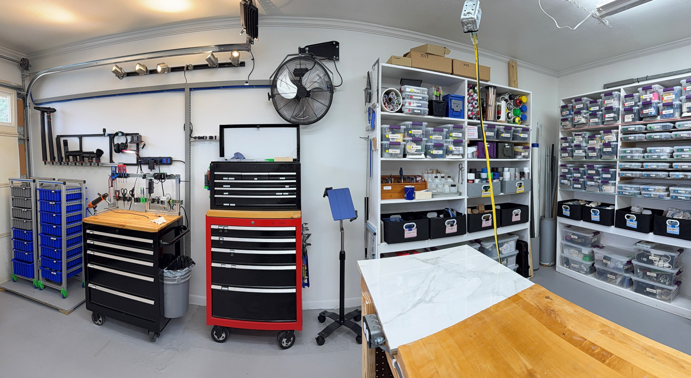
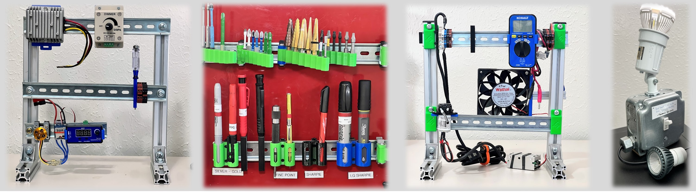

## About
**About openlab:** A fully documented, model robotics lab with everything you need to perform real engineering, research and development.

It's a collection of tools, processes, and even CAD designs for building a great robotics lab.  The focus is for hands-on designers & researchers of mechatronics, often giving way to robotics. 

Note from David: I'll document several assets from the setup of our SCUTTLE Robotics development lab for others to get ideas & methods to enhance their labs around the world.

>
> Want a Tour?
>
> [Click here](tour) or open the tour tab on the navigation menu.  From February 2025, contents will be expanding with ongoing updates.
> 

---

## Projects++

>
> More opensource designs:
>
> | Project | Link | Purpose | 
> | --------------- | ---------------------- | -------------------------------------------------------- | 
> | OpenAir | [qr.net/openairproject](https://qr.net/openairproject) | take control of air, pressure, & flow with open elements | 
> | OpenArm | [qr.net/openarmproject](https://qr.net/openarmproject) | revolutionize robotic arms, a 10-year goal | 
> | OpenBox | [qr.net/openboxproject](https://qr.net/openboxproject) | array of open designs beginning with a steel box | 
> | OpenGrow | [qr.net/opengrowproject](https://qr.net/opengrowproject) | open designs for hydroponics & aquaponics systems | 
> | OpenJar | [qr.net/openjarproject](https://qr.net/openjarproject) | array of designs for standard jars, threads, & seals | 
> | OpenLab | [qr.net/openlabproject](https://qr.net/openlabproject) | build a laboratory to design & fabricate anything. |
> | openME | [qr.net/openmeproject](https://qr.net/openmeproject) | a Mechanical Engineering degree, comprehensive & free, in-progress | 
> | OpenSpin | [qr.net/openspinproject](https://qr.net/openspinproject) | array of designs based on parametric bearings | 
> | SCUTTLE_Nigeria | [qr.net/scuttleafrica](https://qr.net/scuttleafrica) | university-level robotics lab in Lagos, Nigeria |
> | SCUTTLE_tech | [qr.net/scuttleproject](https://qr.net/scuttleproject) | engineering designs for scuttle robot |
> | SCUTTLE_Mini | [qr.net/scuttlemini](https://qr.net/scuttlemini) | miniature mobile robot, 10kg payload, designs |
>

## Processes
The lab supports engineering, prototypig, & maker-grade fabrication.
* woodwork: primarily for building fixtures
* metalwork: several processes for metal fab, without CNC machines
* 3D printing: all my best practices for 3D printing prototypes, even those suited for scaling
* paint & polish: make things the way they should look

## Glossary
* repo - repository, usually hosted by GitHub, where digital documentation is stored.
* OSH - open source hardware (used broadly as a term, but we dont see consistent meanings.)
* OTS - off the shelf (parts sold at retail distributors)
* OEM - original equipment manufacturer, or referring to parts offered by OEMs.
* OEM Brand - a major business that offers a flagship product & may have several "knockoff" brands competing
* NG - no good, a condition equivalent to "needs improvement" and convenient for charts, from Toyota
* eval - evaluation, the parts of design that relate to testing, measuring, and development of targets.  eval can be part of a research stage in a project and also part of the development stage.
* PRL - project readiness level, a rating system similar to NASA's TRL (technology-readiness-levels) term we are beginning to use for describing a prototype by establishing an expected type of outcome.
* janky - having crude and poorly planned characteristics; opposite of precise and well-planned.  Unfortunately this term has etymological relations to jenkem, a recreational drug produced in some regions with crude and unsanitary methods.
* p2p - peer to peer.  a term for communications between devices as opposed to broadcast from one source to many listeners.
* edge device - a communicating wireless device on the edge of a network, such as a mobile phone or a wireless MCU.  The term edge refers to a network diagram, where the center of the network is the cloud, with servers and heavy computing systems.
* multidisciplinary engineering - engineering topics or scope of work consisting of multiple disciplines of the traditional breakdown.  Typically the scope of Mechanical, Electrical, and Software engineering covers the full spectrum in multidisciplinary projects.
* thermo - thermodynamics, or the movement of energy within systems.
* heat transfer - a specific area of thermodynamics covering energy movement in the form of heat and measurable temperature gradients
* IoT - internet of things.  Usually referring to the collection of edge devices which did not exist in the internet in the pre-2000 stage, and now are connecting by the millions or billions.
* DFM - design for manufacturing.  The expertise area and actions relating to integrating manufacturing processes into the design process.
* AM - additive manufacturing.  More modern manufacturing methods, including 3D printing, CNC laser cutting, and other processes which are driven by a fully digital control scheme.
* responsitory - a new word developed by us, 2025.06.25, for someone's terrirtory for a job before designating the tasks, or under consideration.  [See video explanation](https://youtube.com/shorts/bYQpxxtLAJ8)
* inclusion - in a given design, elements that are not inventions of the designer but existing designs that become part of the presented design.
* CAD - computer aided design.  the process of drawing our 3D models on a computer or the product of this effort.  STL files, STEP files, or Solidworks files are examples of CAD models.

## Links
You may find these links helpful, relating to our community, engineering technology, more tutorials & videos too. 

* [community Discord](https://discord.gg/Napn9mhd43), an invite link to the discord initiated along with Youtube channel.
* [DM Amazon Lists](https://www.amazon.com/shop/davidmalawey) including key supplies, lists of tools, and recommended lab equipment.
* [SCUTTLE Robotics Resources](https://www.scuttlerobot.org/resources/) containing a collection of publications that support robotics design & prototyping.
* [David Malawey's homepage](https://davidmalawey.com) just for background information about me, the main author of this github and links to my other projects.
* [DM Youtube Channel](https://www.youtube.com/@davidmalawey) with 400 videos about engineering, and counting.
