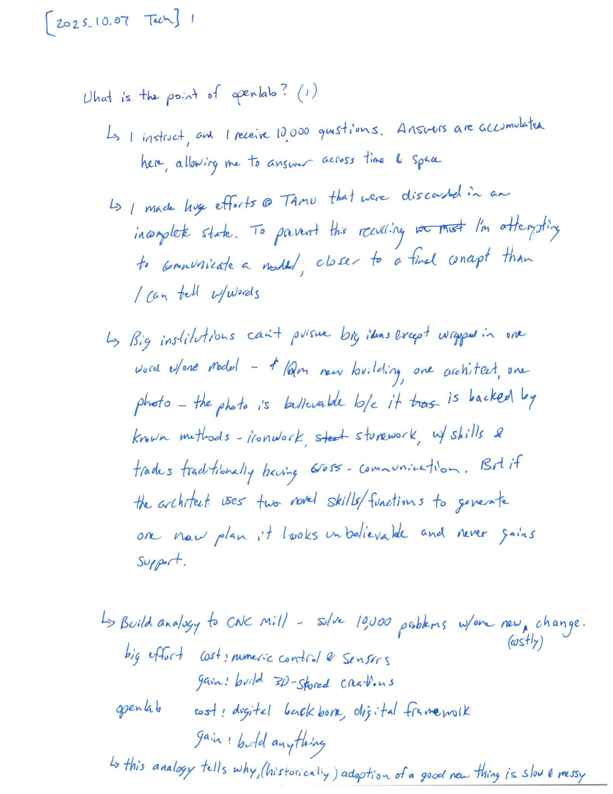
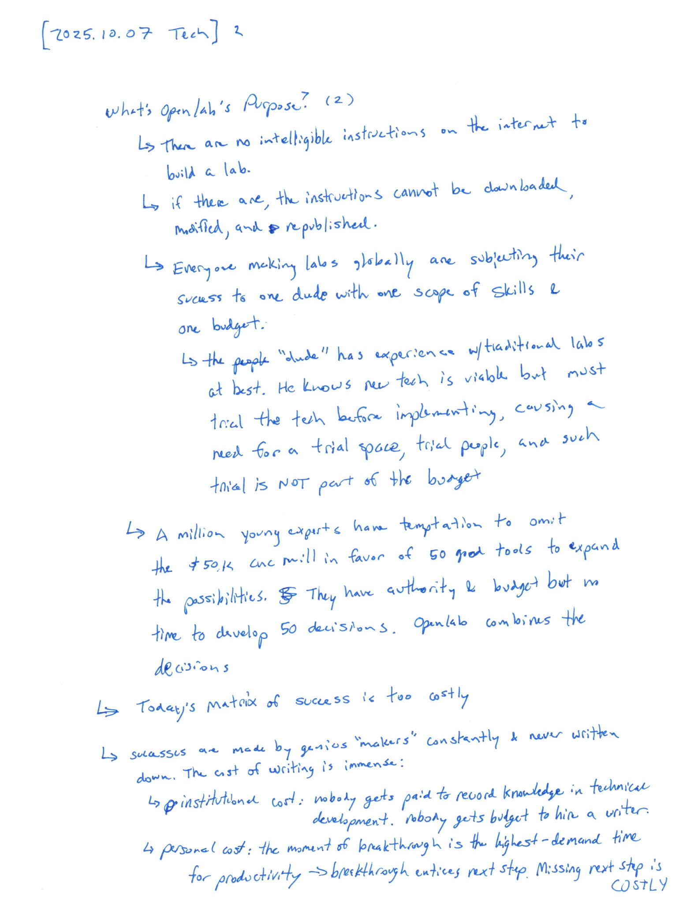
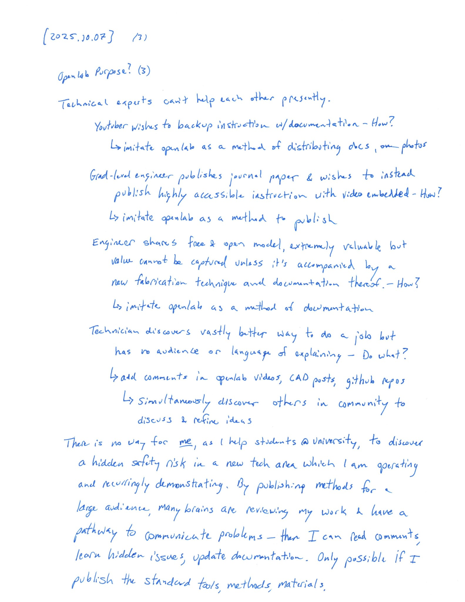

## About
**About openlab:** I'm building a lab for (applied) multidisciplinary engineering, and documenting it here.  I have found no "model lab" for multidisciplinary design in our world so this repository is an attempt to form the first one.  By making the details open, learners can find answers and experts can offer feedback, for continuous improvement.  The goal is to refine a lab, list the tools, and describe the methods for working with wood, metal, polymers, 3D printing, measurement, and all of the tasks for prototyping with robotics, electronics, and modern mechanisms.

It's a collection of tools, processes, and even CAD designs for building a great robotics lab.  The focus is for hands-on designers & researchers of mechatronics, often giving way to robotics. 

Note from David: I'll document several assets from the setup of our SCUTTLE Robotics development lab for others to get ideas & methods to enhance their labs around the world.

>
> Want a Tour?
>
> [Click here](tour) or open the tour tab on the navigation menu.  From February 2025, contents will be expanding with ongoing updates.
> 

**Deeper Purpose**
What's the big idea - why put so much effort into documenting a laboratory? I expect most readers are here to find instructions mentioned in a youtube video, to check what machine I used to design an open model, or discover relevant tools for building & engineering prototypes.  But if you're here to change the world, take a look at the notes on purpose, or [download the notes PDF](https://github.com/davidmalawey/openLab/blob/854e76e8c4caf2084f15029d3c6ca3b7e702c6cf/docs/2025_labPurpose.pdf) and have a look.

- 
- 
- 

---

## Projects++
These are related projects which offer design examples, highly advised components, and knowledge for designing & building

>
> * Project | Link | Purpose | 
> * OpenAir | [qr.net/openairproject](https://qr.net/openairproject) | take control of air, pressure, & flow with open elements | 
> * OpenArm | [qr.net/openarmproject](https://qr.net/openarmproject) | revolutionize robotic arms, a 10-year goal | 
> * OpenBox | [qr.net/openboxproject](https://qr.net/openboxproject) | array of open designs beginning with a steel box | 
> * OpenGrow | [qr.net/opengrowproject](https://qr.net/opengrowproject) | open designs for hydroponics & aquaponics systems | 
> * OpenJar | [qr.net/openjarproject](https://qr.net/openjarproject) | array of designs for standard jars, threads, & seals | 
> * OpenLab | [qr.net/openlabproject](https://qr.net/openlabproject) | build a laboratory to design & fabricate anything. |
> * openME | [qr.net/openmeproject](https://qr.net/openmeproject) | a Mechanical Engineering degree, comprehensive & free, in-progress | 
> * OpenSpin | [qr.net/openspinproject](https://qr.net/openspinproject) | array of designs based on parametric bearings | 
> * SCUTTLE_Nigeria | [qr.net/scuttleafrica](https://qr.net/scuttleafrica) | university-level robotics lab in Lagos, Nigeria |
> * SCUTTLE_tech | [qr.net/scuttleproject](https://qr.net/scuttleproject) | engineering designs for scuttle robot |
> * SCUTTLE_Mini | [qr.net/scuttlemini](https://qr.net/scuttlemini) | miniature mobile robot, 10kg payload, designs |
>

## Processes
_What processes are supported?_

**Processes** The lab supports engineering, prototyping, fabrication, and evaluation, and documentation.
* Engineering - evaluate a benchmark system, with space and tools to dismantle a machine, inspect and measure (weights, dimensions, colors, standards), photograph parts.  Then sketch designs, build CAD models, retrieve data online, tabulate plans mathematically.
* Prototyping - cut materials, access standard components, make permanent bonds, adjust material fit and finish, apply colors & textures, create airtight and watertight seals, generate custom CAD parts, fasten assemblies, clamp & shape materials.
* Fabrication - form raw materials into parts, metals, wood, polymers, springs, seals, fasteners, adjustment of dimensions, fitment of mated parts.
* Evaluation - measure features in size, shape, tolerance, hardness, rigidity of assemblies, apply loads, apply pressure, tension, twisting, compression & measure deflections, leaks, stress & strain.
* Documentation - convert information to written form, publish models online, create manuals, add performance data to designs, create tutorials, metadata for photographs, publish tables, post videos, structure PDFs, refine file sizes, post online writeups, gain feedback globally. 

**Materials**
* woodwork: primarily for building fixtures
* metalwork: several processes for metal fab, without CNC machines
* 3D printing: all my best practices for 3D printing prototypes, even those suited for scaling
* paint & polish: make things the way they should look

## Glossary
* AM - additive manufacturing. More modern manufacturing methods, including 3D printing, CNC laser cutting, and other processes which are driven by a fully digital control scheme.
* analytical - systematic & logic-based computational methods with repeatable solutions, for operating in a problem space with known parameters and limited inputs & ranges of inputs.
* CAD - computer aided design. the process of drawing our 3D models on a computer or the product of this effort. STL files, STEP files, or Solidworks files are examples of CAD models.
* deterministic - having an output that can be logically traced & repeated. Having no possibility of an unpredictable outcome and having an outcome that can be analytically traced to a set of inputs.
* DFM - design for manufacturing. The expertise area and actions relating to integrating manufacturing processes into the design process.
* discrete - having defined boundaries between values. The opposite of continuous. Digital signals have discrete values (ie 1 or 0 or integer values) while analog signals have continuous values.
* edge device - a communicating wireless device on the edge of a network, such as a mobile phone or a wireless MCU. The term edge refers to a network diagram, where the center of the network is the cloud, with servers and heavy computing systems.
* eval - evaluation, the parts of design that relate to testing, measuring, and development of targets. eval can be part of a research stage in a project and also part of the development stage.
* FOOST - fear of open source technology; the tendency of a business-minded individual to allow assumptions about technology to guide their interactions towards ignorant rejection of opportunities.
* heat transfer - a specific area of thermodynamics covering energy movement in the form of heat and measurable temperature gradients.
* heuristic - adjective for computational methods that approximate a solution or operate on a representative dataset, as opposed to analytical methods which form precise repeatable solutions.
* inclusion - in a given design, elements that are not inventions of the designer but existing designs that become part of the presented design.
* IoT - internet of things. Usually referring to the collection of edge devices which did not exist in the internet in the pre-2000 stage, and now are connecting by the millions or billions.
* multidisciplinary engineering - engineering topics or scope of work consisting of multiple disciplines of the traditional breakdown. Typically the scope of Mechanical, Electrical, and Software engineering covers the full spectrum in multidisciplinary projects.
* NG - no good, a condition equivalent to "needs improvement" and convenient for charts, from Toyota.
* OEM - original equipment manufacturer, or referring to parts offered by OEMs.
* OEM Brand - a major business that offers a flagship product & may have several "knockoff" brands competing.
* OSH - open source hardware (used broadly as a term, but we dont see consistent meanings.)
* OTS - off the shelf (parts sold at retail distributors).
* P2P - peer to peer. a term for communications between devices as opposed to broadcast from one source to many listeners.
* PRL - project readiness level, a rating system similar to NASA's TRL (technology-readiness-levels) term we are beginning to use for describing a prototype by establishing an expected type of outcome.
* repo - repository, usually hosted by GitHub, where digital documentation is stored.
* responsitory - a new word developed by us, 2025.06.25, for someone's territory for a job before designating the tasks, or under consideration.
* revision - a milestone in the progress of a work which is saved or published by the designer. Revisions may be assigned before or after a work is complete.
* SMART - an acronym for specific, measurable, achievable, results-based, and time-bound. The ideal characteristic of an engineering target or an engineering communication.
* Technical Data Package - collection of documentation necessary to fully describe a design, having a broader scope than only CAD model, Bill of Materials, Assembly instructions. A completed design in documentation form.
* thermo - thermodynamics, or the movement of energy within systems.
* worry - (in engineering) to exert effort to countermeasure a problem that has not been encountered. To input solution oriented features before verifying & characterizing a problem. This is a concept in a designer's workflow expanded in the "Rulebook" for guiding 3D designs.

## Links
You may find these links helpful, relating to our community, engineering technology, more tutorials & videos too. 

* [community Discord](https://discord.gg/Napn9mhd43), an invite link to the discord initiated along with Youtube channel.
* [DM Amazon Lists](https://www.amazon.com/shop/davidmalawey) including key supplies, lists of tools, and recommended lab equipment.
* [SCUTTLE Robotics Resources](https://www.scuttlerobot.org/resources/) containing a collection of publications that support robotics design & prototyping.
* [David Malawey's homepage](https://davidmalawey.com) just for background information about me, the main author of this github and links to my other projects.
* [DM Youtube Channel](https://www.youtube.com/@davidmalawey) with 400 videos about engineering, and counting.

**Docsify-This**
This web page was made possible by DocsifyThis, a free and open web tool that helps authors publish documentation.  I discovered DocsifyThis in 2024 and it now enables all my Github repositories to render into simple web pages.  Learn more at [docsify-this.net](https://docsify-this.net/#/) and get support on discord at [the docsify-this discord](https://discord.gg/docsify) thanks to developer Paul Hibbits!

