Functional designs, all in one place for you to copy and use in your lab.  In a dream world, these items will become seminal ideas that get improved by experts around the world so we can help each other.  Please do not expect sparkling and exotic machines in this page.  Rather, look for the purpose(s) for which the concept was intended and if you have some expertise, know that these are shared in many cases to drive down cost of expensive items, enhance availability of hard-to-get items, or enhance the usability of cheap & free devices that just don't quite meet the needs of our lab.

## DesignRules
In 2025.09 I am making the first try at the set of design rules that guide designs.  

**Design Rules Document**
* You can access a [draft of the design rules PDF here](docs/2025_designRulesMemo.pdf) 

Some written rules that belong written out here as highlights: This is an immense challenge but following these rules will make prototypes that are modern, with simple materials, fewer decisions, and more reliability.
1. Start with these materials for long beams: Aluminum Extrusion 30mm, Steel EMT conduit 3/4in, Unistrut, and DIN rail.
2. Attach devices using an established standard: Cameras & Instruments (1/4-20 threads, cold-shoe mounts) Electronics modules (DIN rail mounting) and structural joints (EMT conduit joints, unistrut angle brackets).
3. Seek a benchmark for every design.  Include the simplest additional parts to reproduce that assembly. First prefer off-the-shelf parts with families, then 3D printed designs as needed, and common metric fasteners.
4. Design of assembly and design of a part are two separate projects.  Also design of anything new (geometry for sealing, fastener arrangement, nozzle for flow, articulating joint) is an independent project.
5. Only pursue designs which have at most one invention. (ie, an assembly of existing parts that adds suds into a garden sprayer, using all off-the-shelf parts and validated 3D models.  The assembly itself is the design project).  If you want to design a mobile robot with 4 mechanum wheels - then you should be starting with an already validated robot having ordinary wheels).  You cannot validate two unknowns in the same build, except with advanced strategies)
6. To consider any complex geometry, break it down into minimal elements: A chassis geometry is made of rigid beams, joints, panels, and interface (for wires, plumbing, air, or controls).
7. Then build up the geometry in-mind with the preferred materials:  Flat panels 1/4in, 30mm square extrusions, round rods, fasteners, seals, holes, etc).
8. Members are all joined collinear, 90 degrees, or special angle.  Utilize collinear and right-angles as much as possible.

**Guiding Goals**
Designs fill a wide range of applications but have this in common.  The aim is to avoid custom metal fabrication, reuse common components, borrow the max possible geometries from reputable suppliers, and minimize design effort.

## (1)Ready
All the ready devices all in one place.  (or at least some of them.) In order to make new solutions in our world, we need new tools.  To make new tools, we need new workplace solutions.   For each solution that has been designed, implemented, tested, and put into use in the openLab project, I'm publishing my CAD models with the keyword **openlab** on GrabCAD.

**Jump to [GrabCAD collection](https://grabcad.com/library?page=1&time=all_time&sort=recent&query=openlab)**

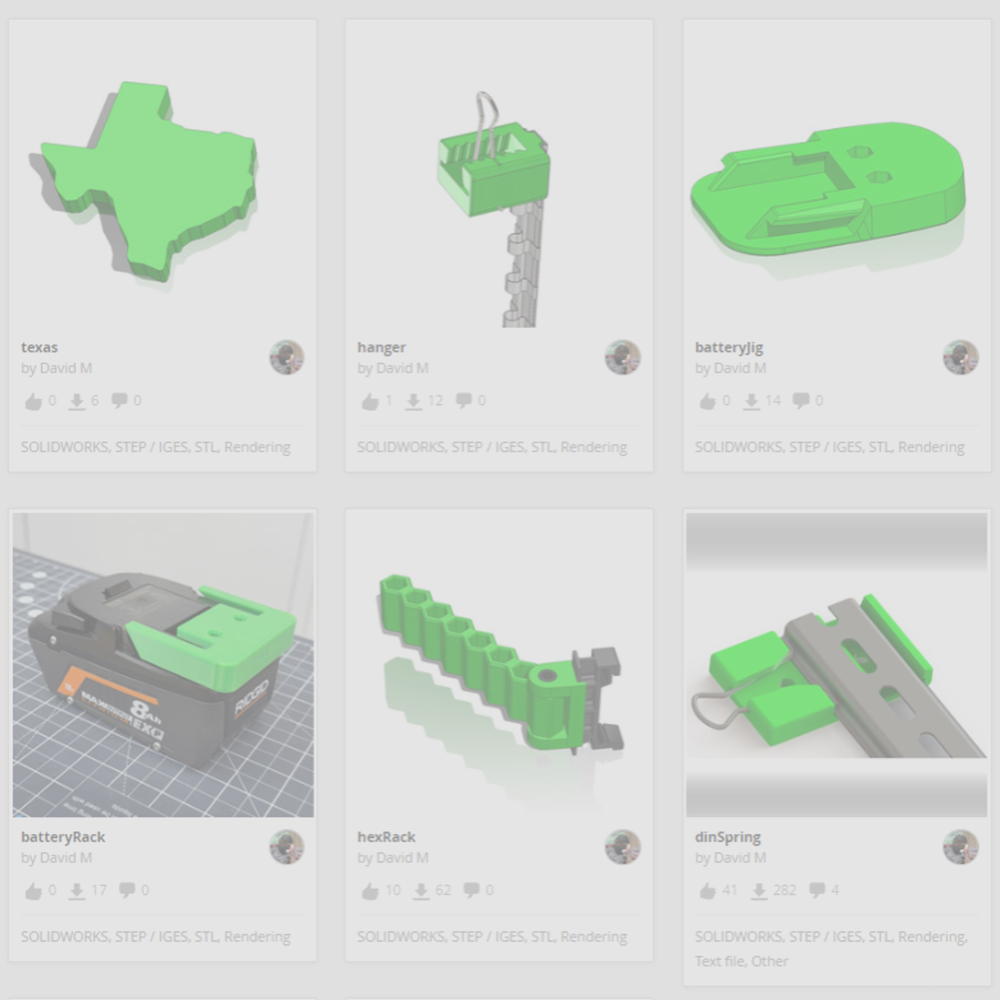

## (2)Concept
Free invention ideas.

This is what I would call "free invention ideas" at age 12 and what I would now call daily notes of relevant tech concepts that have some potential value.   A large portion would be hard to understand without any engineering expertise, a large portion is totally dependent on the context I'm working in, and that leaves a little bit that may have value for those of us with curiosity & an interest.  To be honest, I believe in the path of discovering skillsets of making things, discovering materials, new ways to measure, and so forth - you will naturally get loads and loads of ideas of your own.  And the great thing about acting on your idea is that you can implement it fully in the context that you see it is a good fit.  Just like a hiking boot may be a climber's idea but it does no good for an ice skater.  The more deeply technical we become, the more specific it requires us to constrain our environment to extract the value of a simple concept.  -David M

[download TechNotes 2024 pdf](docs/techNotes_2024.pdf)

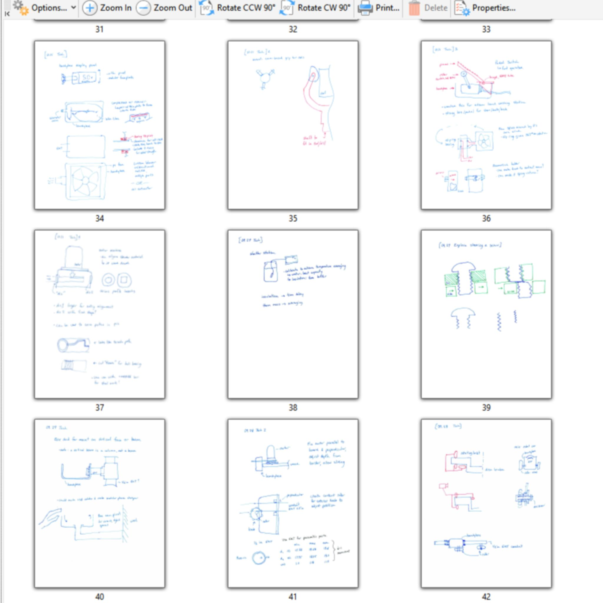

---

[download TechNotes 2023 pdf](docs/techNotes_2023.pdf)

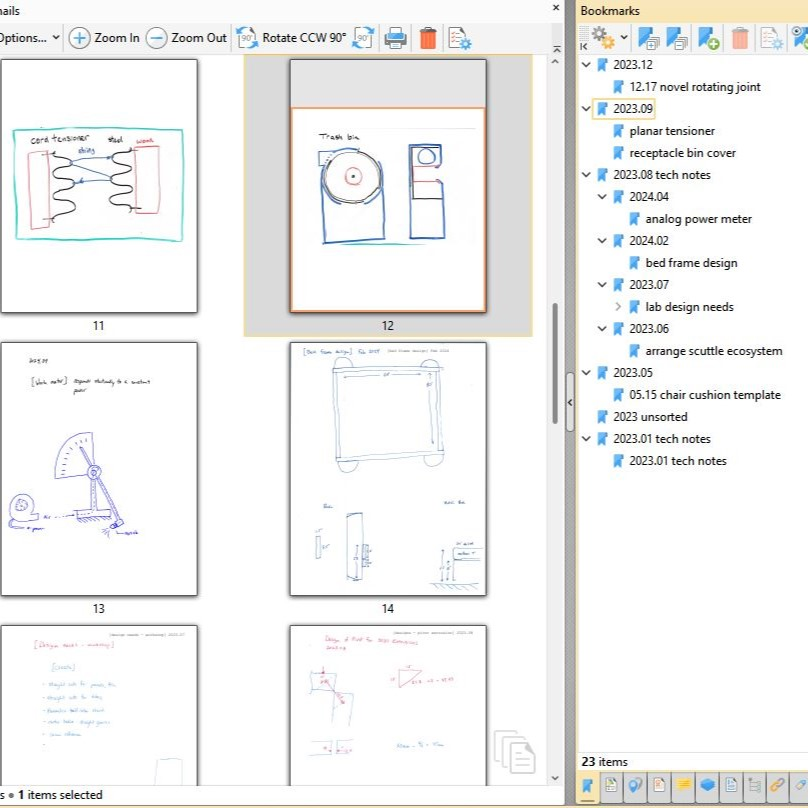

## Standards

Project Readiness Levels
* This is an evolving and new(ish) type of term for dividing projects into various stages.  Someone may do great work at PRL 1 and it looks very different than at PRL6.  By discussing our projects in terms of a "project readiness level" it is easier to see what are the needs and the focus of the engineering for an "invention."  The definitions are not set in stone and I'm publishing to get ongoing feedback from the community to refine our definitions and make it optimally helpful.
  
[Download 2023_Project_Readiness.pdf](https://github.com/user-attachments/files/19146886/2023_Project_Readiness.pdf)

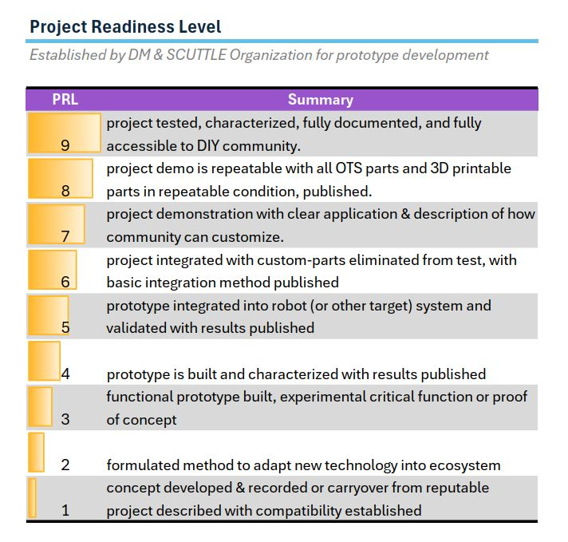

## CAD-models

Good places to discover CAD models.  We use grabCAD This list was generated with help from ChatGPT on 2025.03

| Feature                           | GrabCAD | Thingiverse | Printables | Free3D    | TraceParts  |
| --------------------------------- | ------- | ----------- | ---------- | --------- | ----------- |
| **3D Model Repository**           | ✅       | ✅           | ✅          | ✅         | ✅           |
| **Geometric Search**              | ❌       | ❌           | ❌          | ❌         | ❌           |
| **Focus on 3D Printing**          | ❌       | ✅           | ✅          | ⚠️ (some) | ❌           |
| **Engineering/Industrial Models** | ✅       | ❌           | ❌          | ⚠️ (some) | ✅           |
| **Collaboration Tools**           | ✅       | ❌           | ❌          | ❌         | ❌           |
| **Version Control**               | ✅       | ❌           | ❌          | ❌         | ❌           |
| **Wide File Type Support**        | ✅       | STL only    | STL only   | Mixed     | CAD formats |

## Tutorial
Here's a deep dive into a highly useful design that you can follow along.
* See how the design standards map into a specific model
* See what model features support printability
* See how geometry is defined by equations to make a part parametric
* See a variation built on top of an initial design to create a new functional part

* Download [Hinge Design Tutorial PDF](docs/)
- 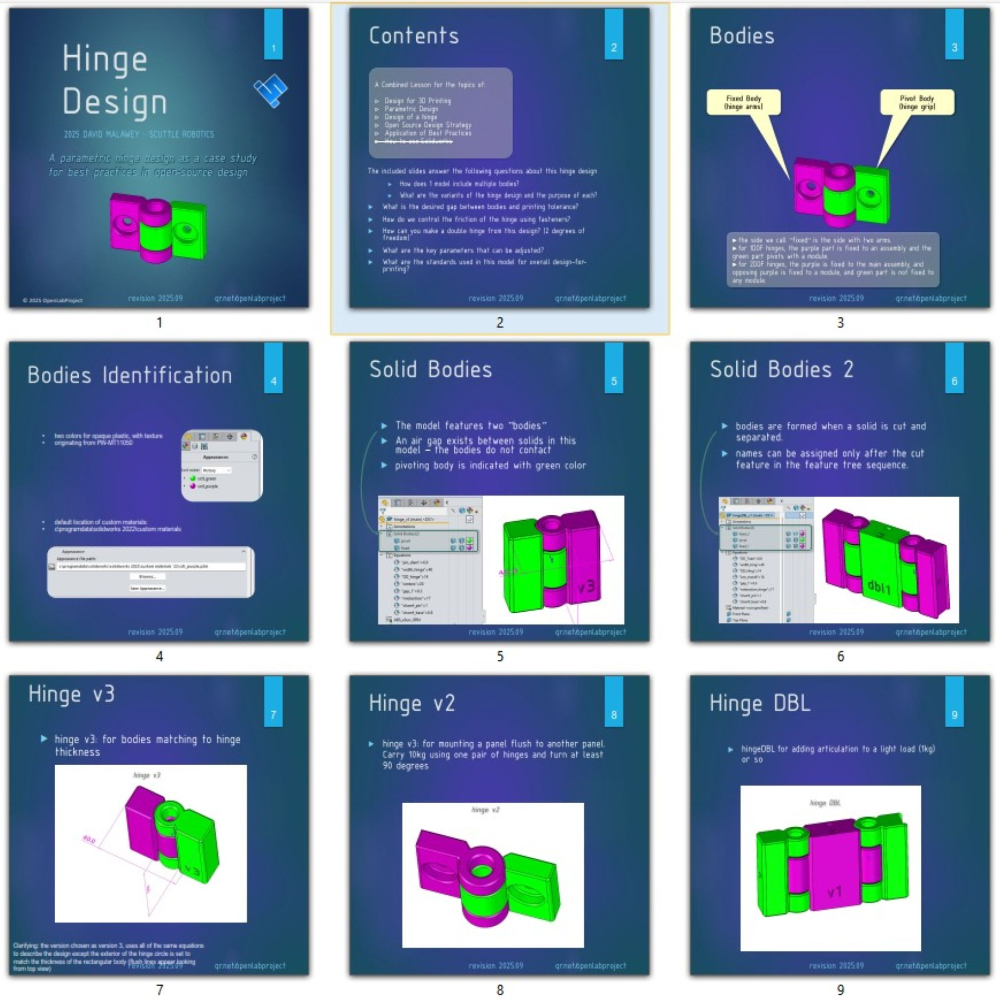
- 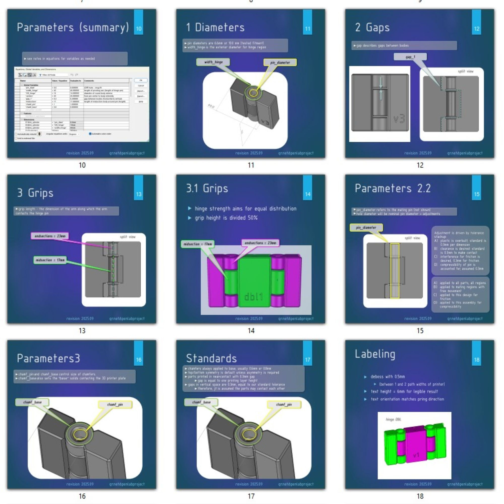

**Takeaways:**

_as described by chatgpt, and I generally agree.  We have not yet used TraceParts but we have used the others often_

- **Use Thangs if** you need **geometric search, version tracking, and both printable & engineering CAD models**.
- **Use GrabCAD for** professional and mechanical engineering CAD files.
- **Use Thingiverse or Printables if** you mainly need **hobbyist 3D printable files**.
- **Use TraceParts if** you want **industry-standard parts and engineering components**.
- **Use Free3D for** a mix of **general 3D models** (not necessarily CAD-focused).

## OpenItem
These projects are not yet ready and I'd love to have support to finish them.

**Universal Joint**
This CV joint (constant velocity joint) has a version-1 attempt, and features a balls-in-cup assembly.  I have not yet been able to test, characterize, and revise the design. But a CV joint has a million use-cases, and it deserves to have a much higher design effort and several different styles of tests that can characterize it.  Given the limits/advantage of 3D printing, what design should become the flagship design for makers?  I hope to raise the performance, test various sizes, and design a representative use-case which accompanies the design documents to define the "central" use case from which other makers can vary.  Perhaps, the best use-case should be the open-source swiffer mop design.  I made a short video describing that problem and 40,000 views later, it looks like many people want to see this design become reality.  

* Check out [cv joint design on grabCAD](https://grabcad.com/library/cvjoint-1)
* See my [Short Video on Swiffer Mop](https://youtube.com/shorts/UY33SE4EJJo?si=LNDsKFZb9DpWIgZS) that describes a good use-case.

**BushBox**
This assembly is intended to be a demonstration of simple rotating shafts, coupling with belts, gear reduction, and strength borrowed from steel to enhance printed parts.   Many variations are possible but the most satisfying result would be "demonstration 1" is a great grade-school level learning project, it serves one complete function, it has one or more real utilities, and a fixed starter bill of materials.  At one point it was to be a mini robot with four wheels, at another point I was going to demonstrate using simple o-rings as a precursor to GT2 belt, and at another point I wanted a gear-up device for a desktop version of a dremel.  A bench-fixed dremel would be a great grinding tool and powered by a cordless driver at the input, with a gear-up and a collet at the output just like a dremel's 1/8inch collet.  With all these ideas, none of them are completed so it's waiting for help.

* GrabCAD [Post for Bushbox Here](https://grabcad.com/library/bushbox_v0-1)

**Spool**
What is the perfect spool?  We need a printable spool that racks in a modular way, which can dispense wire easily, spin up on a hand-driver bit, and nest well in a drawer or on a hanger.  I produced 3 designs, one build each, for this design and it is not satisfactory.  My build sits neatly in a typical tool drawer to maximize space around the diameter for wire, and it has flat sides to prevent rolling on a tabletop.  It can be loaded, with an entry point for the wire-end.  And it prints in 2 pieces, but the assembly was fussy.  We need assembly to be a matter of seconds, and a dab of superglue if it's really needed.  (we always aim to print without supports so the part was split into two pieces).  If we want one style for cords and one style for ribbon (tape-like materials) then what design will support both styles with minimal variation?  What type of storage can easily convert from desk-sitting to drawer or hanging storage? I'd love to see more builds from other people!  Perhaps the problem statement must be revised to improve the goals, as I post 3 model variations online today (2025.09.30)

* GrabCAD [Post for Spool Here](https://grabcad.com/library/spool_project-1)

**Chamfer Tool**
The most common chamfer tools for polymer pipe have a poor performance and we have an opportunity to improve this with an open-source design.  I did not begin modeling yet (2025.09) but this project is highly desirable with low investment and big space for improvement, highly aligned with (print + OTS) constraints.  The goal is to select a standard high-strength carbide insert or modular blade of a standard sort, implement a way to attach it in a handheld printed device, and then generate a geometry that holds the tool aligned on a PVC pipe of any chosen diameter.  The model parameters should give easy access for a designer to change the pipe size selection.

* Example tool [on amazon](https://www.amazon.com/Inner-Outer-Deburring-Chamfer-Aluminum-16-inch/dp/B092455LBD)

**Conveyor Belt**
This conveyor was designed and built in 2020 but it needs to be redesigned with our latest design rules.  Each printed part in the design has a thousand use-cases so the enhancing of even one part is a worthy project.  I made an intensive study before choosing this design.  "What modules are useful on thousands of projects? Conveyor."  and "What system has an ecosystem of supporting parts like the stepper motor, but hasn't seen a reliable open design?" Conveyor with stepper motor.  "What system is a perfect educational design for student laboratories?" Conveyor.  Basically this system fits nicely on SCUTTLE Robot but it also fits all around the world, if we can complete the design as a self-standing module.

* Downloadable Assembly [conveyor on grabCAD](https://grabcad.com/library/scuttle-conveyor-prototype-v1-1)

**Gearbox**
A modular gearbox built from a steel handybox to gain predefined datums, axes, and structural rigidity for very low cost.  The handybox is standard in USA construction and found at brick and mortar stores.  In canada there is a variation of this spec, in Germany they've gone to plastic, but this design is valuable enough to start in the USA and vary for global redesigns.

**Flow Collector**
A parametric, well modeled flow collector for 2-to-1 pipes.  Accomodates various input diameters, but focus on the application shown for starters.  Produce a template model that has appropriate variables such as offset from symmetry, and length of individual tubes. Make this design to follow all our 3D printing rules for compatibility in attaching the next members.
* 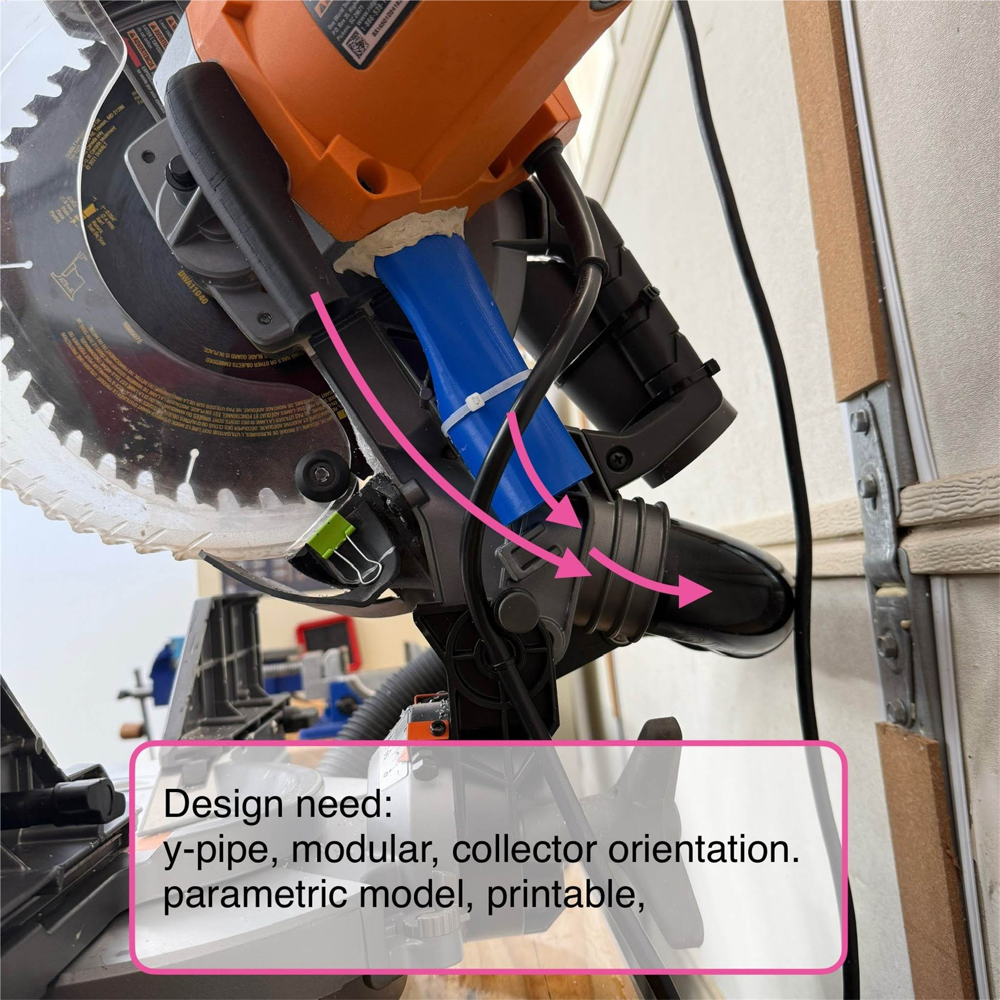
* 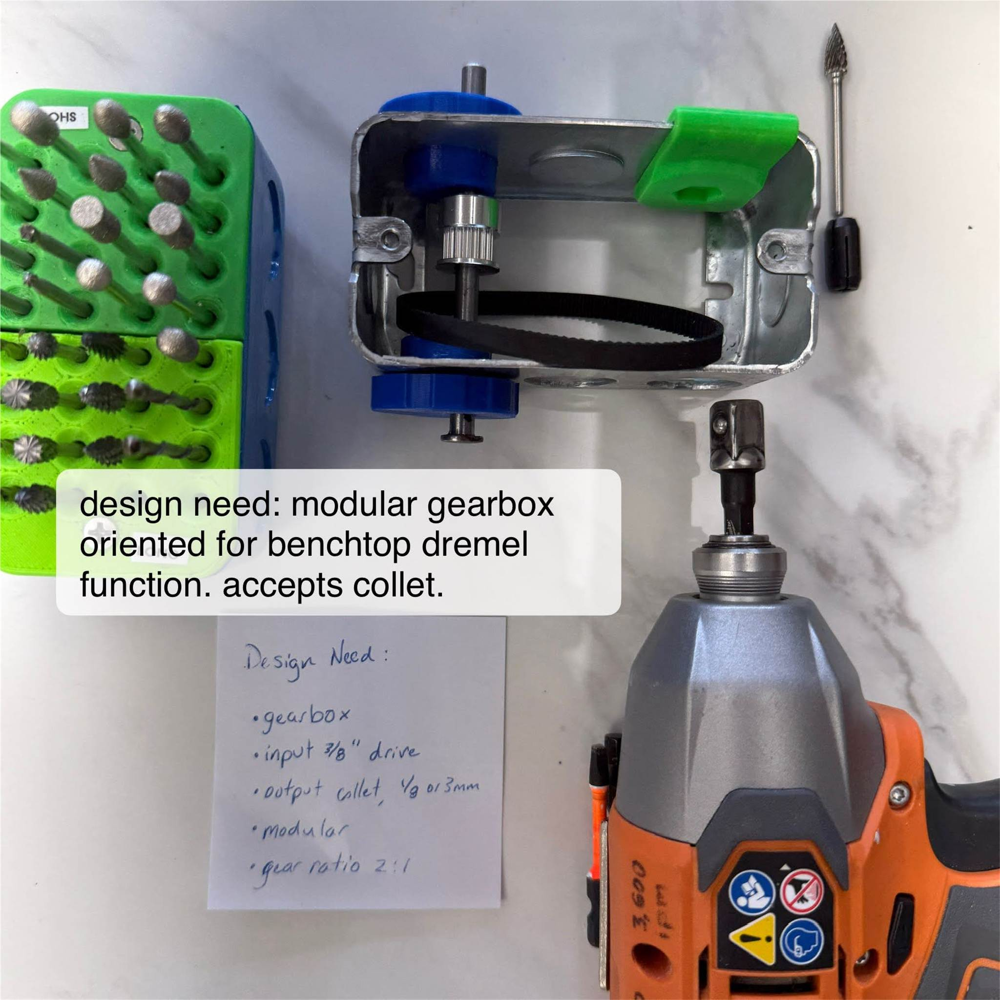
* 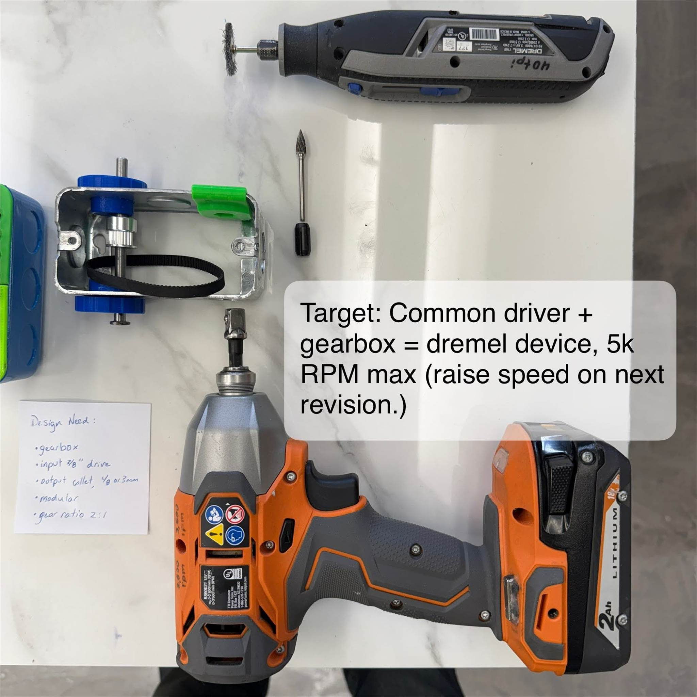

**Modular thread, ACME**
A printable thread design which harnesses the durability of steel.  Makes a threaded male part which can fit into common threads of 5mm pitch or larger.  The ACME thread is a representative universla thread with near-matching designs globally.  We can create a parametric model for the printed unit which allows for high mechanical strength by bonding steel balls in printed pockets.

**Jigsaw Rig**
A minimal chassis for mounting a jigsaw at a flat location for easy two-hands-free work, similar to a scroll saw.

**Sander Rig**
We're making a benchtop version of a highly utilized palm sander.  Only the rig must be designed, using our standard structural materials.  The purpose is to easily clamp and orient a sander in a flat orientation or for a bonus, it pivots to a vertical orientation.  The sanding discs are high volume and similar in nature for thousands of brands and variations.  A chassis to capture this sander is also a design that suits 90% of the task for clamping other unique tools at human-grip strength range.

* 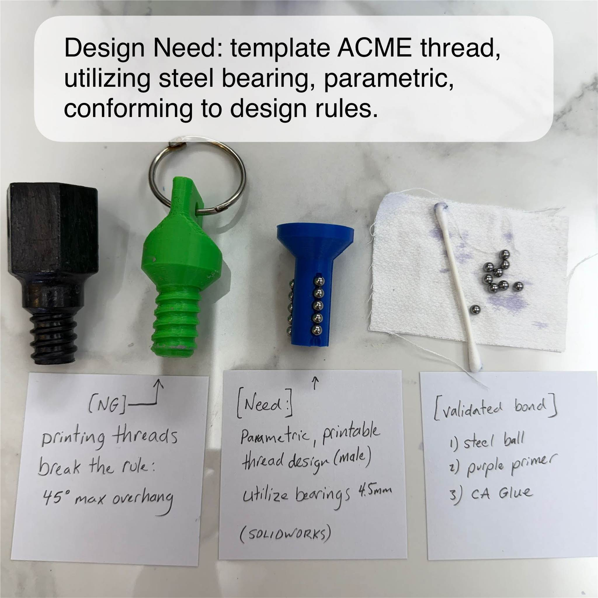
* 
* 

**Invention Path**
A couple of images to portray the design cycles - modules will continue to be released, such as joints which support broader structures which make up repeatable designs for functional contraptions.
* 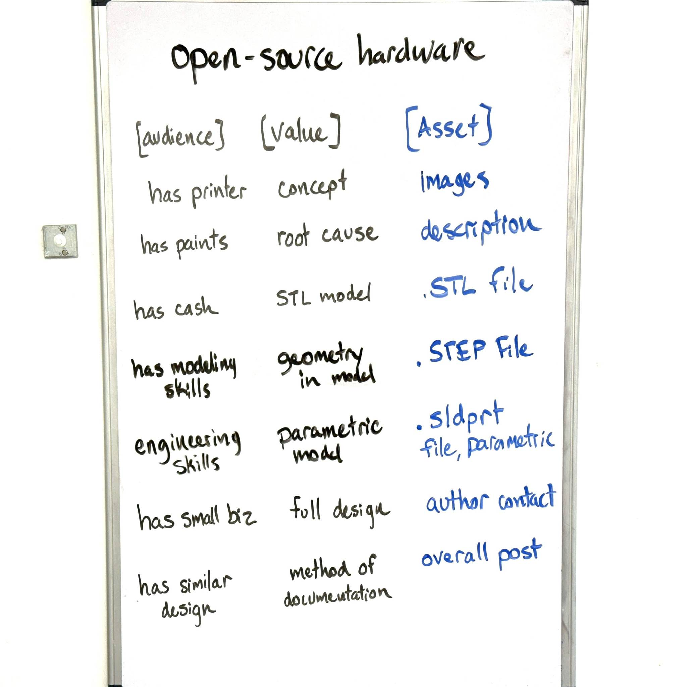
* 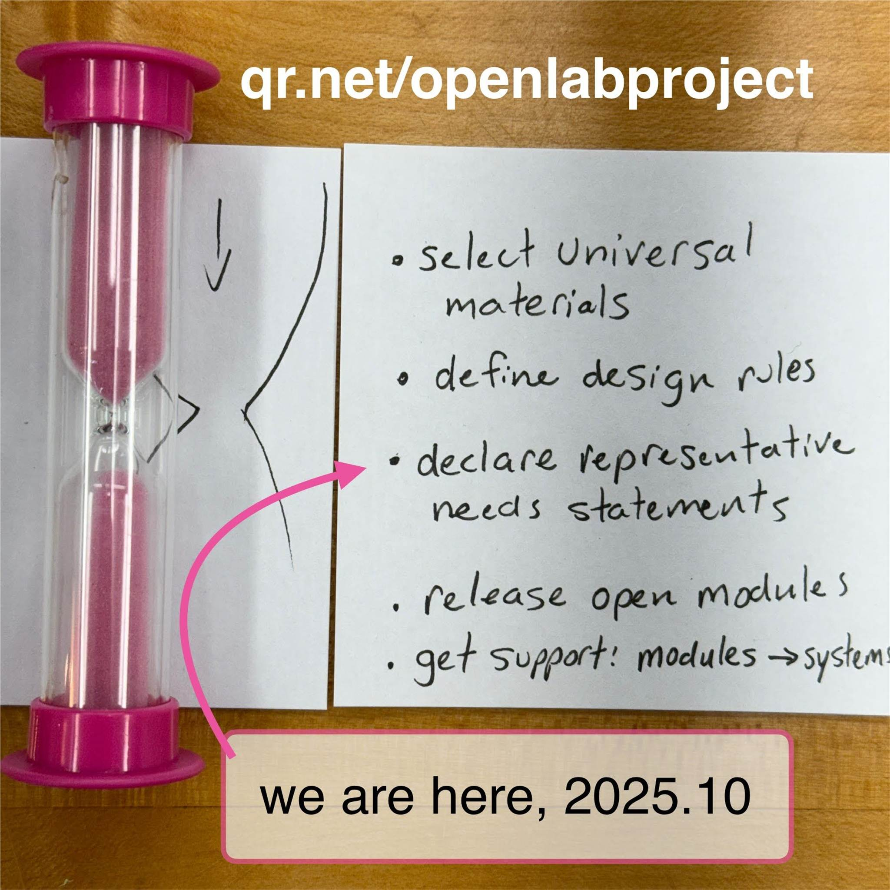
* 
