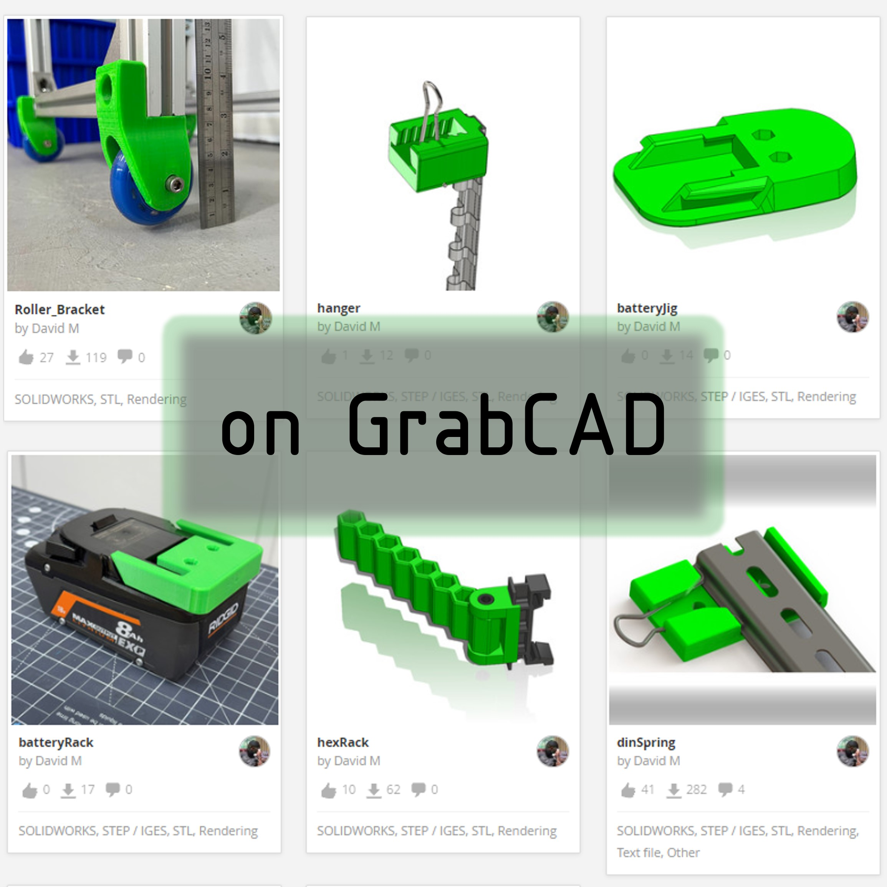

Functional designs, all in one place for you to copy and use in your lab.  In a dream world, these items will become seminal ideas that get improved by experts around the world so we can help each other.  Please do not expect sparkling and exotic machines in this page.  Rather, look for the purpose(s) for which the concept was intended and if you have some expertise, know that these are shared in many cases to drive down cost of expensive items, enhance availability of hard-to-get items, or enhance the usability of cheap & free devices that just don't quite meet the needs of our lab.

## DesignRules
In 2025.09 I am making the first try at the set of design rules that guide designs.  

**Design Rules Document**
You can access a [draft of the design rules PDF here](docs/2025_designRulesMemo.pdf)  Below you'll find a preview image for the design rules PDF, and a couple snapshots about the invention pathway.  I posted in october 2025 on youtube an invitation for other creators to invent together, sharing some lab concepts.  But every contribution benefits from a bigger context.  The invention of a device is supported by pre-existing open modules, professionally designed.  The selection of the needs may help meet one need in the Texas lab but it's been identified as a benefit to makers globally.  The "rules" are not intended to restrict designers, they're intended to guarantee a higher likeliness of compatibility and higher potential for community revisions.

* 
* 
* 
  
Some written rules that belong written out here as highlights: This is an immense challenge but following these rules will make prototypes that are modern, with simple materials, fewer decisions, and more reliability.
1. Start with these materials for long beams: Aluminum Extrusion 30mm, Steel EMT conduit 3/4in, Unistrut, and DIN rail.
2. Attach devices using an established standard: Cameras & Instruments (1/4-20 threads, cold-shoe mounts) Electronics modules (DIN rail mounting) and structural joints (EMT conduit joints, unistrut angle brackets).
3. Seek a benchmark for every design.  Include the simplest additional parts to reproduce that assembly. First prefer off-the-shelf parts with families, then 3D printed designs as needed, and common metric fasteners.
4. Design of assembly and design of a part are two separate projects.  Also design of anything new (geometry for sealing, fastener arrangement, nozzle for flow, articulating joint) is an independent project.
5. Only pursue designs which have at most one invention. (ie, an assembly of existing parts that adds suds into a garden sprayer, using all off-the-shelf parts and validated 3D models.  The assembly itself is the design project).  If you want to design a mobile robot with 4 mechanum wheels - then you should be starting with an already validated robot having ordinary wheels).  You cannot validate two unknowns in the same build, except with advanced strategies)
6. To consider any complex geometry, break it down into minimal elements: A chassis geometry is made of rigid beams, joints, panels, and interface (for wires, plumbing, air, or controls).
7. Then build up the geometry in-mind with the preferred materials:  Flat panels 1/4in, 30mm square extrusions, round rods, fasteners, seals, holes, etc).
8. Members are all joined collinear, 90 degrees, or special angle. Utilize collinear and right-angles as much as possible.

**Guiding Goals**
Designs fill a wide range of applications but have this in common.  The aim is to avoid custom metal fabrication, reuse common components, borrow the max possible geometries from reputable suppliers, and minimize design effort.

**Pull System**
Toyota integrates a famous "pull system" strategy for production efficiency. It is a powerful concept to apply in engineering design as well, so we reuse this concept in many ways in OpenLab designs. It is better to pull a design towards a user application than to push a design to fit an expected utility. Without this rule, several problems arise.
1. The designer exerts a high effort on a part which sees no adoption.
2. The design is made for an application but is uninformed by a user who describes the need.
3. A design must be tested for strength, but it cannot pass a strength test unless a criteria is chosen.  The strength criteria cannot be chosen unless an application exists to "pull" the design towards a need.  
4. The "template" or "standard" configuration of a design cannot be chosen
5. A design requires many decisions for completeness, but has many possible variations.  A target application must be implemented to "pull" the decisions of the design, rather than designing for many broad use cases.

How the Pull System is implemented here:
1. each segment of writing and graphics in this repository are answers to past questions.  A student design team had questions in a design, and the example solution is posted here.  A commenter on my youtube videos asked a question about fabrication: the answer is included here.  Several colleaugues asked which softwares I am using to perform a task: the list of softwares is included here.  I tried to explain a concept but it required a reference.  The explanation & references is in this repo.  The openLab project could expand to excessive size but the content is limited to that which answers questions that were asked in real life.  Therefore, the content is all pulled by real needs.
2. Many 3D designs are presented as examples of how to perform a function such as "attach a beam to a round bar" but first this need was  for the lab design examples were pulled by a previous case of student needs. A past project
3. Many models have a thousand possible configurations, but we choose a configuration to build and publish which has a validated use case.
_Example: The bit holder below was designed to hold tools and during design it was clear the device can be configured for many kinds of tools.  During the design it was easy to make a configuration for holding drill bits.  From the designer side it is a good decision for creating more options, but from the user side it is not desired.  If the user is available to "pull" the needs, he will inform the designer that tools of many sizes are best accessed in a row from small to large.  If the bits are placed in a grid, it becomes visually confusing.  So the design to store drill bits became a completely different design.  The only way to make this good decision is to have the user available to "pull" the design in the best direction.  If the pull system is omitted from the design process it causes wasted time and effort, ambiguous decisions, and so on.  So we always try to establish one sensible use-case before finishing a design and publishing._

- 
- 
- 

## Resources
All the ready devices all in one place.  (or at least some of them.) In order to make new solutions in our world, we need new tools.  To make new tools, we need new workplace solutions.   For each solution that has been designed, implemented, tested, and put into use in the openLab project, I'm publishing my CAD models with the keyword **openlab** on GrabCAD.
**Jump to [GrabCAD collection](https://grabcad.com/library?page=1&time=all_time&sort=recent&query=openlab)**

**Tech Notebooks**
This is what I would call "free invention ideas" at age 12 and what I would now call daily notes of relevant tech concepts that have some potential value.   A large portion would be hard to understand without any engineering expertise, a large portion is totally dependent on the context I'm working in, and that leaves a little bit that may have value for those of us with curiosity & an interest.  To be honest, I believe in the path of discovering skillsets of making things, discovering materials, new ways to measure, and so forth - you will naturally get loads and loads of ideas of your own.  And the great thing about acting on your idea is that you can implement it fully in the context that you see it is a good fit.  Just like a hiking boot may be a climber's idea but it does no good for an ice skater.  The more deeply technical we become, the more specific it requires us to constrain our environment to extract the value of a simple concept.  -David M
* [download TechNotes 2024 pdf](docs/techNotes_2024.pdf)
* [download TechNotes 2023 pdf](docs/techNotes_2023.pdf)

The images below feature previews of the tag-based search on grabCAD and the tech notes PDFs for download.
- 
- 
- 

## Standards

Project Readiness Levels
* This is an evolving and new(ish) type of term for dividing projects into various stages.  Someone may do great work at PRL 1 and it looks very different than at PRL6.  By discussing our projects in terms of a "project readiness level" it is easier to see what are the needs and the focus of the engineering for an "invention."  The definitions are not set in stone and I'm publishing to get ongoing feedback from the community to refine our definitions and make it optimally helpful.
* [Download 2023_Project_Readiness.pdf](https://github.com/user-attachments/files/19146886/2023_Project_Readiness.pdf)
* Update 2025.10 - the project-readiness-levels document is not ready to be directly implemented for a specific purpose.  It's a forward-looking goal to enhance our vocabulary in collaboration, but right now it is more actionable just to make a simple list of criteria that we aim for.  Over time it will be appropriate to have documents about tiers of readiness.

## CAD-models

Good places to discover CAD models.  We use grabCAD This list was generated with help from ChatGPT on 2025.03

| Feature                           | GrabCAD | Thingiverse | Printables | Free3D    | TraceParts  |
| --------------------------------- | ------- | ----------- | ---------- | --------- | ----------- |
| **3D Model Repository**           | ✅       | ✅           | ✅          | ✅         | ✅           |
| **Geometric Search**              | ❌       | ❌           | ❌          | ❌         | ❌           |
| **Focus on 3D Printing**          | ❌       | ✅           | ✅          | ⚠️ (some) | ❌           |
| **Engineering/Industrial Models** | ✅       | ❌           | ❌          | ⚠️ (some) | ✅           |
| **Collaboration Tools**           | ✅       | ❌           | ❌          | ❌         | ❌           |
| **Version Control**               | ✅       | ❌           | ❌          | ❌         | ❌           |
| **Wide File Type Support**        | ✅       | STL only    | STL only   | Mixed     | CAD formats |

## Tutorial
Here's a deep dive into a highly useful design that you can follow along.
* See how the design standards map into a specific model
* See what model features support printability
* See how geometry is defined by equations to make a part parametric
* See a variation built on top of an initial design to create a new functional part
* Download [Hinge Design Tutorial PDF](docs/)

_Images below feature quick previews of the tutorial on design of a hinge. My model uses solidworks but the tutorial is software agnostic._

- 
- 

**Takeaways:**

_as described by chatgpt, and I generally agree.  We have not yet used TraceParts but we have used the others often_

- **Use Thangs if** you need **geometric search, version tracking, and both printable & engineering CAD models**.
- **Use GrabCAD for** professional and mechanical engineering CAD files.
- **Use Thingiverse or Printables if** you mainly need **hobbyist 3D printable files**.
- **Use TraceParts if** you want **industry-standard parts and engineering components**.
- **Use Free3D for** a mix of **general 3D models** (not necessarily CAD-focused).

## OpenItem
These projects are not yet ready and I'd love to have support to finish them.

_Images below feature CAD model for "bushbox," a CV-joint in development and the spool project._
* 
* 
* 

**Universal Joint**
This CV joint (constant velocity joint) has a version-1 attempt, and features a balls-in-cup assembly.  I have not yet been able to test, characterize, and revise the design. But a CV joint has a million use-cases, and it deserves to have a much higher design effort and several different styles of tests that can characterize it.  Given the limits/advantage of 3D printing, what design should become the flagship design for makers?  I hope to raise the performance, test various sizes, and design a representative use-case which accompanies the design documents to define the "central" use case from which other makers can vary.  Perhaps, the best use-case should be the open-source swiffer mop design.  I made a short video describing that problem and 40,000 views later, it looks like many people want to see this design become reality.  
* Check out [cv joint design on grabCAD](https://grabcad.com/library/cvjoint-1)
* See my [Short Video on Swiffer Mop](https://youtube.com/shorts/UY33SE4EJJo) that describes a good use-case.

**Spool**
What is the perfect spool?  We need a printable spool that racks in a modular way, which can dispense wire easily, spin up on a hand-driver bit, and nest well in a drawer or on a hanger.  I produced 3 designs, one build each, for this design and it is not satisfactory.  My build sits neatly in a typical tool drawer to maximize space around the diameter for wire, and it has flat sides to prevent rolling on a tabletop.  It can be loaded, with an entry point for the wire-end.  And it prints in 2 pieces, but the assembly was fussy.  We need assembly to be a matter of seconds, and a dab of superglue if it's really needed.  (we always aim to print without supports so the part was split into two pieces).  If we want one style for cords and one style for ribbon (tape-like materials) then what design will support both styles with minimal variation?  What type of storage can easily convert from desk-sitting to drawer or hanging storage? I'd love to see more builds from other people!  Perhaps the problem statement must be revised to improve the goals, as I post 3 model variations online today (2025.09.30)
* GrabCAD [Post for Spool Here](https://grabcad.com/library/spool_project-1)

---

* 
* 
* 

**Chamfer Tool**
The most common chamfer tools for polymer pipe have a poor performance and we have an opportunity to improve this with an open-source design.  I did not begin modeling yet (2025.09) but this project is highly desirable with low investment and big space for improvement, highly aligned with (print + OTS) constraints.  The goal is to select a standard high-strength carbide insert or modular blade of a standard sort, implement a way to attach it in a handheld printed device, and then generate a geometry that holds the tool aligned on a PVC pipe of any chosen diameter.  The model parameters should give easy access for a designer to change the pipe size selection.
* Example tool [on amazon](https://www.amazon.com/Inner-Outer-Deburring-Chamfer-Aluminum-16-inch/dp/B092455LBD)

**Conveyor Belt**
This conveyor was designed and built in 2020 and it was developed prior to several new modules that would make it easier, simpler, cheaper, stronger. It needs to be redesigned with our latest design rules.  Each printed part in the design has a thousand use-cases so the enhancing of even one part is a worthy project.  I made an intensive study before choosing this design.  "What modules are useful on thousands of projects? Conveyor."  and "What system has an ecosystem of supporting parts like the stepper motor, but hasn't seen a reliable open design?" Conveyor with stepper motor.  "What system is a perfect educational design for student laboratories?" Conveyor.  Basically this system fits nicely on SCUTTLE Robot but it also fits all around the world, if we can complete the design as a self-standing module.
* Downloadable Assembly [conveyor on grabCAD](https://grabcad.com/library/scuttle-conveyor-prototype-v1-1)

**Gearbox**
A modular gearbox built from a steel handybox to gain predefined datums, axes, and structural rigidity for very low cost.  The handybox is standard in USA construction and found at brick and mortar stores.  In canada there is a variation of this spec, in Germany they've gone to plastic, but this design is valuable enough to start in the USA and pivot for global versions.  Find the GrabCAD [Post for Bushbox Here](https://grabcad.com/library/bushbox_v0-1).  This design has double-purposes and the second purpose is to advance our set of modules which give freedom to new designs. Under that goal, the same project is called "bushbox" named after the "ideal parametric bushing" which can convert any hole into a useful mechanical element.  Before assigning the specific purpose "make a desktop dremel" to the gearbox, it was identified that the general gearbox concept has many utilities.  The gearbox concept is a "host" for an array of sub-module designs that carry high-impact even as standalone components.  Check out [OpenBox Project](qr.net/openboxproject) for more inspiration. 

---

* 
* 
* 

**Flow Collector**
A parametric, well modeled flow collector for 2-to-1 pipes.  Accomodates various input diameters, but focus on the application shown for starters.  Produce a template model that has appropriate variables such as offset from symmetry, and length of individual tubes. Make this design to follow all our 3D printing rules for compatibility in attaching the next members.

**Modular thread, ACME**
A printable thread design which harnesses the durability of steel.  Makes a threaded male part which can fit into common threads of 5mm pitch or larger.  The ACME thread is a representative universla thread with near-matching designs globally.  We can create a parametric model for the printed unit which allows for high mechanical strength by bonding steel balls in printed pockets.

**Jigsaw Rig**
A minimal chassis for mounting a jigsaw at a flat location for easy two-hands-free work, similar to a scroll saw.

**Sander Rig**
We're making a benchtop version of a highly utilized palm sander.  Only the rig must be designed, using our standard structural materials.  The purpose is to easily clamp and orient a sander in a flat orientation or for a bonus, it pivots to a vertical orientation.  The sanding discs are high volume and similar in nature for thousands of brands and variations.  A chassis to capture this sander is also a design that suits 90% of the task for clamping other unique tools at human-grip strength range.

* 
* 
* 
 
**Github for MEs**
This is an immense mission.  As of 2025, we have a million mechanical inventions that aren't improving.  Among designers, some know how to describe the entire design.  Among them, some know how to document content using online posts.  Among those, some know how to crosslink multiple online assets that are necessary to describe a complete design.  Among them, some know how to gain revision tracking, peer-to-peer collaboration, and error correction with Github.  Among them, some know how to take control of a github repo to make a repository that can then reach out to those who don't know how to use github.  And the final population is so exceedingly small that we can nearly never find a fully documented mechanical thing where the designer took control of the documentation.  We can show a million people about this but among them, 10% have time to learn and repeat.  I'm aiming to reduce that effort level so it's 95% of them have time to learn and repeat.  That is the problem statement.  When I discovered Docsify-This by Paul hibbits it was a game changer because he formed  a system that would omit 95% of the github learning requirements to build your own webpaage.  So, for the first time, it enabled myself to expand documentation quickly enough to begin making things whole online.  By whatever means necessary we need to teach the mechanical experts about how to use the minimal online functions (NOT FORCE THEM TO USE LINUX AND STUDY CLI, ETC) so they can repeat this and let their work shine for the world.  I don't know how, I don't know where, but I know someone needs to make it so mechanical folks can make their own repo and link photos and data. 2025.10 DM

**OpenItems Footnote** I need to post more images and explanations to portray the design cycles.  How do we differentiate between a design and just a module that lives in another design?  How do we find a central goal for collaborating?  I don't have words to answer all of these so I still need to write diagrams and create more structure (DM2025) modules will continue to be released, such as joints which support broader structures which make up repeatable designs for functional contraptions.  The true invention path takes on much more detail but we're keeping this page slim for folks to gain a sense of the goals.

