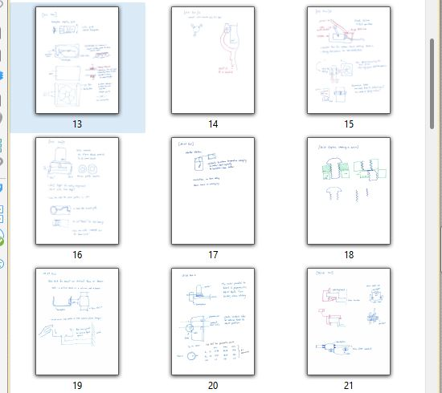

## Inventions
Free invention ideas.

This is what I would call "free invention ideas" at age 12 and what I would now call daily notes of relevant tech concepts that have some potential value.   A large portion would be hard to understand without any engineering expertise, a large portion is totally dependent on the context I'm working in, and that leaves a little bit that may have value for those of us with curiosity & an interest.  To be honest, I believe in the path of discovering skillsets of making things, discovering materials, new ways to measure, and so forth - you will naturally get loads and loads of ideas of your own.  And the great thing about acting on your idea is that you can implement it fully in the context that you see it is a good fit.  Just like a hiking boot may be a climber's idea but it does no good for an ice skater.  The more deeply technical we become, the more specific it requires us to constrain our environment to extract the value of a simple concept.  -David M

[download TechNotes 2024 pdf](docs/techNotes_2024.pdf)

