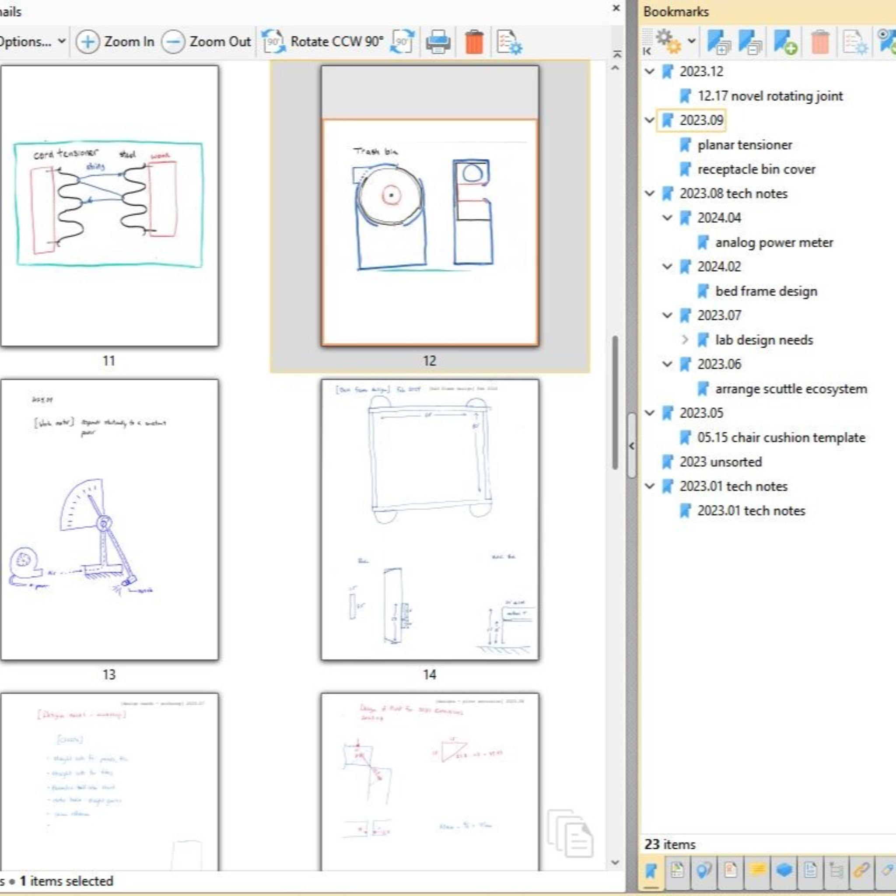

Functional designs, all in one place for you to copy and use in your lab.  In a dream world, these items will become seminal ideas that get improved by experts around the world so we can help each other.  Please do not expect sparkling and exotic machines in this page.  Rather, look for the purpose(s) for which the concept was intended and if you have some expertise, know that these are shared in many cases to drive down cost of expensive items, enhance availability of hard-to-get items, or enhance the usability of cheap & free devices that just don't quite meet the needs of our lab.

## (1)Ready
All the ready devices all in one place.  (or at least some of them.) In order to make new solutions in our world, we need new tools.  To make new tools, we need new workplace solutions.   For each solution that has been designed, implemented, tested, and put into use in the openLab project, I'm publishing my CAD models with the keyword **openlab** on GrabCAD.

**Jump to [GrabCAD collection](https://grabcad.com/library?page=1&time=all_time&sort=recent&query=openlab)**

## (2)Concept
Free invention ideas.

This is what I would call "free invention ideas" at age 12 and what I would now call daily notes of relevant tech concepts that have some potential value.   A large portion would be hard to understand without any engineering expertise, a large portion is totally dependent on the context I'm working in, and that leaves a little bit that may have value for those of us with curiosity & an interest.  To be honest, I believe in the path of discovering skillsets of making things, discovering materials, new ways to measure, and so forth - you will naturally get loads and loads of ideas of your own.  And the great thing about acting on your idea is that you can implement it fully in the context that you see it is a good fit.  Just like a hiking boot may be a climber's idea but it does no good for an ice skater.  The more deeply technical we become, the more specific it requires us to constrain our environment to extract the value of a simple concept.  -David M

[download TechNotes 2024 pdf](docs/techNotes_2024.pdf)

---

[download TechNotes 2023 pdf](docs/techNotes_2023.pdf)

## Standards

Project Readiness Levels
* This is an evolving and new(ish) type of term for dividing projects into various stages.  Someone may do great work at PRL 1 and it looks very different than at PRL6.  By discussing our projects in terms of a "project readiness level" it is easier to see what are the needs and the focus of the engineering for an "invention."  The definitions are not set in stone and I'm publishing to get ongoing feedback from the community to refine our definitions and make it optimally helpful.
  
[Download 2023_Project_Readiness.pdf](https://github.com/user-attachments/files/19146886/2023_Project_Readiness.pdf)

## CAD-models

Good places to discover CAD models.  We use grabCAD This list was generated with help from ChatGPT on 2025.03

| Feature                           | GrabCAD | Thingiverse | Printables | Free3D    | TraceParts  |
| --------------------------------- | ------- | ----------- | ---------- | --------- | ----------- |
| **3D Model Repository**           | ✅       | ✅           | ✅          | ✅         | ✅           |
| **Geometric Search**              | ❌       | ❌           | ❌          | ❌         | ❌           |
| **Focus on 3D Printing**          | ❌       | ✅           | ✅          | ⚠️ (some) | ❌           |
| **Engineering/Industrial Models** | ✅       | ❌           | ❌          | ⚠️ (some) | ✅           |
| **Collaboration Tools**           | ✅       | ❌           | ❌          | ❌         | ❌           |
| **Version Control**               | ✅       | ❌           | ❌          | ❌         | ❌           |
| **Wide File Type Support**        | ✅       | STL only    | STL only   | Mixed     | CAD formats |

**Takeaways:**

_as described by chatgpt, and I generally agree.  We have not yet used TraceParts but we have used the others often_

- **Use Thangs if** you need **geometric search, version tracking, and both printable & engineering CAD models**.
- **Use GrabCAD for** professional and mechanical engineering CAD files.
- **Use Thingiverse or Printables if** you mainly need **hobbyist 3D printable files**.
- **Use TraceParts if** you want **industry-standard parts and engineering components**.
- **Use Free3D for** a mix of **general 3D models** (not necessarily CAD-focused).
