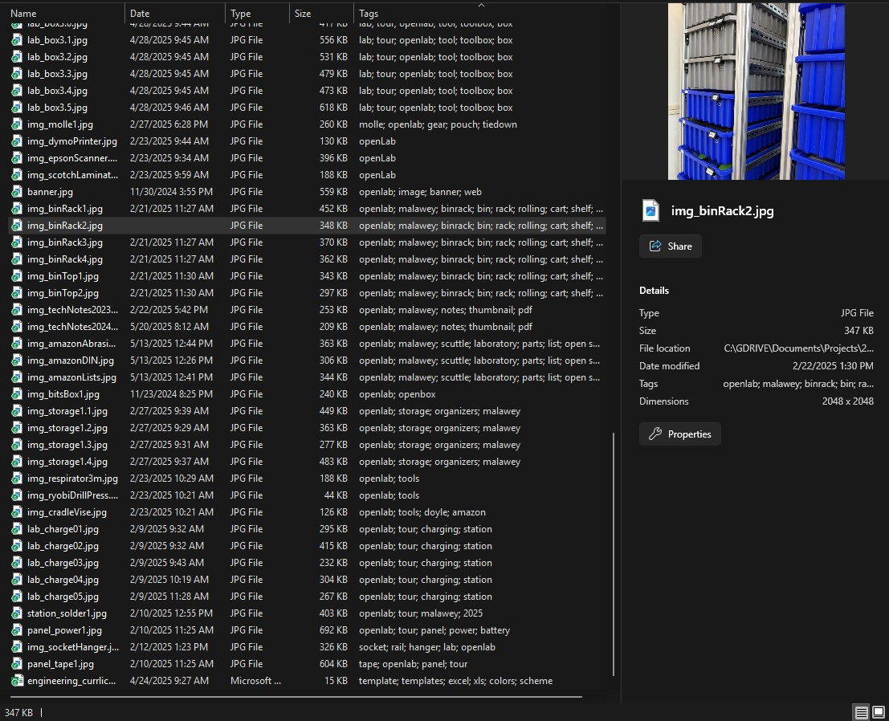
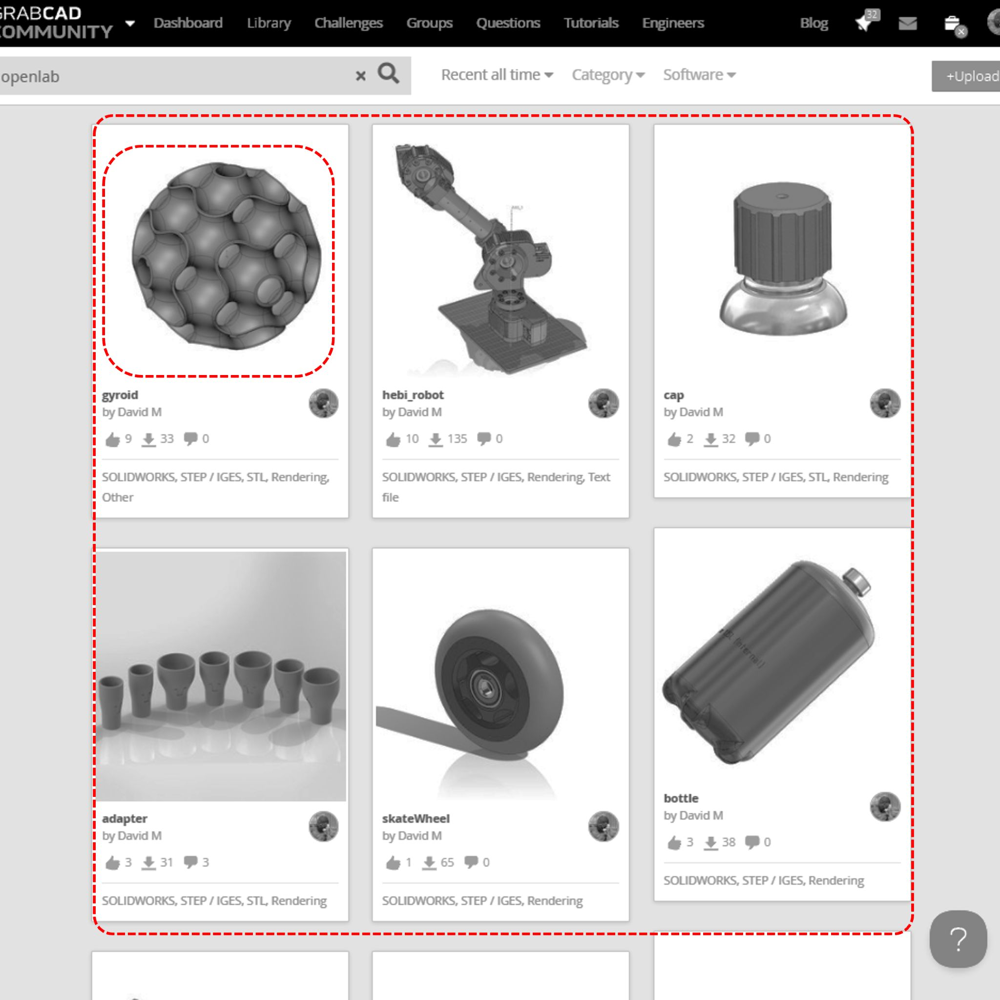
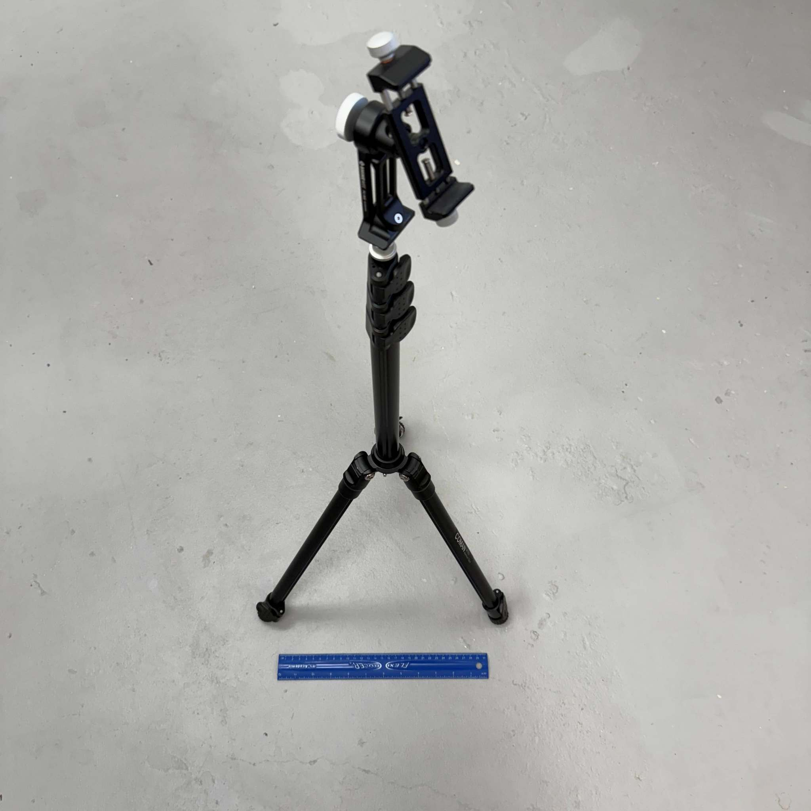
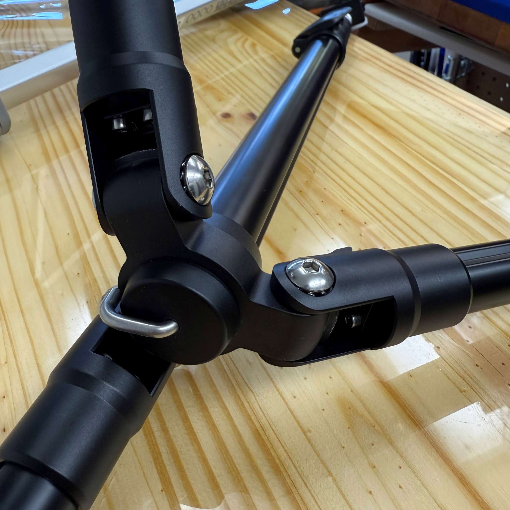
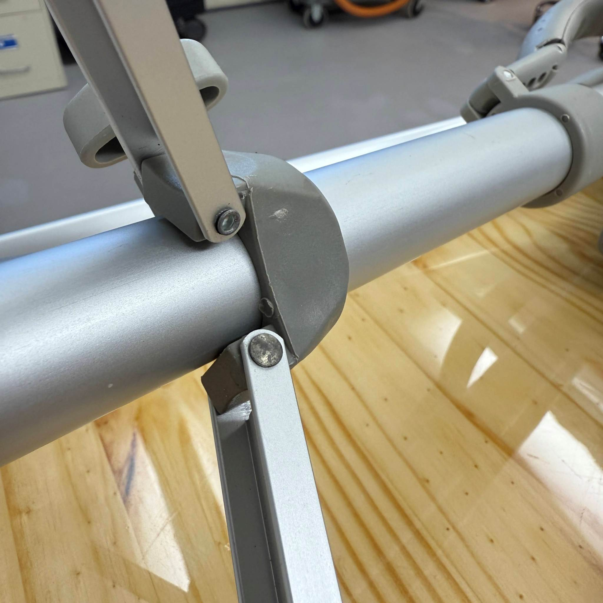

## Intro

Documentation about making documentation. Instructions for making Instructions, and so forth.

If you wish to be a contributor to documentation, you should know how to make top-tier docs.   Documentation is only worthwhile if it's treated like authoring a textbook or other publication that carries weight.  Hopefully it serves a purpose for 10 years or more, it's distilled to only actionable information, and we receive feedback to find errors & correct them.

## Images
_best practices for images as of 2025.05_
You should see these features in the images across all of the documentation from 2024 forward, in openLabProject and our other open projects.

>
> **Quick list of best practices for images:**
> * use .jpg image type
> * use square aspect ratio
> * use resolution of 2048x2048
> * aim for 350 KB or below
> * use multiple photos when the images need more detail
> * include tags in the image that relate to its context.
> * include img_descriptor with prefix "img_" if the file resides with many other files
> * include img_descriptor1 with number if the image has multiple images for the same purpose
>

Why select .jpg?
* the compression is typically better than .png
* it supports tags, for inclusion of keywords directly in the file (.png does not)
* ultimately, lighter web pages and faster loading

Why square aspect ratio?
* photography using square a/r yields the most versatile types of online posting.
* These images fit neatly inside the expandable images on web pages (like this one) rendered with Docsify-This.
* These images usually can survive cropping to BOTH portrait and landscape if edits are needed for special uses.
* We get more consistency when posted inside GrabCAD where they are refit into little albums
* when designer adjusts image files by pixels, no need for computing values.

See the image below, with a collection of files to support this Github repo.  The tags let us search inside of Windows Explorer to find our files even if they are not in the expected directory.  When our audience (students, researchers, designers) download the images or sends by email, SMS, etc.  The tags and other metadata follows the images wherever they go and offer traceability back to the original sources.  Over time this can 10x the viability of our designs to be built upon, expanded, and shared.

_in a screenshot of my local drive, see tags added to all the images for the github repo_

Consider grabCAD, instagram, or other online content and how they handle images. They automatically crop the photos to fit within their libraries and the fitment is more predictable when we post originals with square aspect ratio.

_screenshot of grabCAD search results with 6 posts on the screen_

## Diagrams
The next level up from images would be diagrams: images with minimal editing.  These are made by two methods:

**Edit on Mobile**
Grab the 

## Accessibility
We should make it easy to navigate and this impacts both humans and AI agents.  Images and attachments should offer a trail back to their webpage, project, or other documentation online.  Names and tags and metadata all has the purpose of accessibility overall.

>
> **Quick list about PDF files**
> * include keywords that relate back to the main documentation
> * include a document title that is relevant, often matching the filename
> * include an author (you) if you made the publication and two authors if you have made modifications
> 

Images placed in the .md markdown text should include a brief description immediately before or after the image.  Images are only included when it adds some information to the text.  You may find some PDF files attached as hyperlinks in a text paragraph, and followed by one image that was snipped from the PDF.  This works like a thumbnail, to offer visual cues about the document so the reader can identify if they found the right document before they download.  We want to minimize the reader's effort to find the information they are seeking.  Important images should be saved in the _img folder even if they are also hosted online somewhere.  This gives a unified documentation in the case of downloading the whole github repository. 

Files or images that are not described in the text should be excluded from the repository.  If we upload a duplicate image with a new filename, the old image is deleted.  So, every file in the repository serves a purpose.  

## Photography

(incomplete section, began 2025.05 DM) I'm including special notes about the audio/video setup we use for recording in the lab.

The tripod selection makes a huge impact - compared with common photography we need more sturdiness, faster adjustability, and vibration-free setups.

The Coman MT85 was my selection from Amazon.com.  It's a product for holding lamps rather than cameras - it's suitable because we have a low camera mass (just an iphone) and the footing takes less space than my other tripods. All of the joints are made of billet aluminum or steel instead of cheap stamped plate steel.
* [shop Coman tripod](https://amzn.to/3FejyhT) on amazon

See the images below for reference.  The gray tripod is a fairly respectable design for "video camera tripod" category but it still has undesirable cheap manufacturing elements like the thin aluminum pins that attach the linkages together.  These cheap pins cause loosening over time, wobble or chatter between links, and make the whole structure prone to damage if it is dropped or compressed.   I was thrilled to see the construction of this new black design (MT85) that is far more mechanically desirable, at a lower price point.

* 
* 
* 

## File Size

Aim for all files below 25 MB.  For gitHub, this is the max file size that can be attached.  Other limits to consider:
* grabCAD max file size (for upload of CAD)
* lobFile max (for hosting generic filetypes)
* whatsapp max (for global p2p collaboration)

For larger files, we should ask: What is the purpose this file serves?
* If it is a video - it's preferred to upload on YouTube.
* select "unlisted" type so youtube will not spread it publicly
* the video link is available to share, or embed anywhere and has no file size limit
* Youtube's servers are globally max performance for high resolution, rapid loading, and automatically generating thumbnails, etc.

## Mechanical Part

The best way to discover our recommended documentation of a 3D design is to find a model similar to the one at your desk today, and use our parts as a benchmark.  For a full example of how to document a mechanical part, I recommend that you browse the following examples.

1. A reverse engineered part - [fire extinguisher](https://grabcad.com/library/extinguisher-3)
2. Functional Geometry - [Rod Hook](https://grabcad.com/library/hook-136)
3. Parametric part - [Vacuum Adapter](https://grabcad.com/library/adapter-52)
4. An assembly - [Clamp mechanism](https://grabcad.com/library/clamp-526)

For these parts, I treat the following as my template decisions:
* Folder structure - the GrabCAD parts all live in folders, not outside.  This keeps things organized when a user downloads.
* STEP priority - most websites that display CAD models work nicely with STEP format, and if you can zoom and rotate, you're seeing a rendered .step file.  If we use STEP-AP14, then grabCAD renders the part colors beautifully.  In many other cases, color is omitted.
* Postprocessing - if you physically print and test the part, you aim for no postprocessing.  Ad chamfers to deburr & adjust diameters for the desired fitment.  Don't hide a step in postprocessing that gives another user a failure.  The goal is the uploaded design is the latest and most operational design.
* Mating components - which mating component(s) is crucial to validate this part?  Are there many variations of this mating part?  If so, it's best to specify the variation that works and include it in your model.  Use a simplified geometry that does not bury the main design file in relative filesize.
* STL files - generate one STL file of the isolated printable part. Give it proper orientation with the Z-axis pointed up, to indicate the print direction.  Omit STL files of the mating parts, since these STLs are not necessary for any function.
* STL revision number - I try to give a 1-digit revision number in the STL filename.  If I make a small adjustment of the native part and export a new STL, I can drag and drop it into the STL folder so the old one isn't overwritten.  If my part appears in a video or other documentation, users may notice the STL post is outdated and can easily comment - "hey do you have a newer STL?" and refer directly to the part filename which they have, and is unique.
