_What is meta?_ It's documentation about making documentation. Instructions for making Instructions, and so forth.

If you wish to be a contributor to documentation, you should know how to make top-tier docs.   Documentation is only worthwhile if it's treated like authoring a textbook or other publication that carries weight.  Hopefully it serves a purpose for 10 years or more, it's distilled to only actionable information, and we receive feedback to find errors & correct them.

## Images
_best practices for images as of 2025.05_
You should see these features in the images across all of the documentation from 2024 forward, in openLabProject and our other open projects.

>
> **Quick list of best practices for images:**
> * use .jpg image type
> * use square aspect ratio
> * use resolution of 2048x2048
> * aim for 350 KB or below
> * use multiple photos when the images need more detail
> * include tags in the image that relate to its context.
> * include img_descriptor with prefix "img_" if the file resides with many other files
> * include img_descriptor1 with number if the image has multiple images for the same purpose
>

Why select .jpg?
* the compression is typically better than .png
* it supports tags, for inclusion of keywords directly in the file (.png does not)
* ultimately, lighter web pages and faster loading

Why square aspect ratio?
* photography using square a/r yields the most versatile types of online posting.
* These images fit neatly inside the expandable images on web pages (like this one) rendered with Docsify-This.
* These images usually can survive cropping to BOTH portrait and landscape if edits are needed for special uses.
* We get more consistency when posted inside GrabCAD where they are refit into little albums
* when designer adjusts image files by pixels, no need for computing values.

See the image below, with a collection of files to support this Github repo.  The tags let us search inside of Windows Explorer to find our files even if they are not in the expected directory.  When our audience (students, researchers, designers) download the images or sends by email, SMS, etc.  The tags and other metadata follows the images wherever they go and offer traceability back to the original sources.  Over time this can 10x the viability of our designs to be built upon, expanded, and shared. Consider grabCAD, instagram, or other online content and how they handle images. They automatically crop the photos to fit within their libraries and the fitment is more predictable when we post originals with square aspect ratio.

_in a screenshot of my local drive, see tags added to all the images for the github repo.  (right) screenshot of grabCAD search results with returned posts._
- 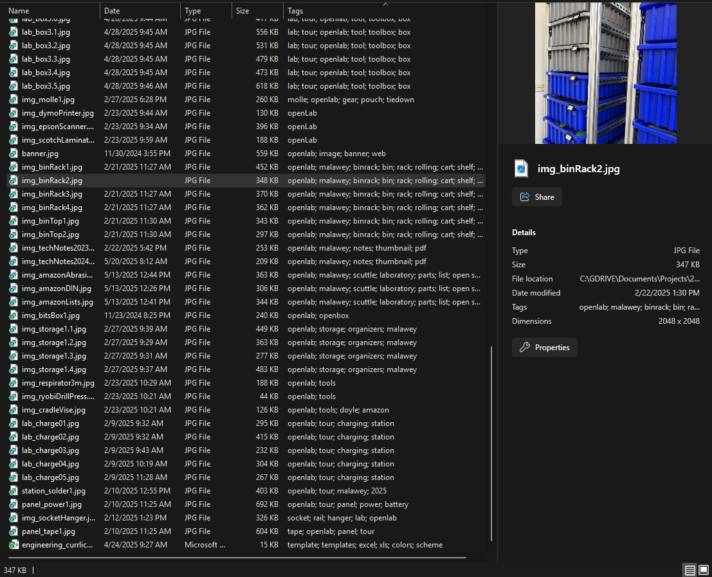
- 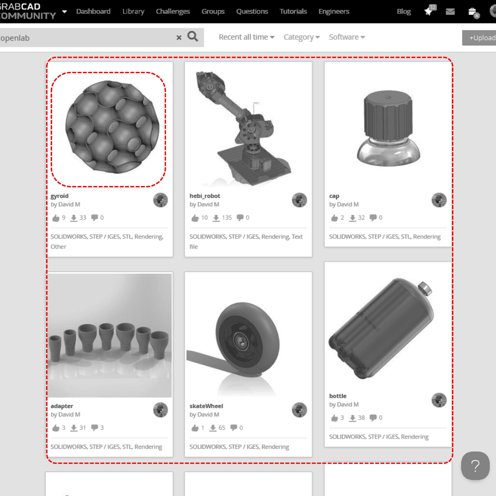
- 

## Diagrams
The next level up from images would be diagrams: images with minimal editing.  These are made with Powerpoint and Draw.io  As of 2025 I'm posting sample templates from Drawio, because I often copy these files to start my new diagrams instead of drawing from scratch. The diagrams used to build designs are the same kinds of diagrams for building the lab and documenting it.
* download [templates for diagrams as a PDF](https://github.com/davidmalawey/openLab/blob/4c53e4a34ba5942ea0cccf207de6eb0ed1631b6c/docs/templatePacket_2025.pdf) to see the previews
* or download [zipped templates here](https://github.com/davidmalawey/openLab/blob/4c53e4a34ba5942ea0cccf207de6eb0ed1631b6c/docs/templatePacket.zip).

 Images below show a few of the template diagrams used to quickly start with wire colors, tree diagram layouts, and so forth.
* 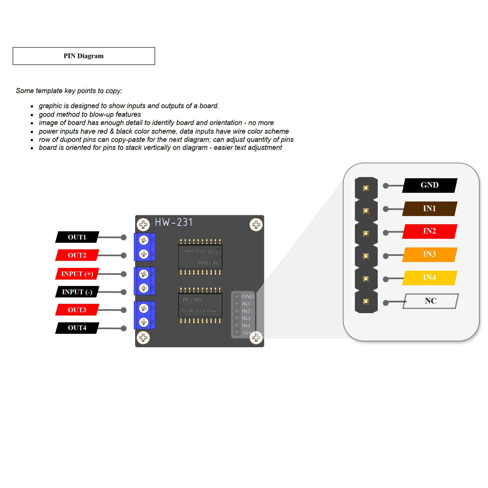
* 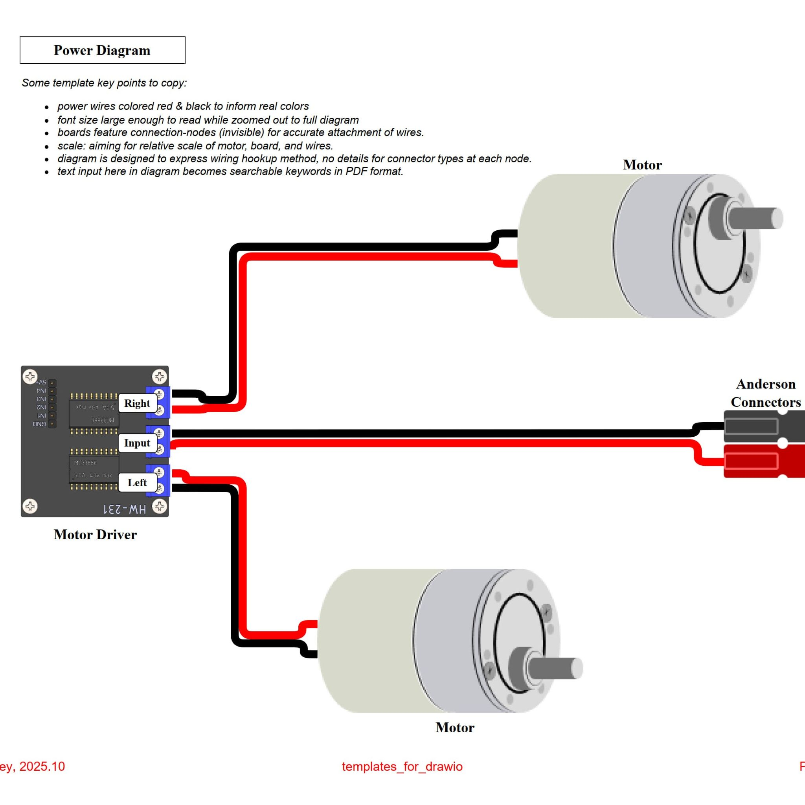
* 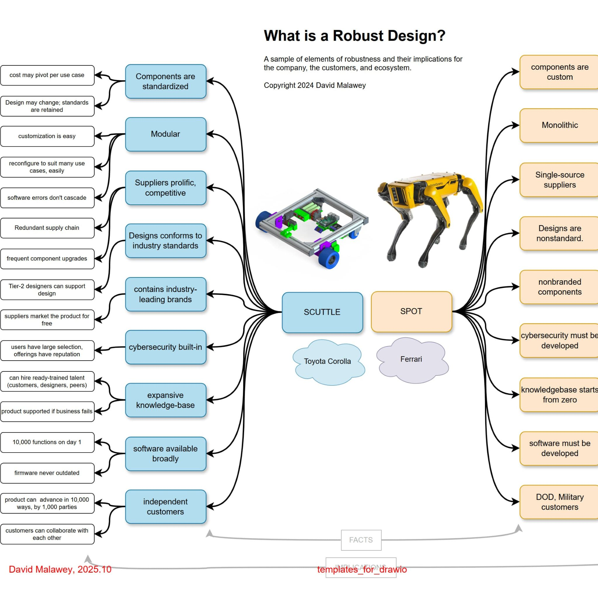

## Accessibility
We should make it easy to navigate and this impacts both humans and AI agents.  Images and attachments should offer a trail back to their webpage, project, or other documentation online.  Names and tags and metadata all has the purpose of accessibility overall.

>
> **Quick list about PDF files**
> * include keywords that relate back to the main documentation
> * include a document title that is relevant, often matching the filename
> * include an author (you) if you made the publication and two authors if you have made modifications
> 

Images placed in the .md markdown text should include a brief description immediately before or after the image.  Images are only included when it adds some information to the text.  You may find some PDF files attached as hyperlinks in a text paragraph, and followed by one image that was snipped from the PDF.  This works like a thumbnail, to offer visual cues about the document so the reader can identify if they found the right document before they download.  We want to minimize the reader's effort to find the information they are seeking.  Important images should be saved in the _img folder even if they are also hosted online somewhere.  This gives a unified documentation in the case of downloading the whole github repository. 

Files or images that are not described in the text should be excluded from the repository.  If we upload a duplicate image with a new filename, the old image is deleted.  So, every file in the repository serves a purpose.

Printing: if the documentation becomes printed to paper or printed to pdf, embedded links are lost.  For important links such as diagrams, include a full text of original hyperlink

## Photography

(incomplete section, began 2025.05 DM) I'm including special notes about the audio/video setup we use for recording in the lab.

The tripod selection makes a huge impact - compared with common photography we need more sturdiness, faster adjustability, and vibration-free setups.

The Coman MT85 was my selection from Amazon.com.  It's a product for holding lamps rather than cameras - it's suitable because we have a low camera mass (just an iphone) and the footing takes less space than my other tripods. All of the joints are made of billet aluminum or steel instead of cheap stamped plate steel.
* [shop Coman tripod](https://amzn.to/3FejyhT) on amazon

See the images below for reference.  The gray tripod is a fairly respectable design for "video camera tripod" category but it still has undesirable cheap manufacturing elements like the thin aluminum pins that attach the linkages together.  These cheap pins cause loosening over time, wobble or chatter between links, and make the whole structure prone to damage if it is dropped or compressed.   I was thrilled to see the construction of this new black design (MT85) that is far more mechanically desirable, at a lower price point.

- 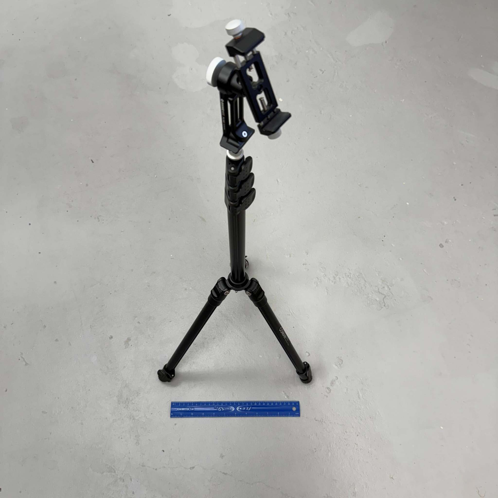
- 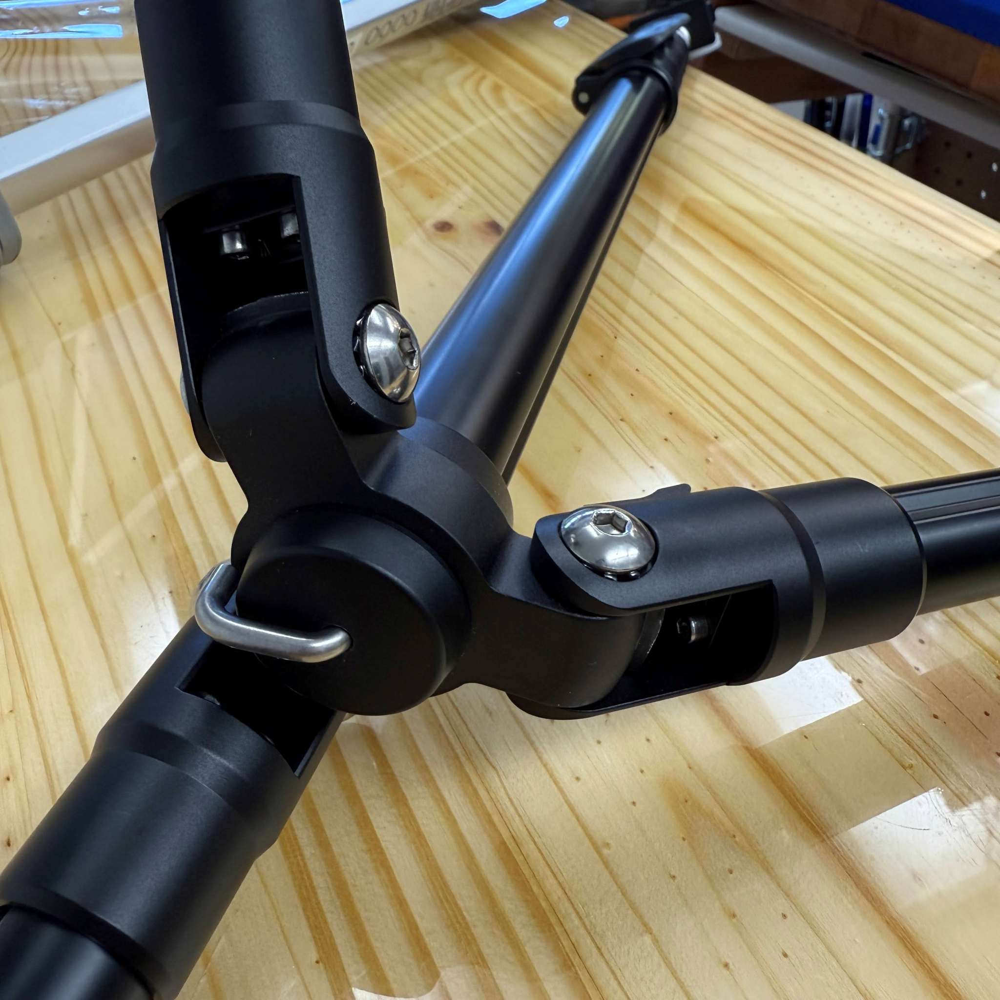
- 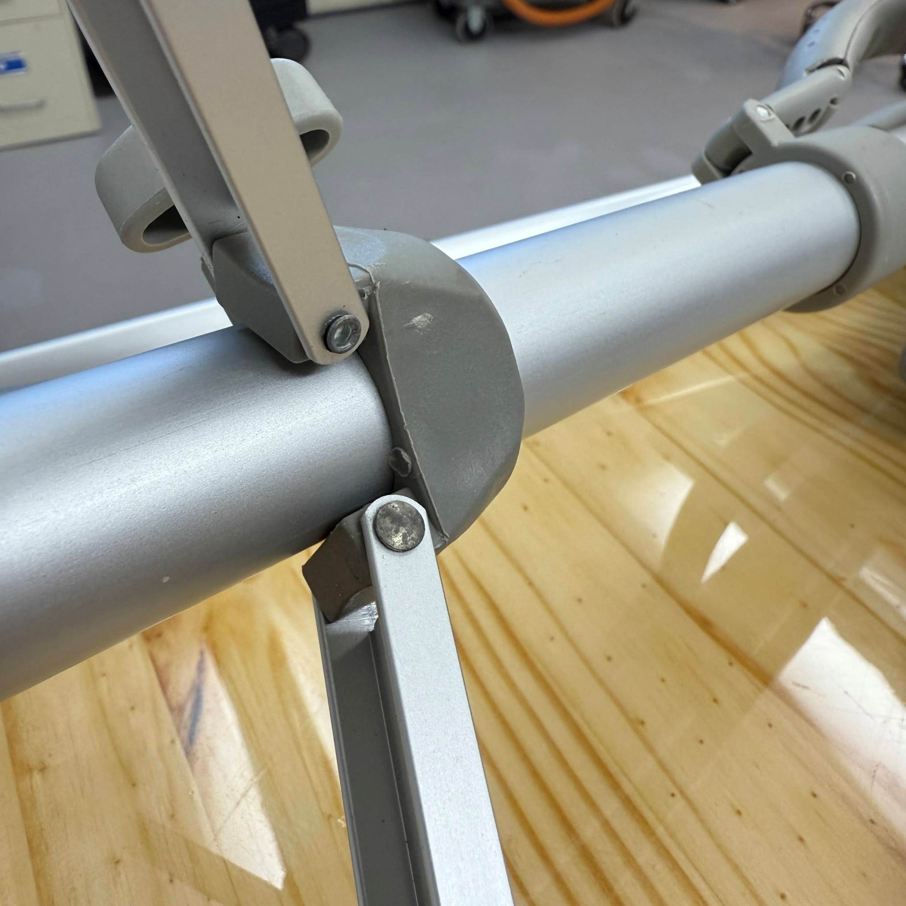

## File Size

Aim for all files below 25 MB.  For gitHub, this is the max file size that can be attached.  Other limits to consider:
* grabCAD max file size (for upload of CAD)
* lobFile max (for hosting generic filetypes)
* whatsapp max (for global p2p collaboration)

For larger files, we should ask: What is the purpose this file serves?
* If it is a video - it's preferred to upload on YouTube.
* select "unlisted" type so youtube will not spread it publicly
* the video link is available to share, or embed anywhere and has no file size limit
* Youtube's servers are globally max performance for high resolution, rapid loading, and automatically generating thumbnails, etc.

## Mechanical Part

The best way to discover our recommended documentation of a 3D design is to find a model similar to the one at your desk today, and use our parts as a benchmark.  For a full example of how to document a mechanical part, I recommend that you browse the following examples.

1. A reverse engineered part - [fire extinguisher](https://grabcad.com/library/extinguisher-3)
2. Functional Geometry - [Rod Hook](https://grabcad.com/library/hook-136)
3. Parametric part - [Vacuum Adapter](https://grabcad.com/library/adapter-52)
4. An assembly - [Clamp mechanism](https://grabcad.com/library/clamp-526)

For these parts, I treat the following as my template decisions:
* Folder structure - the GrabCAD parts all live in folders, not outside.  This keeps things organized when a user downloads.
* STEP priority - most websites that display CAD models work nicely with STEP format, and if you can zoom and rotate, you're seeing a rendered .step file.  If we use STEP-AP14, then grabCAD renders the part colors beautifully.  In many other cases, color is omitted.
* Postprocessing - if you physically print and test the part, you aim for no postprocessing.  Ad chamfers to deburr & adjust diameters for the desired fitment.  Don't hide a step in postprocessing that gives another user a failure.  The goal is the uploaded design is the latest and most operational design.
* Mating components - which mating component(s) is crucial to validate this part?  Are there many variations of this mating part?  If so, it's best to specify the variation that works and include it in your model.  Use a simplified geometry that does not bury the main design file in relative filesize.
* STL files - generate one STL file of the isolated printable part. Give it proper orientation with the Z-axis pointed up, to indicate the print direction.  Omit STL files of the mating parts, since these STLs are not necessary for any function.
* STL revision number - I try to give a 1-digit revision number in the STL filename.  If I make a small adjustment of the native part and export a new STL, I can drag and drop it into the STL folder so the old one isn't overwritten.  If my part appears in a video or other documentation, users may notice the STL post is outdated and can easily comment - "hey do you have a newer STL?" and refer directly to the part filename which they have, and is unique.

## Project

When does a design turn into a project? Consider a design of a physical device that branches into multiple directions.  The project has several utilities, not one.  And the value of the design shifts to its' diversity rather than its performance as a unit.  Then we transition to a project.  The documentation deserves new types of information, and this design information does not fit in the confines of a GrabCAD post or Github repo.

_CRITERIA_
_What makes it a project, rather than a part?_
A) The documentation does not fit within one CAD model post, with PDF, hyperlinks, & short description
B) The intended value is outside of the part's performance.

>
> Example: OpenBox Project
> Let's use this example as a lesson in documentation of a project.  Visit the [webpage for openbox](qr.net/openboxproject) and find these elements, beyond a mechanical design:
> * Multiple parts relating to the project are posted on grabCAD
> * The CAD posts each contain a model that serves one function & creates stand-alone value
> * The posts contain a keyword "openbox" so one search returns a collection of parts.
> * The project gains naming conventions.  The names of parts are described, with more detail than just a version number
> * The **use cases** are listed in a homepage, to introduce purposes
> * The **key suppliers** who manufacture OTS parts, that fall within the specifications are mentioned.
> * Two OTS parts are benchmarked for differences.  The designer discovers the specs which match and those which deviate, and mentions his findings in the webpage.
> * The project has **applications** which have been executed in full, such as the "car adapter" and a video is required to explain it.
> * The **videos** are posted on youtube and directly embedded in the "designs" tab.
>
>

I built the openbox project directly as an example for multidisciplinary engineering development projects.  It merges mechanical designs, demonstration videos, reference sources, electrical designs, and basic prototyping, and multimedia web development.  For many decades, an open project would fall into only one category.  So, platforms sprung up to support only one category, such as printables.com for open 3D printing.  To combine multiple project types, we need to invent new forms of documentation.

## Amazon-Lists
Here are links to lists I wrote up for my amazon associates page. As of 2025 Feb, the above links are mostly for my associates link (please use these links if you buy the product, this generates revenue for the lab.)  Currently this webpage is more primary source than my amazon account but I may update the amazon lists later this year.
* My storefront:
  * [amazon.com/shop/davidmalawey](https://www.amazon.com/shop/davidmalawey)
  * if you visit here, you can explore all my lists in progress.
* Tapes, as a category:
  * [tapes shopping list](https://www.amazon.com/shop/davidmalawey/list/23JC56RVU5QCD?ref_=cm_sw_r_cp_ud_aipsflist_QDTS3XMR324V5SRFJWMD)
  * [tape video](https://youtu.be/W0sAR_jI4b8) on youtube.
* Organization supplies
  * [shopping list](https://www.amazon.com/shop/davidmalawey/list/3WYDWTJG1O2?ref_=cm_sw_r_cp_ud_aipsflist_QDTS3XMR324V5SRFJWMD_1)
* Abrasives
  * [abrasives amazon list](https://www.amazon.com/shop/davidmalawey/list/25N8151E0DCS9?ref_=aipsflist) including sanding discs, sandpaper, and conditioning tools
* DIN rail related tools
  * [DIN Rail Amazon list](https://www.amazon.com/shop/davidmalawey/list/7IHZLLQHFXO9?ref_=cm_sw_r_cp_ud_aipsflist_MAE4HJHDX19B9EJDS6X4)
* Pneumatics
  * [pneumatics list amazon](https://www.amazon.com/shop/davidmalawey/list/15M90MC04G6B3?ref_=cm_sw_r_cp_ud_aipsflist_SQBNSQQTA4BB96E7T7Y4)

_A few images from my "collections" posted on Amazon._
- 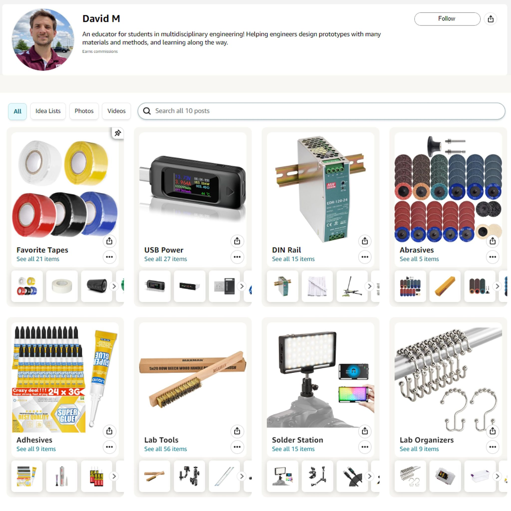
- 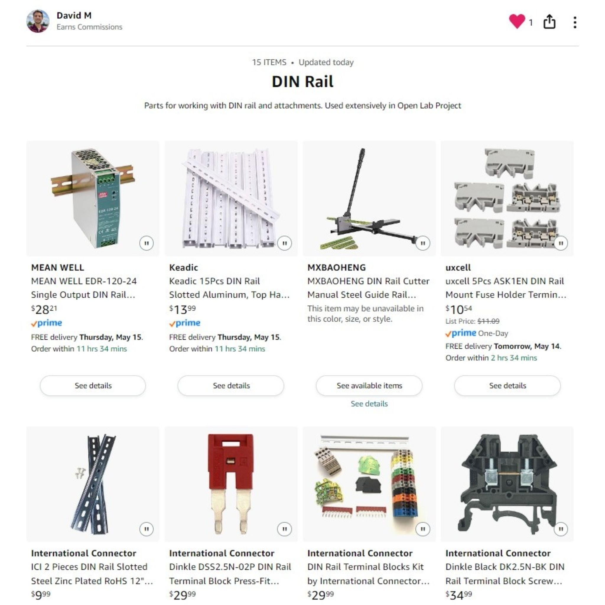
- 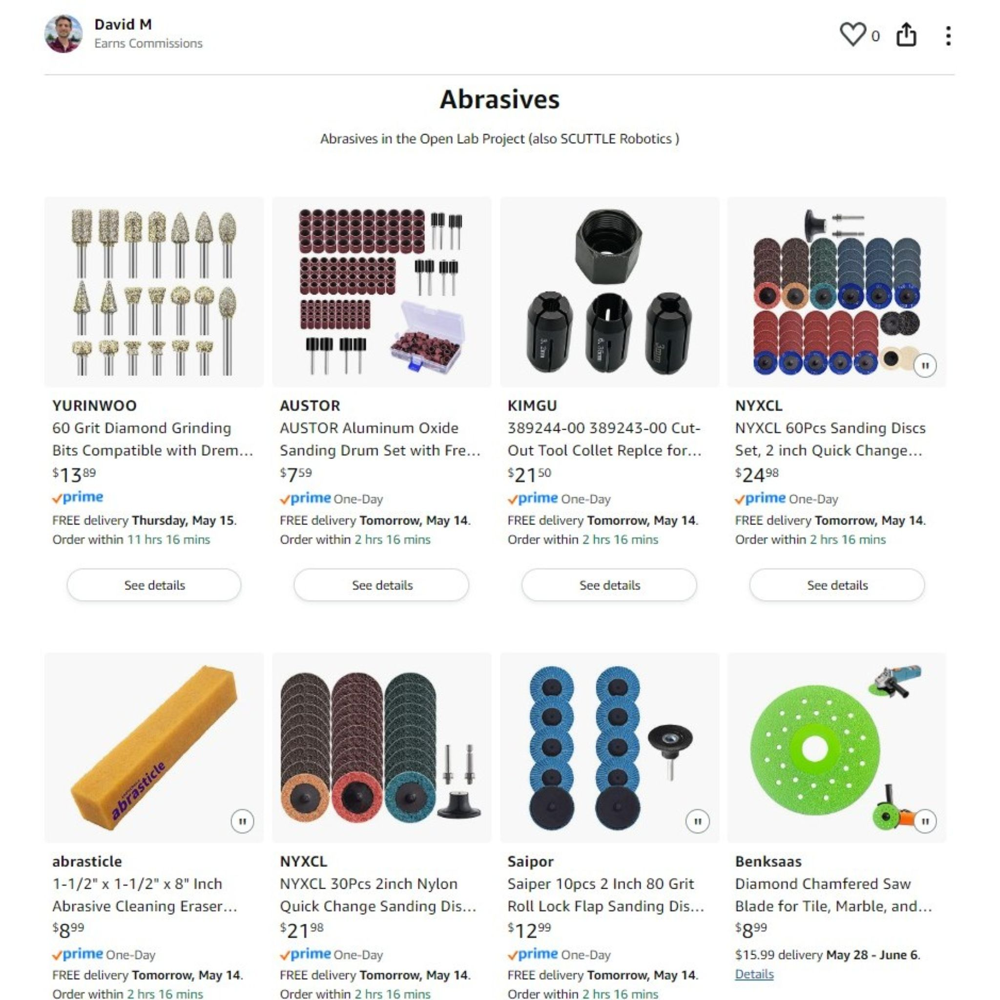

## Research

2026.05 I am beginning this section to include the research I gather for lab machines, supplies, or narrow topics that recurringly appear.  We can start with the guides found in the wild.  Beginners see distributors like McMaster and AutomationDirect as stores, but experts use them as research partners.  The effort required for AutomationDirect (AD) to choose its inventory is the same effort we need to understand the tools & parts we need.  The difference is, AD hires whole groups of engineers to build an understanding of the applications of the customers (you and me) to succesfully stock the parts we need.  In that process the distributor builds an expertise that's often deeper than the customer.  I may need to buy screwdrivers four times and but they are selling units perpetually and to customers who are building critical infrastructure in our civilization.  Let's discover which distributors are experts in each area and leverage their big brains to gather knowledge for free.

### Brochures
Brochures are more light reading and less technical than catalogs.  The brochure will span more product spaces by one manufacturer or one brand. These documents help in the discovery phase of finding solutions for a buyer who has not yet decided on a technical solution but has a technical problem.  I open up brochures when it's my first time choosing a product that also has a family of attachments or whole categories of alternate methods.  The load securement catalog, for example, is where I browsed in search of a high quality ratchet strat but I understood there may be an entirely different tie-down method that suits my needs better.  Brochures also show us how much of a brand's total product line was made available at my distributor.  Ideally, Grainger would offer all of the different tie-down parts from a manufacturer but in reality they only offer a few percent, sometimes.  This comparison gives us more understanding of both the distributor and the manufacturer.  We could learn that Grainger is a poor choice to shop for a particular product range or we could learn that zip ties are actually one of ten sophisticated methods to secure cables and we have never seen the nine others before.

* Get the [Strut Channels Brochure](https://github.com/davidmalawey/openLab/blob/4c53e4a34ba5942ea0cccf207de6eb0ed1631b6c/docs/brochure_superstrut_2025.pdf) by Superstrut, 2025
* Get the [Mini Switches Brochure](https://github.com/davidmalawey/openLab/blob/4c53e4a34ba5942ea0cccf207de6eb0ed1631b6c/docs/brochure_miniSwitch_2026.pdf) by Omron, 2026
* Get the [eTrack Brochure](https://github.com/davidmalawey/openLab/blob/4c53e4a34ba5942ea0cccf207de6eb0ed1631b6c/docs/brochure_eTrack_2025.pdf) by SnapLoc, 2025
* Get the [Medical Tapes Brochure](https://github.com/davidmalawey/openLab/blob/4c53e4a34ba5942ea0cccf207de6eb0ed1631b6c/docs/brochure_medicalTapes_2026.pdf) by 3M medical group, 2026
* Get the [PTFE laminate materials Brochure](https://github.com/davidmalawey/openLab/blob/4c53e4a34ba5942ea0cccf207de6eb0ed1631b6c/docs/brochure_laminatedPTFE_2024.pdf) by Chemfab, 2024

### Catalogs
Catalogs are grouped by one distributor or more often one manufacturer.  Since the manufacturer's interest is to span all variations of a space, the catalog from one manufacturer should inform us of the full span of technical variations in that space.  I usually try to find the catalog of the longest-standing or highest-reputation manufacturer for a product category, then use that catalog to interpret the offerings of other competitors in that space.  Give some extra admiration to the manufacturer who offers a catalog with technical data because they are the ones who create transparency behind the marketing claims of their own products, ultimately raising the standard for the customer's expectations for products to meet specifications and marketing claims.  Once one manufacturer publishes a strong catalog then it impacts the whole market, gradually sifting the fakers out from the real value creators.

* Get the [Filament Properties Catalog](https://github.com/davidmalawey/openLab/blob/4c53e4a34ba5942ea0cccf207de6eb0ed1631b6c/docs/catalog_filamentProperties_2021.pdf) by BCN3D, 2021
* Get the [FDM Filament Catalog](https://github.com/davidmalawey/openLab/blob/4c53e4a34ba5942ea0cccf207de6eb0ed1631b6c/docs/catalog_eSunFilaments_2024.pdf) by eSun, 2024
* Get the [Load Securement Catalog](https://github.com/davidmalawey/openLab/blob/4c53e4a34ba5942ea0cccf207de6eb0ed1631b6c/docs/catalog_loadSecurement_2025.pdf) by Erikson, 2025
* Get the [Clamping Catalog](https://github.com/davidmalawey/openLab/blob/4c53e4a34ba5942ea0cccf207de6eb0ed1631b6c/docs/catalog_clampingPanavise_2025.pdf) by Panavise, 2025
* Get the [Cable Tie Catalog](https://github.com/davidmalawey/openLab/blob/4c53e4a34ba5942ea0cccf207de6eb0ed1631b6c/docs/catalog_cableTies_2024.pdf) by Panduit, 2024
* Get the [Sanding & Buffing Catalog](https://github.com/davidmalawey/openLab/blob/4c53e4a34ba5942ea0cccf207de6eb0ed1631b6c/docs/catalog_sandingBuffing_2023.pdf) by 3M, 2023
* Get the [Pipe Clamp Catalog](https://github.com/davidmalawey/openLab/blob/4c53e4a34ba5942ea0cccf207de6eb0ed1631b6c/docs/catalog_pipeClamps_2023.pdf) by Bessey, 2023
* Get the [Strut Channel Catalog](https://github.com/davidmalawey/openLab/blob/4c53e4a34ba5942ea0cccf207de6eb0ed1631b6c/docs/catalog_superstrut_2024.pdf) by Superstrut, 2024
* Get the [Markers Catalog](https://github.com/davidmalawey/openLab/blob/4c53e4a34ba5942ea0cccf207de6eb0ed1631b6c/docs/catalog_markers_2023.pdf) by Markal, 2023

### Guides
Guides are focused on the products combined with an application.  If an engineering student is building a robot with sensors and actuators she might find herself for the first time seeking a cable that can carry signals from the microcontroller to the sensor across the system.  For her first sourcing activity for a cable, she is simultaneously shopping and designing.  For the starting point, she needs a cable that performs the same as the jumper wires on her breadboard, but it is one meter longer now and needs to fit neatly through a port in an enclosure wall and nest in a channel in her machine.  That cable selection requires her to discover what cable types are available and also discover what requirements she didn't yet consider.  The guide for cable design is the one-stop booklet for her to find parts and understand technical requirements, plus refine the budget for materials.  The guide is an intentional expert advice published by a manufacturer or distributor for technical learning.  

* Get the [Automation Tools guide](https://github.com/davidmalawey/openLab/blob/4c53e4a34ba5942ea0cccf207de6eb0ed1631b6c/docs/2026_guide_screwdrivers.pdf) authored by AutomationDirect
* Get the [Wiring Design Guide](https://github.com/davidmalawey/openLab/blob/4c53e4a34ba5942ea0cccf207de6eb0ed1631b6c/docs/guide_cableDesign_2018.pdf) by Alphawire, cable and connector manufacturer, 
* Get the [Screwdriver Products Guide](https://github.com/davidmalawey/openLab/blob/4c53e4a34ba5942ea0cccf207de6eb0ed1631b6c/docs/guide_screwdrivers_2026.pdf) from AutomationDirect
* Get the [Cable Design Guide 2021](https://github.com/davidmalawey/openLab/blob/4c53e4a34ba5942ea0cccf207de6eb0ed1631b6c/docs/guide_cableDesign_2018.pdf) from Panduit
* Get the [Bearing Technical Guide](https://github.com/davidmalawey/openLab/blob/4c53e4a34ba5942ea0cccf207de6eb0ed1631b6c/docs/guide_bearings_2024.pdf) from Koyo
* Get the [Switch Integration Guide](https://github.com/davidmalawey/openLab/blob/4c53e4a34ba5942ea0cccf207de6eb0ed1631b6c/docs/guide_switchIntegration_2026.pdf) from Honeywell, 2026
