>
> Methods, for engineering, fabricating, and building.  Engineering consists of design, evaluation, benchmarking, parts-research, and documentation. Fabricating consists of constructing parts from raw materials, and building refers to all technician-level activities.  Methods offer standard instructions that can be applied to multiple different actions, in the overall engineering process.
>

## Beams

### Extrusions
_Keywords: alumimum extrusion, framing, rails, 3030, 2020, extruded, frame_

Aluminum framing is popular in research labs, engineering facilities and academic spaces and has been expanding in use for several decades.  Several of our lab stations are built around 3030 framing, with a profile of 30 x 30 mm.  By 2025 it is available from retailers like Amazon.com but we source it from an industrial supplier.  The unique value is it's dimensional accuracy compared with lumber, and symmetry to ease planning effort for a designer of assemblies.

Industrial vendors like AutomationDirect (AD) maintain more consistency in product specs over time, have a single-source manufacturer, and offer specifications & CAD models that match the product with a guarantee. For design engineering it is best to have a full dataset to work with. I was pleased with AD having extremely fast free shipping in the USA, and free custom cut lengths including 45 degree angles.  If you plan your framing design ahead of ordering, leverage their cutting service for sub-mm accuract.  Each supplier may have slightly different profiles that impact a refined design.

**Resources**
Examples: I included a few common designs in one GrabCAD upload to see them side-by-side.  You can see [the models from grabCAD here](https://grabcad.com/library/extrusion-variants-3030-1)
Video: See this video on youtube for an introduction to working with extrusions.

<iframe width="1250" src="https://www.youtube.com/embed/cLrIE6ltErE" title="Aluminum Extrusions Fundamentals" frameborder="0" allow="accelerometer; autoplay; clipboard-write; encrypted-media; gyroscope; picture-in-picture; web-share" referrerpolicy="strict-origin-when-cross-origin" allowfullscreen></iframe>

**Product Links**
* Amazon, 1 meter lengths [product for 99 usd](https://amzn.to/41P8K1Y)
* AutomationDirect (preferred) [product with custom cut length](https://www.automationdirect.com/adc/shopping/catalog/structural_frames_-z-_rails/t-slotted_rails/30-3030c)
* McMaster Carr (expensive but reliable) [product with unique geometry](https://www.mcmaster.com/47065T101-47065T412/)

- 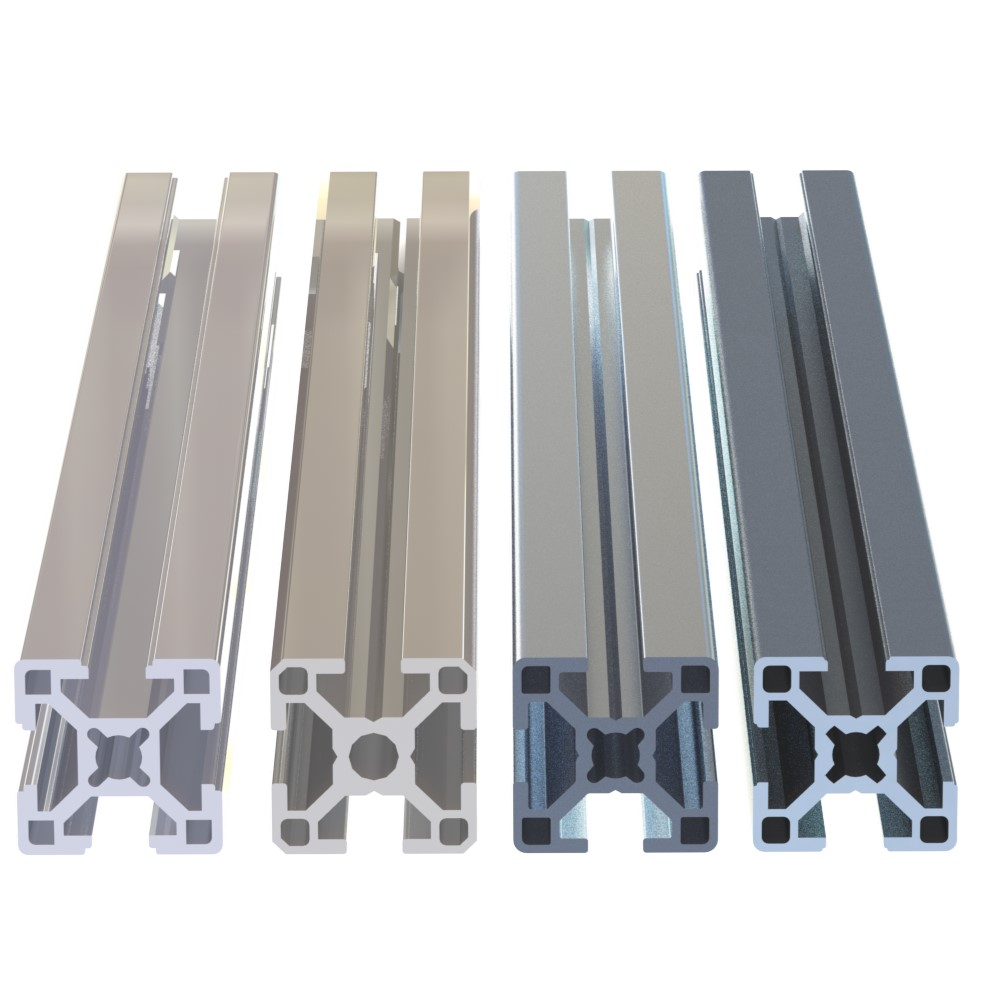
- 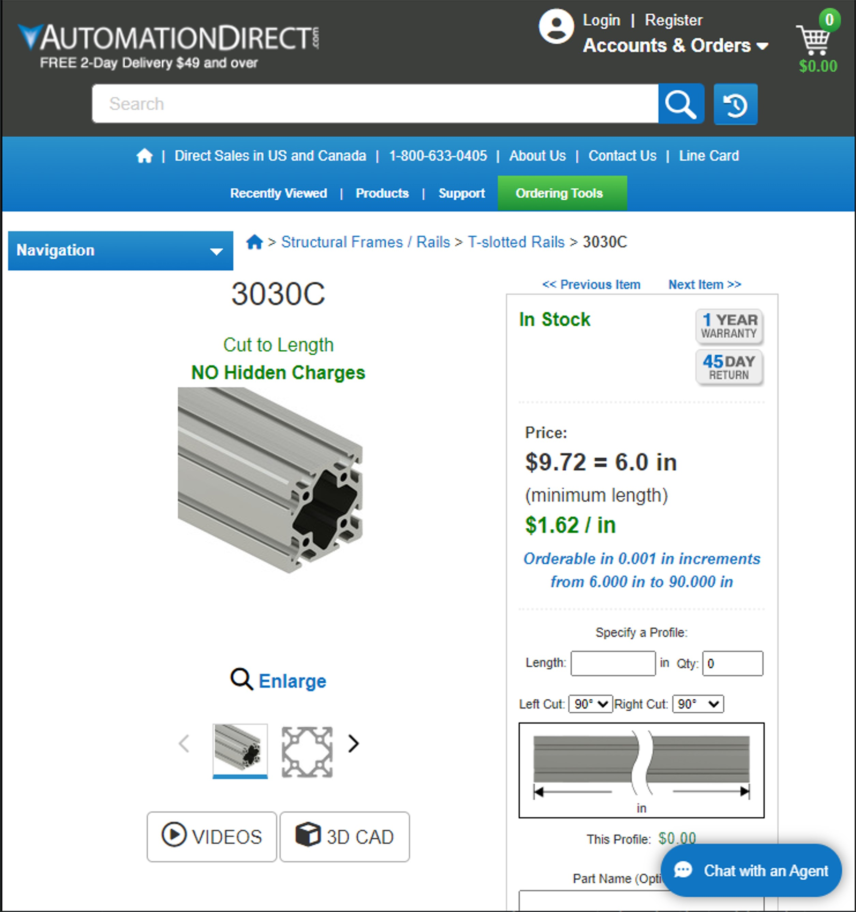
- 
_Left to right: popular extrusion variants, a simple frame built from 3030, and fastener hardware options._

### DIN-rail

Steel 35mm DIN rail is extremely common in industrial electronics assemblies but it is also useful for mounting & organizing workspaces.  I published several 3D Models for printable brackets, including:

* [DIN-spring](https://grabcad.com/library/dinspring-1) for a clip-on function to add to din-mounted items
* [Tube clamp](https://grabcad.com/library/tubeclamp-1) that fastens to any round pole and attaches DIN rail
* [minimal-pi-bracket](https://grabcad.com/library/minimal-pi-bracket-1) which holds raspberry Pi, and prints in only 15 minutes
* [DIN-rail-pivot](https://grabcad.com/library/din-rail-pivot-1) which connects two DIN pieces end-to-end and bends +/- 90 degrees
* [compliant DIN brackets](https://grabcad.com/library/compliant-din-brackets-1) which features 5 unique brackets which contain built-in springs
* [handy-mount](https://grabcad.com/library/handymount-1) which attaches an electrical box (handybox) securely against the DIN rail

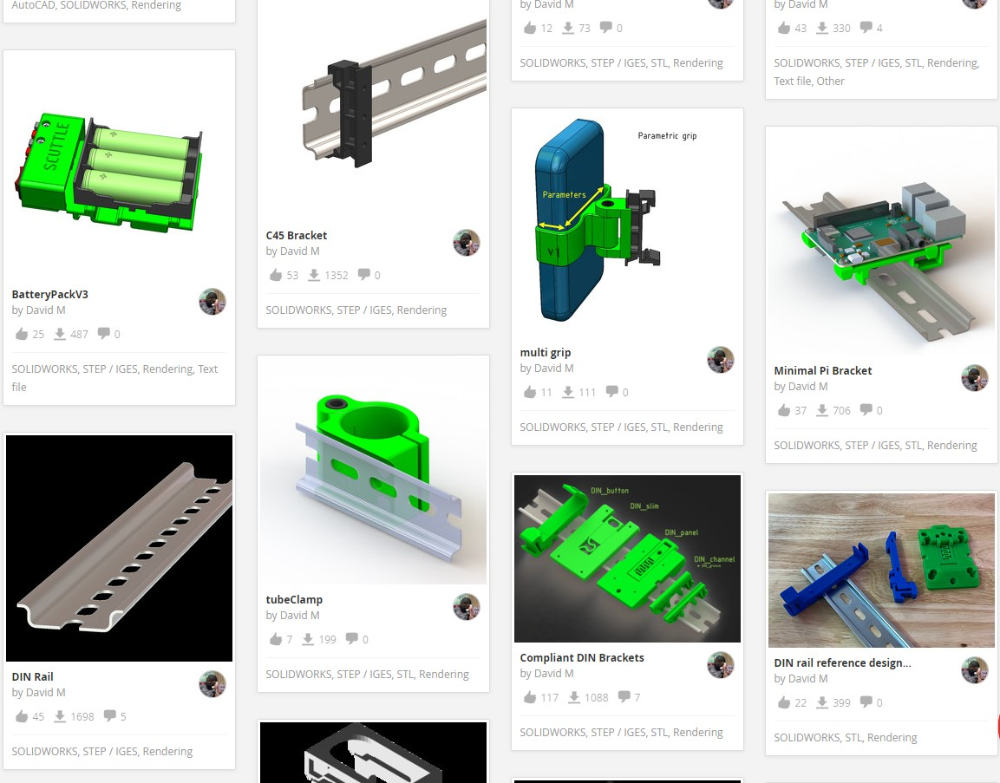

### Strut_&_Tube

These materials make a foundation for strength in our mechanical designs, at low cost.  They are selected for accessibility, and ease of implementation, and prolific possibilities with 3D printing. 

* 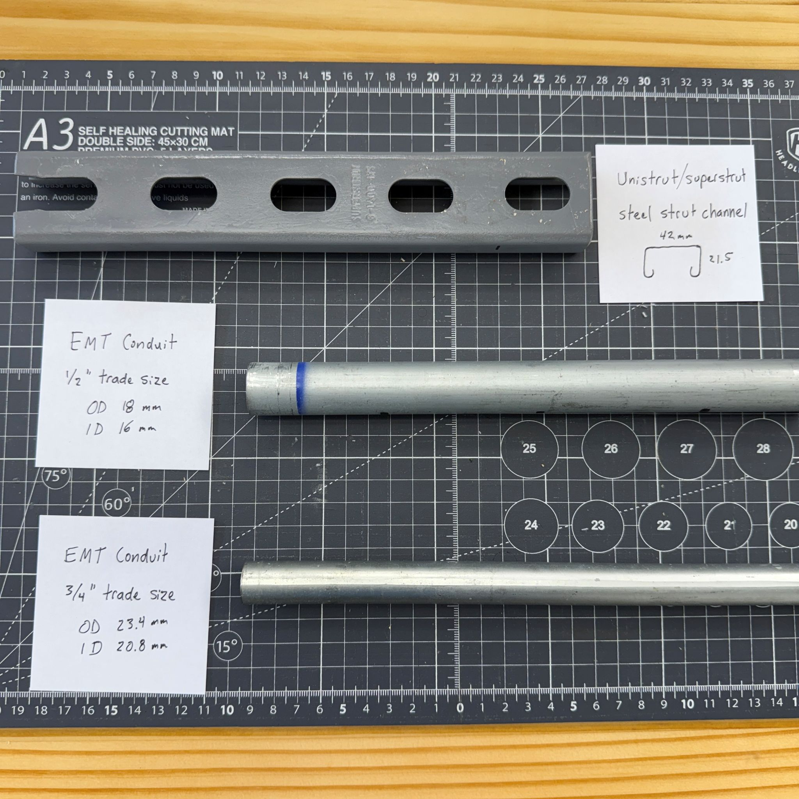
* 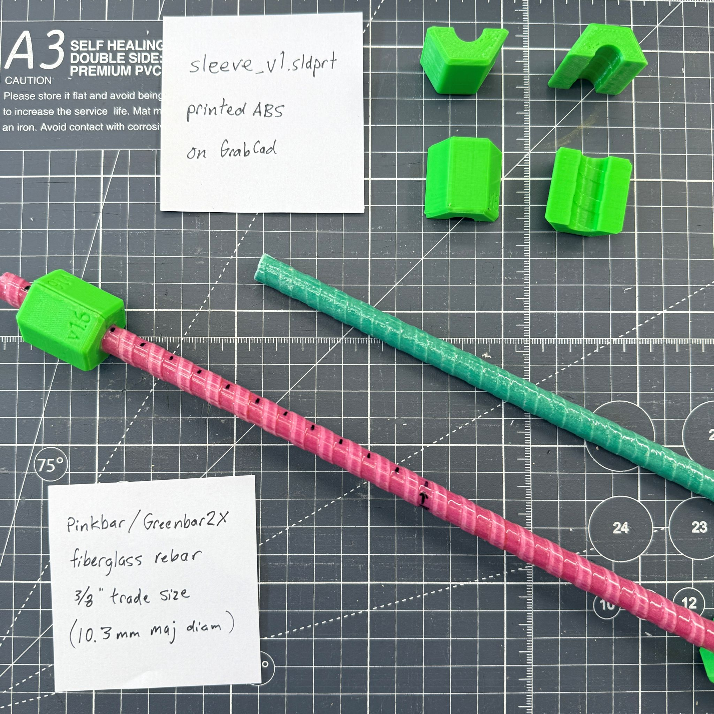
* 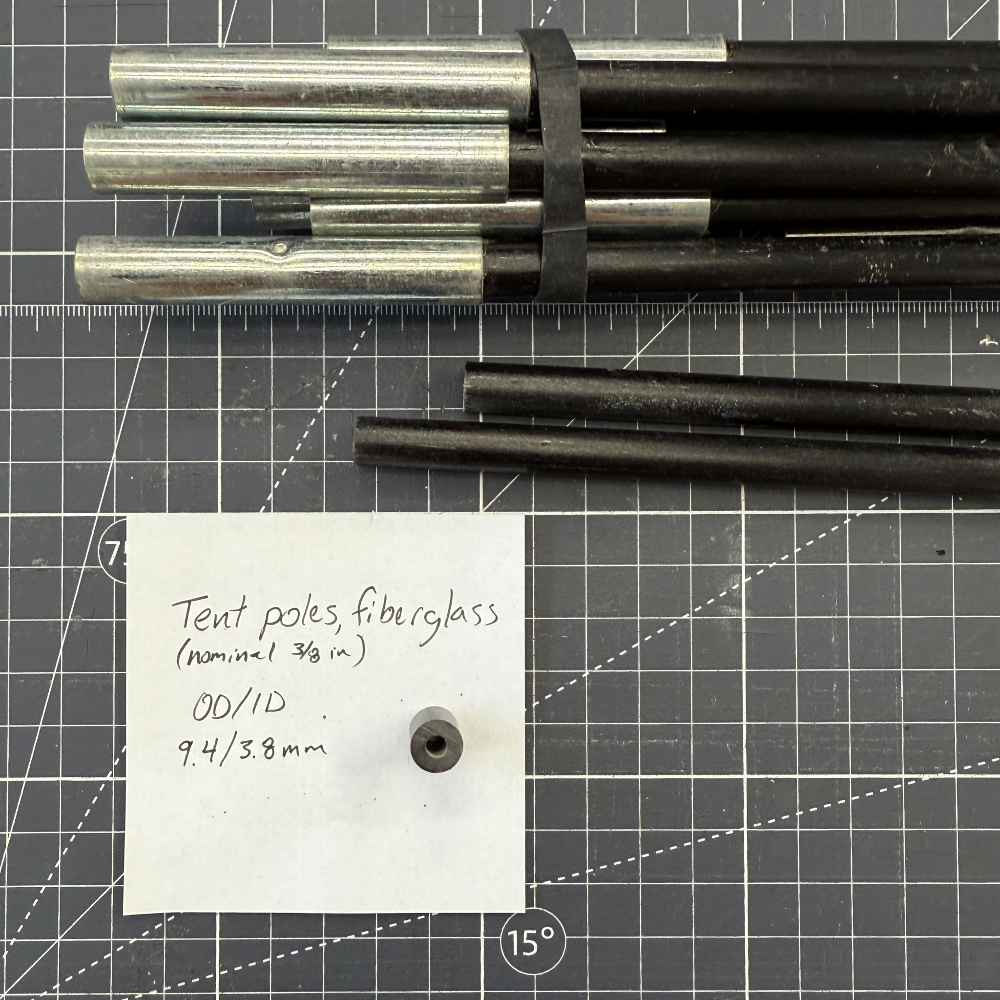
* 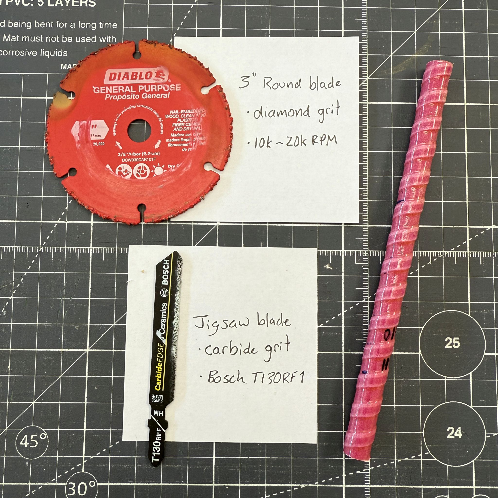

**Unistrut and Superstrut** (brands names) are standard heavy steel material.  They comprise load-bearing assemblies for plumbing & cabling in facilities all around you.  The slots are 1/2in diameter, fitting 0.5in or M12 fasteners.
**EMT conduit** is the most affordable steel tube on the market. These parts also have indexing marks at 1inch increments for easy measure, and can be cut without power tools. I use a handheld tube cutter.
**Pinkbar & Greenbar** are brand names for fiberglass rebar (reinforcing structural members for concrete) but they have amazing compatibility with superglue and 3D printing.

**Cutting** the fiber materials is effective with carbide and diamond blades.
* a [diamond grit 3in blade](https://amzn.to/4mRQxcl) is the 3-inch round cutoff wheel I often use, half-speed at 10k rpm with a cutoff tool.
* a [carbide grit jigsaw blade](https://amzn.to/3I3gLJR) fits a jigsaw and works great on fiber.  Turn the oscillating mode OFF.
* for safe handling after cuts, I spray a quick clear poly lacquer and [krylon clear coat](https://amzn.to/4mTIrjj) has high hardness and sandability.  Without a coating, fiberglass can cause your hands to itch. 

**Beam materials and design value:**
This list describes how these materials are chosen to meet the needs of the lab.  Consider this like choosing furniture, except we make finer-grain decisions:  "I need a shelf" becomes "I need a 1/2 meter parts hanging structure."  And since we can relocate and rearrange attachments, the lab evolves, processes update, and new needs appear.

| material | needs met|
| ---------- | ----- |
| unistrut | VERY high strength - a steel backbone for assemblies intended for applying force, which demand rigidity |
| 3030 Aluminum | strong beams to carry loads, for holding together any desk-sized assembly or machine |
| 2020 Aluminum | used for non-forceful assemblies, to create accurate datums for parts that work together |
| EMT Conduit, 1/2in size | to give reach on an assembly which datum features are less crucial, like mop design |
| EMT Conduit, 3/4in size | for long-reaching assemblies requiring rigidity, less dimensional accuracy - like parts-hanger |
| Fiberglass 3/8in rod | to reinforce a design, in tension arrangement; relieve forces from other members. Or, rigid rotation with light torque |
| DIN rail | for mounting modular items at a reach, for arrangement and fitment with alignment |

## Conduit

The Electrical Metallic Conduit (EMT) topic includes tubes, rigid boxes, and connectors. EMT forms a huge collection of engineered high-value, high-strength, low cost parts that are often the best engineering choice for non-electrical purposes.  EMT conduit at 1/2 and 3/4 inch trade sizes have been validated and integrated together with other openLab supplies.  Most parts are soft grades of steel, stronger than alumimum but not structural steel.  That makes a 1/2inch beam a bit stronger than aluminum 20mm extrusion.  The parts take painting readily, are easily drilled with common bits, and easily shaped with a carbide burr. The steel is just thick enough to tap holes and add screws as needed.  

* Download [PDF Conduit Notes](docs/2025_conduitData.pdf) with a subset of EMT parts I've gathered, identified, recorded.
* Find my [tubing cutter on amazon](https://amzn.to/3Z1WDfR) (I love this tool!)

- 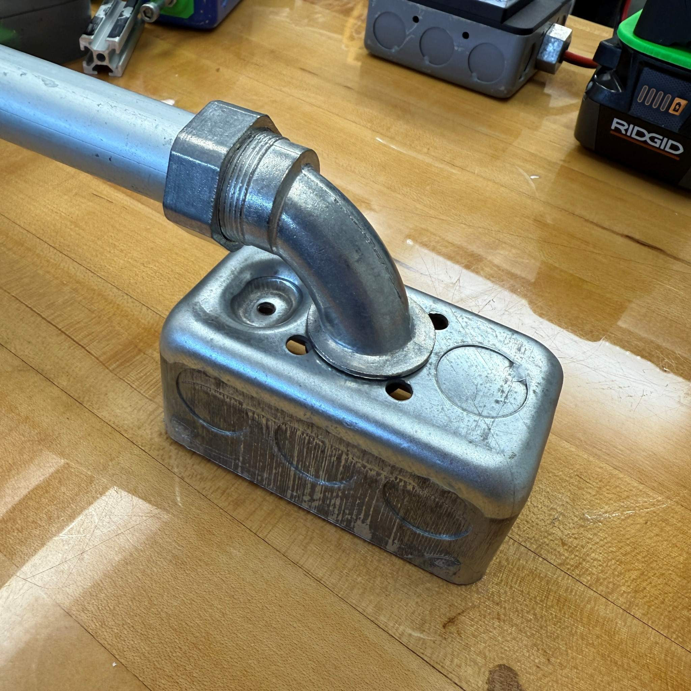
- 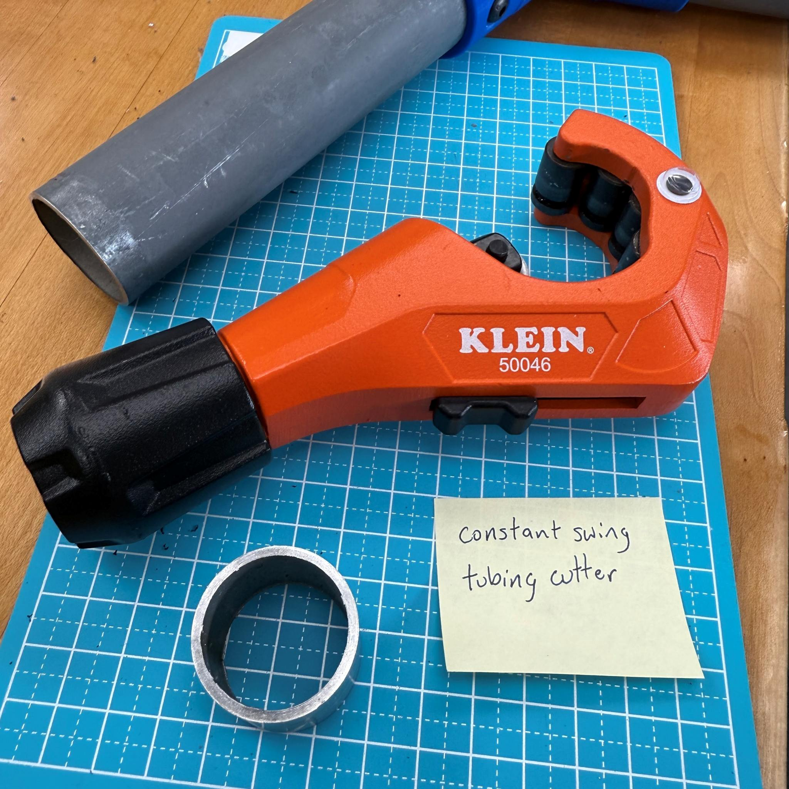
- 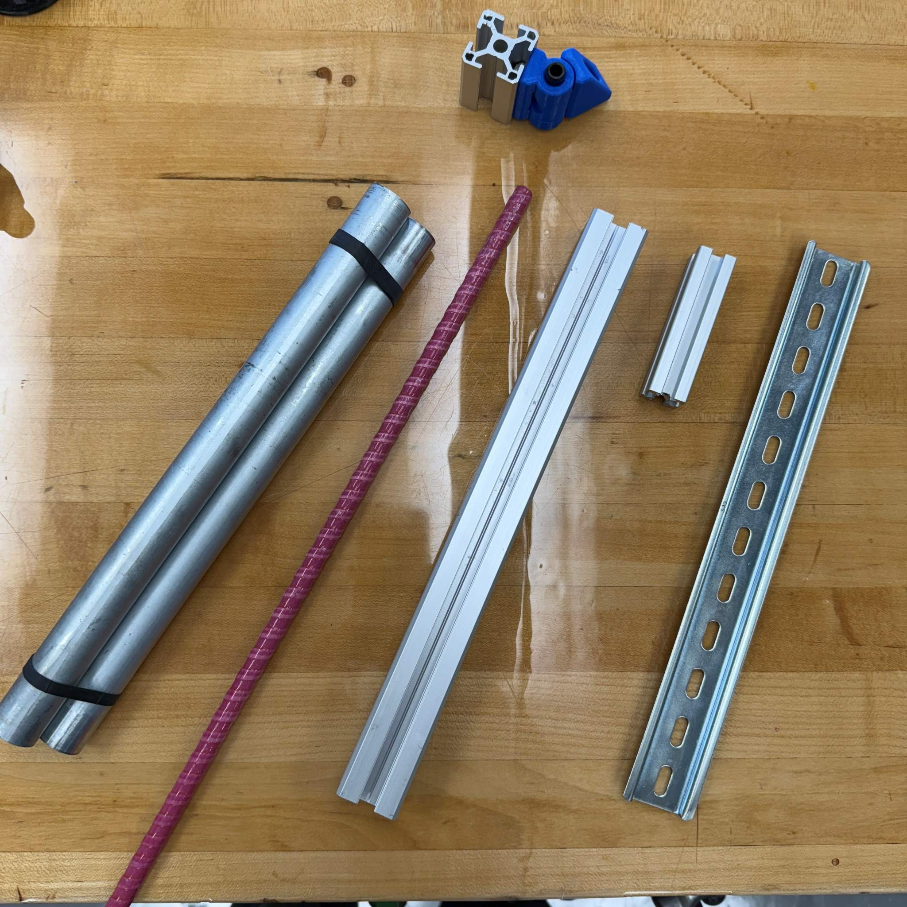
- 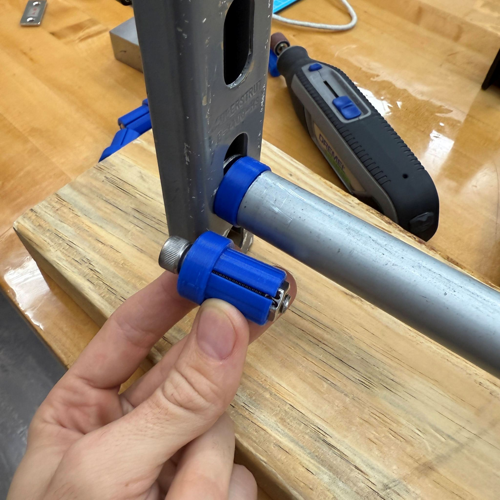

In the video below, it's a show-and-tell of EMT conduit related parts in-hand, telling how they fit, how to choose them, the mechanics of tightening tube to boxes, and the properties of the materials.  This video should make you ready to choose parts to suit your needs and get building.
<iframe width="300" src="https://www.youtube.com/embed/n3na6mTBLvA" title="Highly Engineered EMT Conduit Parts to Study Before Designing" frameborder="0" allow="accelerometer; autoplay; clipboard-write; encrypted-media; gyroscope; picture-in-picture; web-share" referrerpolicy="strict-origin-when-cross-origin" allowfullscreen></iframe>

## Panels

Panels deserve a section and this is where design-for-manufacturing revs up.  If we always design panels for easy fabrication, then we can prioritize panel materials that are easy to fabricate, and easy to design with.

**Expanded PVC Panels**
Also known as PVC foam. The introduction video shows how to cut it, bond it, choose it among other panels, and how it behaves.  Watch this video for an introduction to Expanded PVC.  My tips:
* choose 6mm thickness
* mark with pencil, cut with utility knife
* bond using PVC cement, with nearly any other material. 

<iframe width="1250" src="https://www.youtube.com/embed/M7CvLJcEAds" title="Expanded PVC for Engineering Designs - a powerful material" frameborder="0" allow="accelerometer; autoplay; clipboard-write; encrypted-media; gyroscope; picture-in-picture; web-share" referrerpolicy="strict-origin-when-cross-origin" allowfullscreen></iframe>

## OTP-Parts
_keyword off-the-print or OTP parts, also #printegrated for future discussion as of feb 2025_

Let's introduce OTP parts and their implementation as an overall method to enhance a lab: Some engineered parts in the lab have recurring instances. The parts have parametric designs, and each instance is unique.  These items, such as a simple load-bearing hinge, are driven by parametric models that allow us to 3D print a new copy for a new need, and rapidly adjust the size & shape for exactly the needs of that assembly.  We get a fully engineered assembly or system that matches a custom design intent, from an engineering effort that was refined in the first copy of the part. For those designs, I'm publishing our best-try at the parametric model suited for general users to copy & reproduce in their own applications.

Using the [hinge_V2](https://grabcad.com/library/hingev2-1) as an example, I can explain the impact on our lab. This hinge is used first on the toolboxes for give us nested racks that add tool storage and convenient access to the box. (Why? Fit more tools, more available, easier to reach & replace quickly). The same hinge is used again, with adjusted geometry, to connect the assembly that holds & displays datasheets for capturing videos and making notes. Each place where the hinge is adjusted and re-used, we gain a solution that was not available from off-the-shelf parts. Or, it was impossible to get a result with matching reliability & robustness.

These model-driven parts meet such wide-ranging needs that they are worth highlighting in discussion, so readers can find and learn how to use them.  The parts can save thousands of dollars or give you access to more space, better safety, better organization, etc.  They also give you control to exact a solution you may need, for your specific space.  I'll just call these parts off-the-print parts, reminiscent of OTS (off-the-shelf) parts because they are similar to OTS in these ways: 1) they're easy to grab-and-go, they are low cost, they have very wide ranges of application for each part, and they are globally available.  Also each part is far from custom in function, and highly custom in your selection available to you.

- 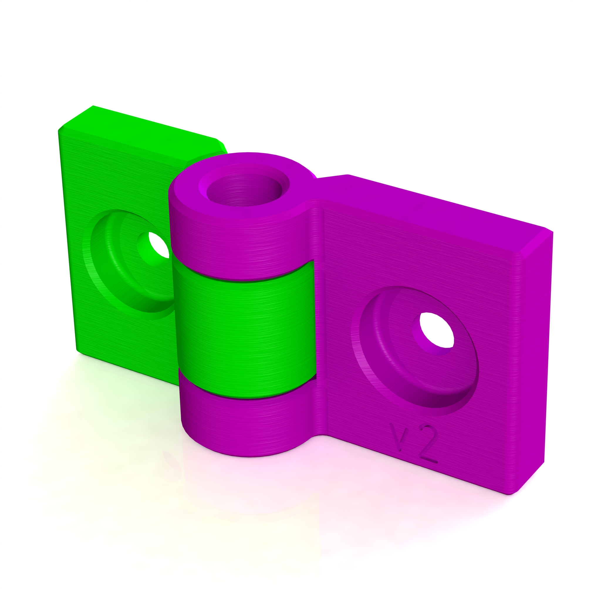
- 
- 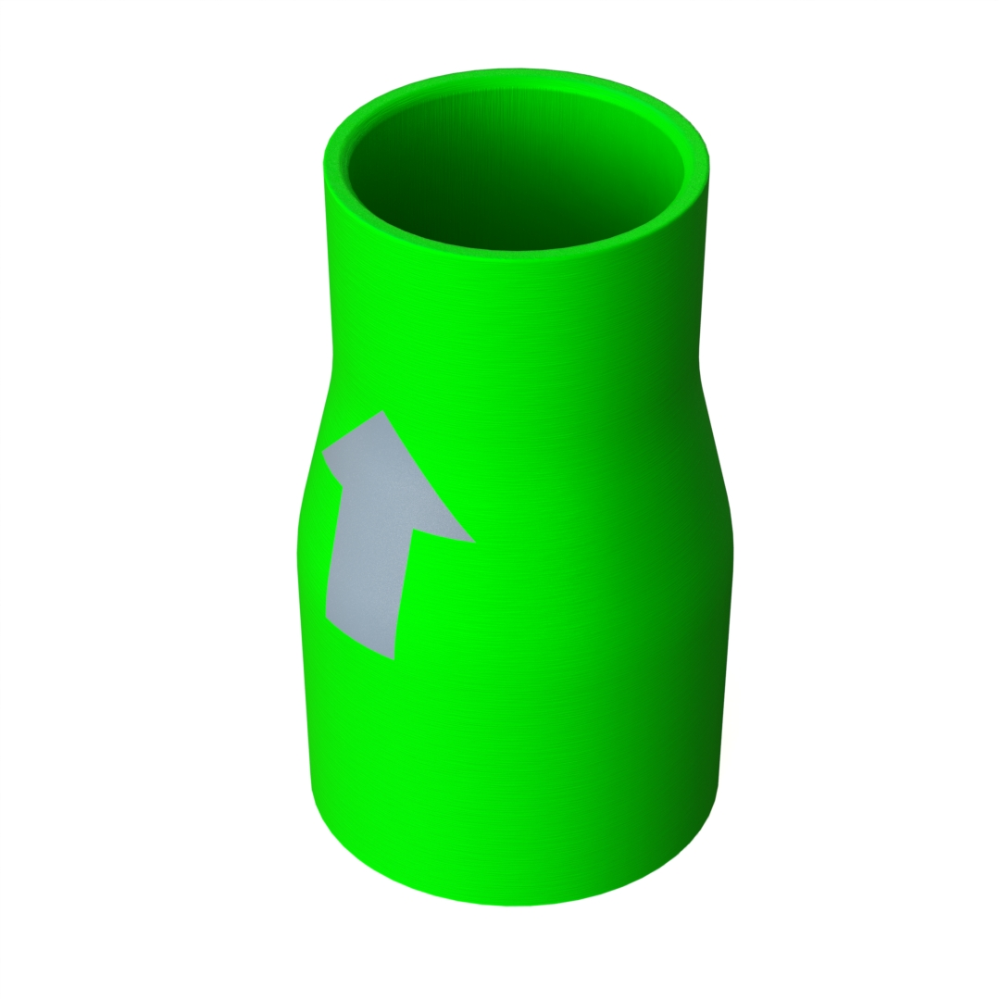
- 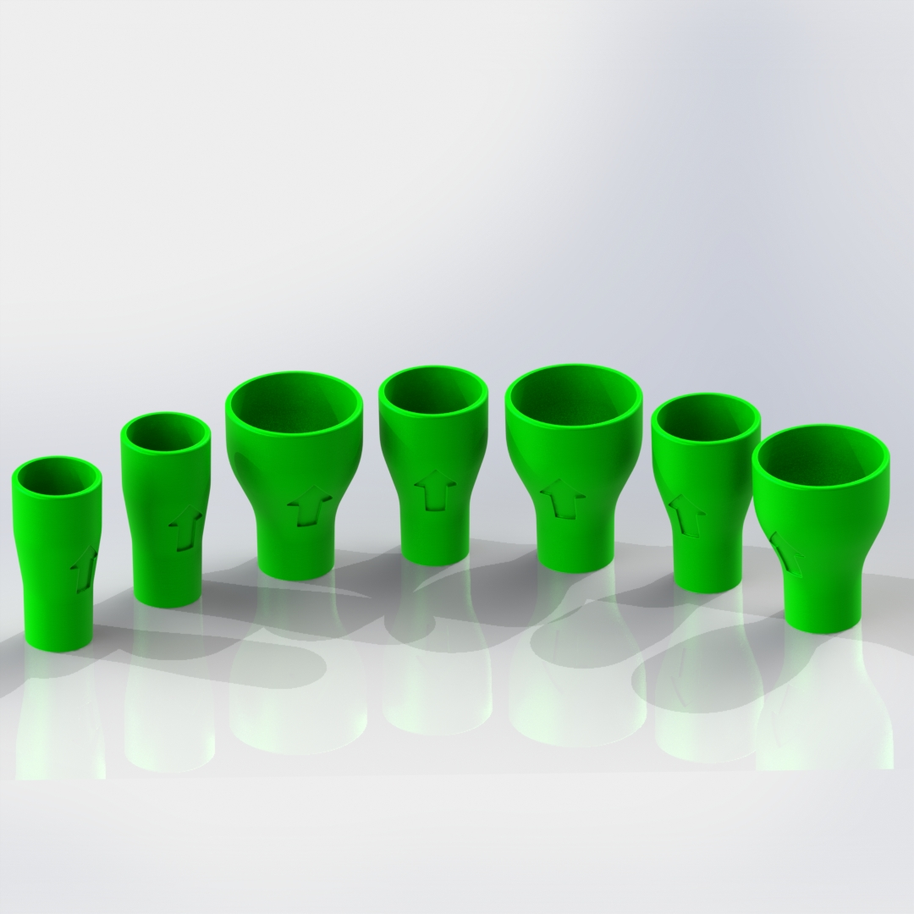
- 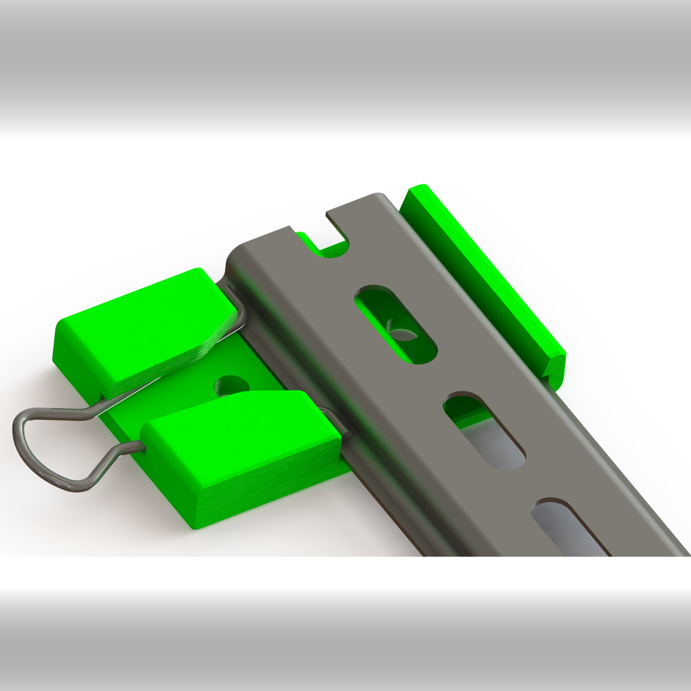
- 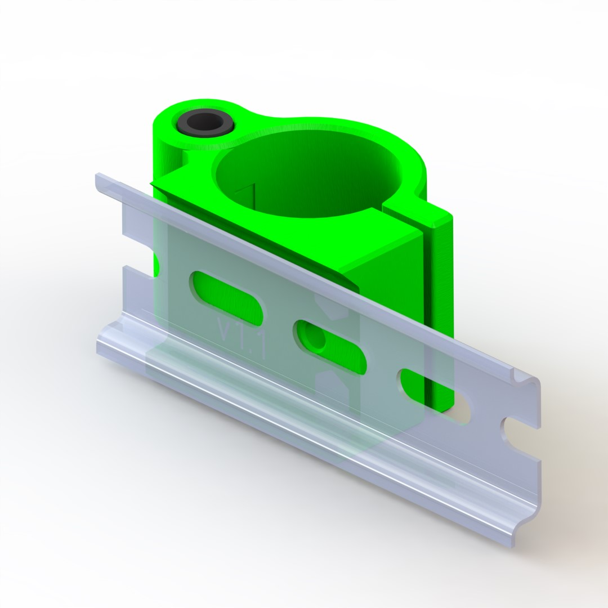

**OTP Joining** parts are underway as of 2025.09. These designs are templates to guide you in designing structurally sound 3D prints that mate with standard geometries and carry loads. Two examples are "mandrel" and "sleeve."  The mandrel fastens to a steel EMT conduit - it's a template for attaching any size of tube with a fastener, to your assembly.  It's tested to hold over 150lbs in the shear direction.  The sleeve is bonded with superglue to fiberglass rod and offers a load-bearing attachment point.  I'm adding the keyword: printegrated, to refer to this style of printable parts that are integrated with standards.  Repositories for [mandrel CAD here](https://grabcad.com/library/mandrel_v1-1) and [sleeve CAD here](https://grabcad.com/library/sleeve_v1-1) contain models & further details.

- 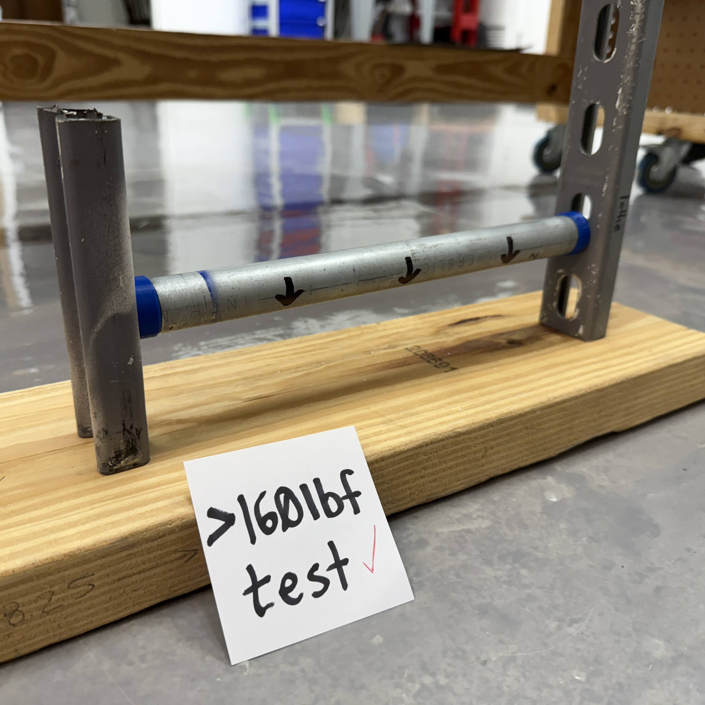
- 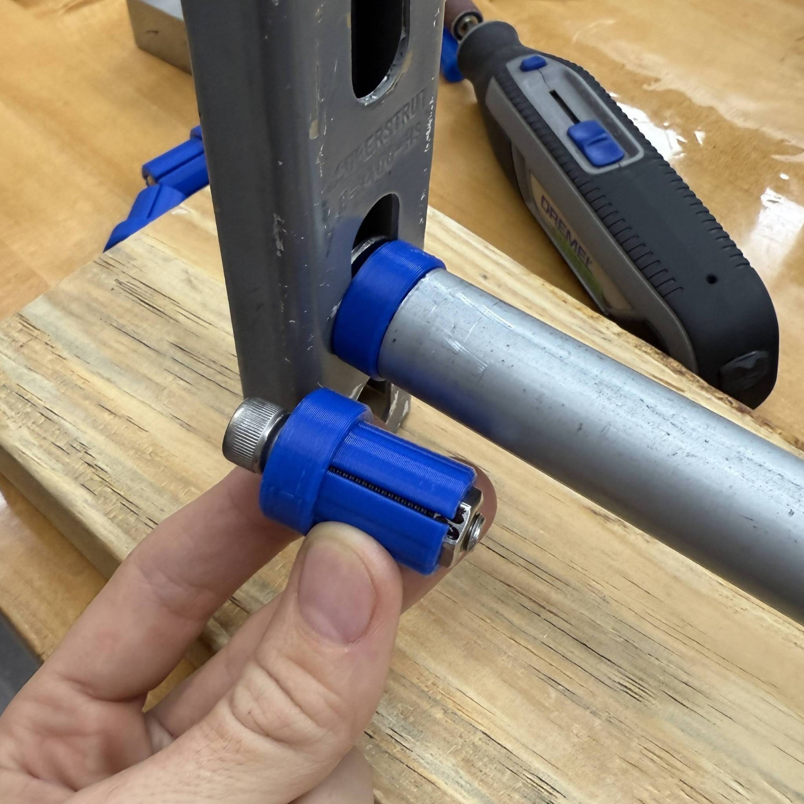
- 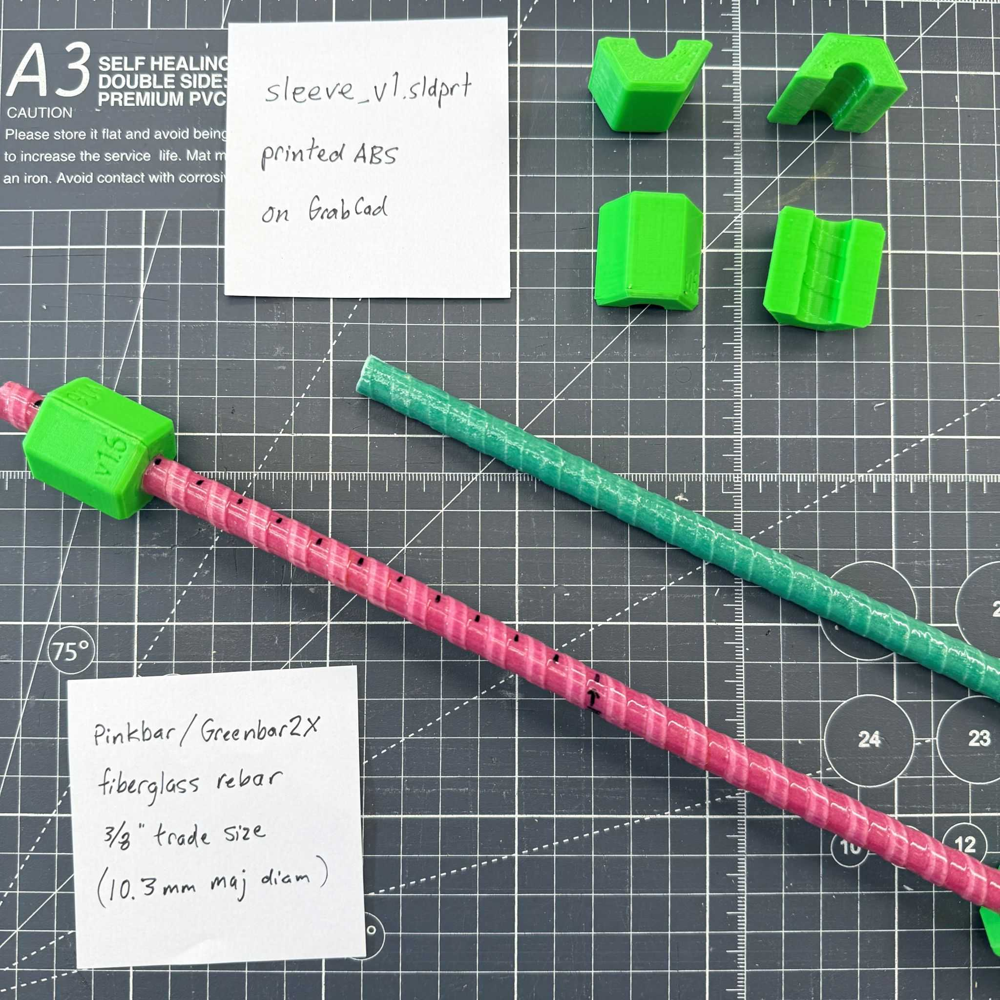
- 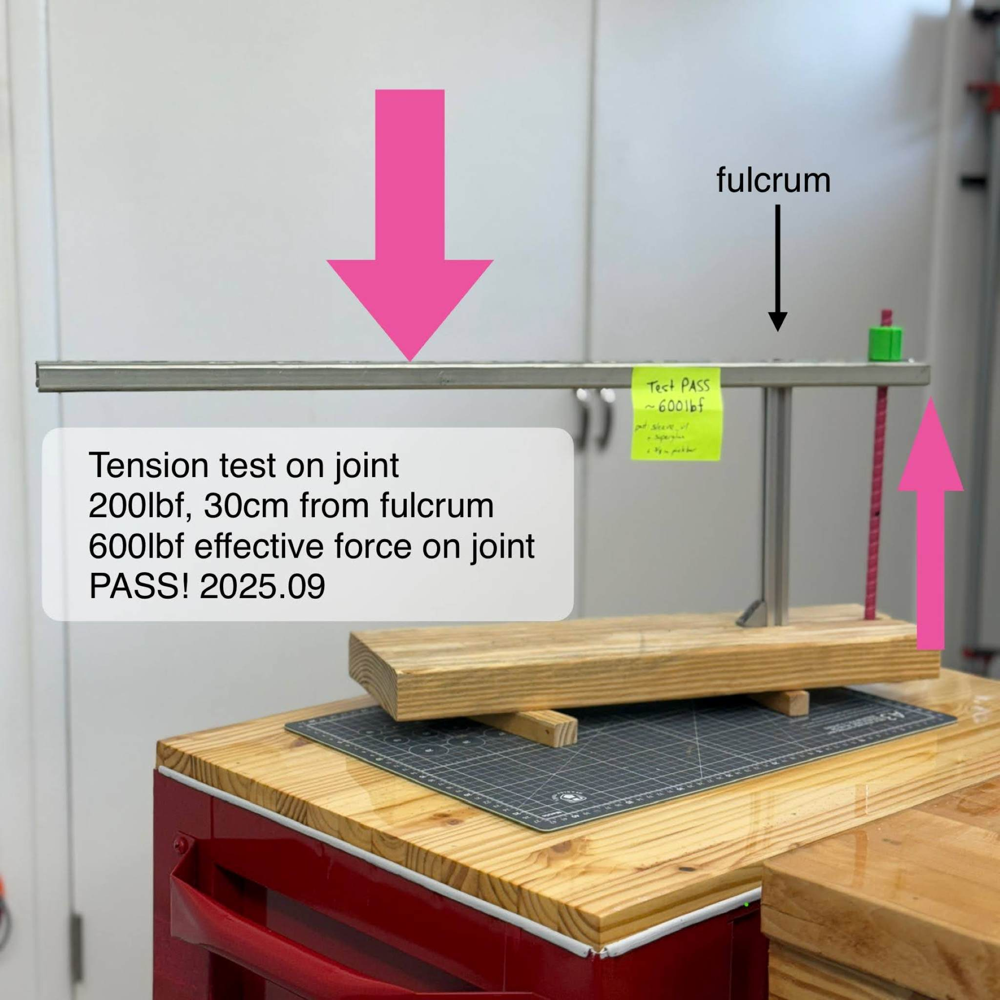

>
> **metal fabrication**
> Before leaping into CNC mills, there is a subset of metal fabrication methods that ought to be understood and practiced.  Let's refer to [SukhbirSkill on YouTube](https://www.youtube.com/@SukhbirSkill) who has published a broad range of methods for metal fabrication. This content creator is based in Bikaner, Rajasthan, India.
> * dissimilar metals - joining by soldering (04:58)
> * roundness achieved by grinding (04:31)
> * gap-filling with solder (04:58)
> * reheating of solder
> * trimming within <1mm (05:10)
> In the video below, find the methods & materials demonstrated for each step listed above.
>
> <iframe width="300" src="https://www.youtube.com/embed/4seJc2lKwoc" title="Powerful JCB behind Banai tractor || Mini Powerful Tractor Back Loader || @Sukhbir Skill" frameborder="0" allow="accelerometer; autoplay; clipboard-write; encrypted-media; gyroscope; picture-in-picture; web-share" referrerpolicy="strict-origin-when-cross-origin" allowfullscreen></iframe>
>
> You will also find in this video: creating a four-bar linkage from threaded rod (5min), integrating a DC gearmotor with a metal enclosure, forming custom pinned joints, and making load-bearing structures.
>

**Short Videos - OTP Parts**
* tube-holder <iframe width="300" src="https://www.youtube.com/embed/PWyZB1nha_o" title="This printed design holds a steel tube where the tube goes. #opensourcehardware #conduit" frameborder="0" allow="accelerometer; autoplay; clipboard-write; encrypted-media; gyroscope; picture-in-picture; web-share" referrerpolicy="strict-origin-when-cross-origin" allowfullscreen></iframe> |
* fiberglass joint <iframe width="300" src="https://www.youtube.com/embed/SVHGuEITloo" title="3D Printed Joint is SUPER STRONG! With cheap fiber rods" frameborder="0" allow="accelerometer; autoplay; clipboard-write; encrypted-media; gyroscope; picture-in-picture; web-share" referrerpolicy="strict-origin-when-cross-origin" allowfullscreen></iframe>video |

## Airflow
_Airflow is fundamental to your lab and you have more power to control it than you realize.  How do we ventilate fumes?  How do we clean up dust?  How do we extract dust from the air?  How do we make our vacuums work for us, so we can focus on building?_

** Vacuum Systems **
This particular design reappears throughout the lab.  It is a simple adapter for vacuum hoses and attachments to allow universal fitment as you need.  Universal fitment comes from your customization of the design, rather than one-size-fits-all.   Download the parts on grabCAD for customizing or printing.  [Link to GrabCAD parts HERE.](https://grabcad.com/library/adapter-52)  Keywords: parametric, tube, hose, pipe, flow, nozzle, connector.

- 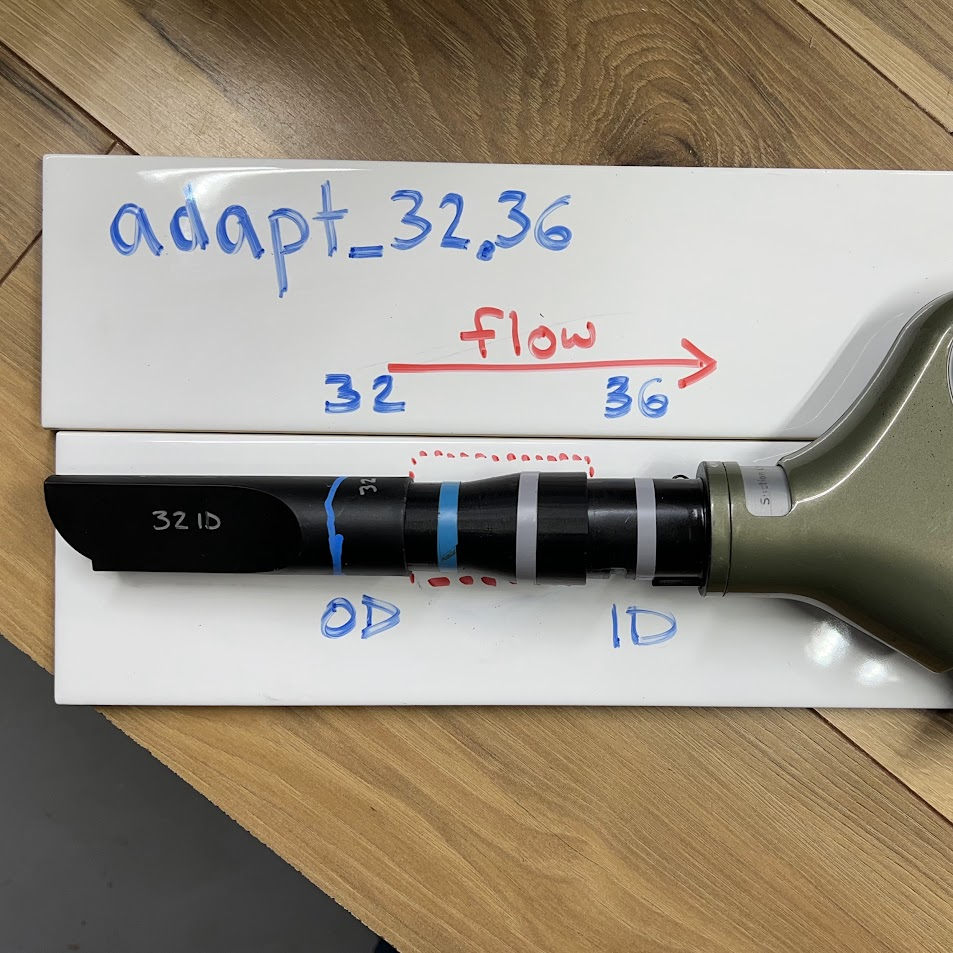
- 
- 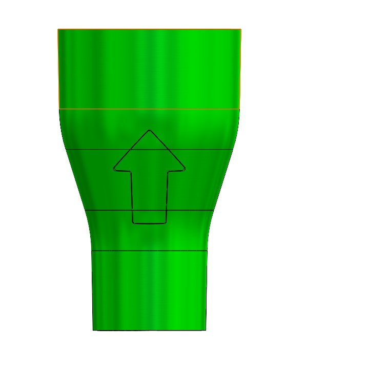

This adapter is a simple design, but it can be incredibly important to simplify millions of labs and make things work better.

#### Intro video
An excessively technical video about a vacuum adapter.

<iframe width="600"  src="https://www.youtube.com/embed/wWQ2x0hBkBY?si=Mk61fEGe3ejZZGO6" title="YouTube video player" frameborder="0" allow="accelerometer; autoplay; clipboard-write; encrypted-media; gyroscope; picture-in-picture; web-share" referrerpolicy="strict-origin-when-cross-origin" allowfullscreen></iframe>

## Bonding
_Adhesives are everything.  Please consider this info carefully._

To benefit from adhesives we need a complete design-methodology reset. How would you change your design methods if you could trust a bond to outperform the properties of its' materials?  Two parts can now be one part, after manufacturing, and the impact cannot be overstated.  We can build things never imagined in the 1900s. With bonds that exceed material strength,We have over 10 years of adhesives research to share with the community.  As of 2025, we have 10 years of novel best-practices to share with the world, and get further feedback to refine the methods.

[2025.09 Bonding Guide Draft PDF](https://github.com/davidmalawey/openLab/blob/d06d0a1b5ddcd02dc7e80e1ec11b800954070d18/docs/2025_bondingGuide.pdf)

This year you can expect:
* more videos to explain bonding for our favorite materials
* tables of data on bond strength
* tables of characteristics for cured adhesives
* more descriptions of use-cases that are utterly underutilized
* carryover of professional engineering methods into ordinary workspaces
  * with classroom-level budgets safety considerations

The images below show the highest-priority materials to test, having the most ubiquity, versatility of function in multidisciplinary design as of 2025. These materials were tested together with ABS printed parts in the most recent trials 2025.10.  Two primers and three adhesives, in various combinations, gave the greatest performance.  The bonding table, last revised around 2024 is summarized in the final image.

- 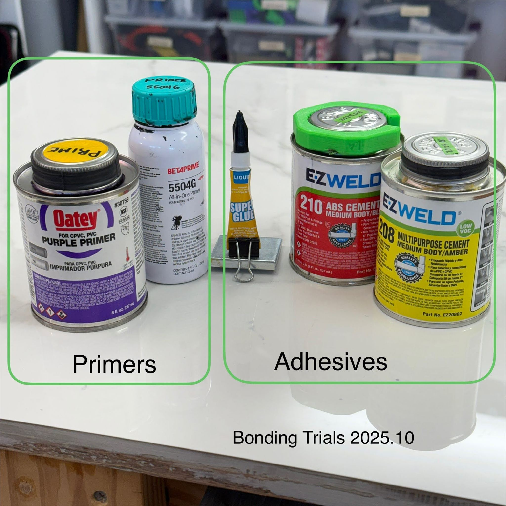
- 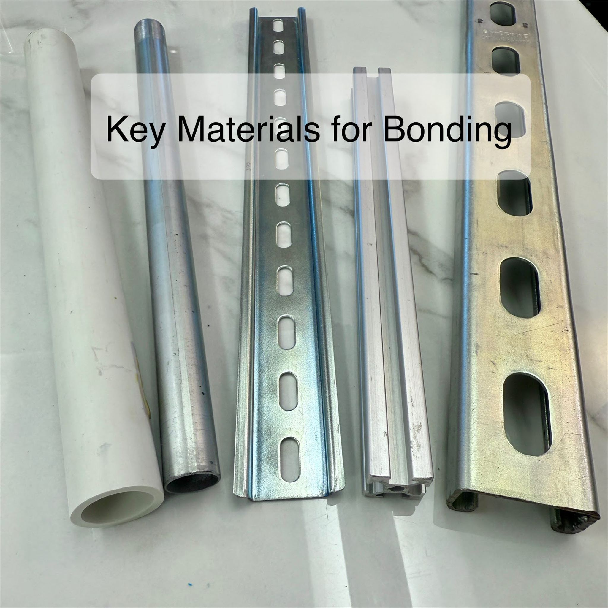
- 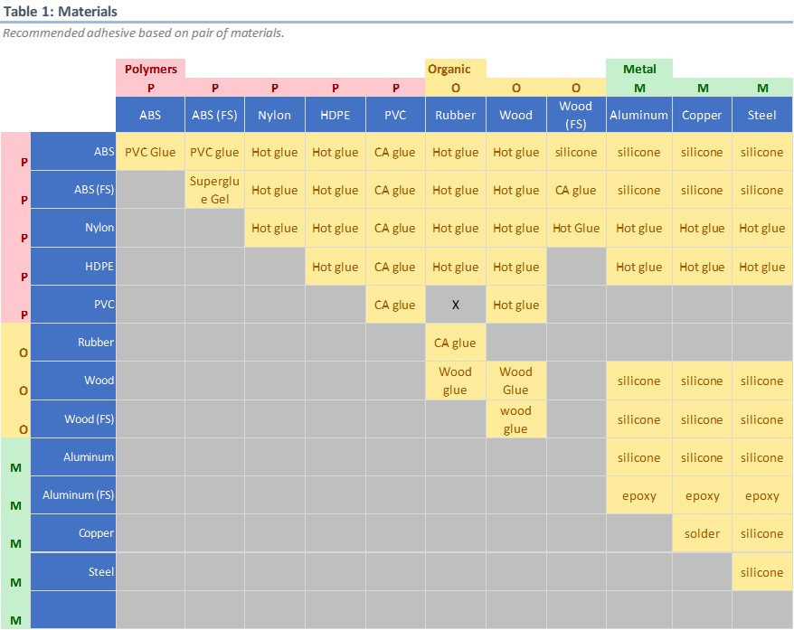

See photos from the latest trials below, which primarily uses a testing sample called "testbar."  The bonds are subject to shear loads mainly, and this pair of sample + stock material has a result that can quickly qualify if the glue/material combination is satisfactory.  Testing instruments aside, if you can crack the parts free with arm-strength it's likely below 40-lbs on the pull-test.  Download the [Test Bar Geometry on grabCAD]( and run tests at home to help the community!

- 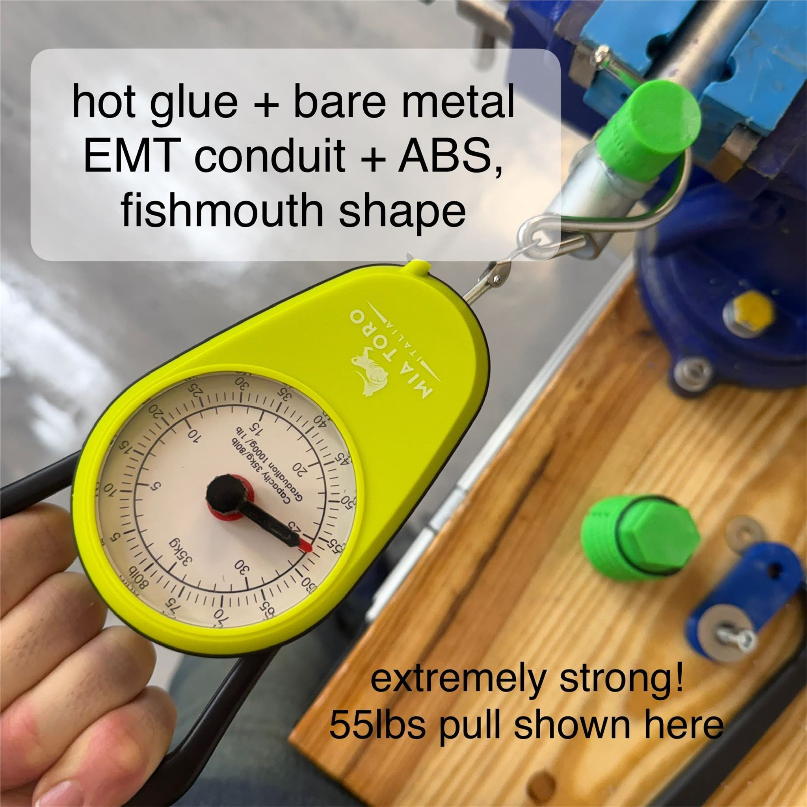
- 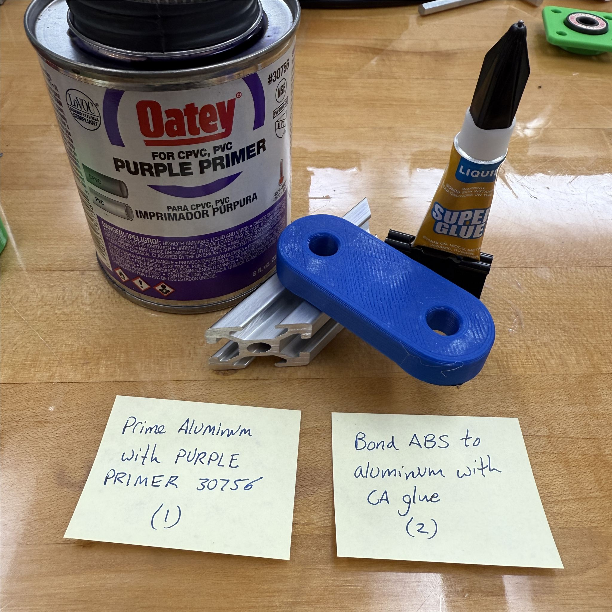
- 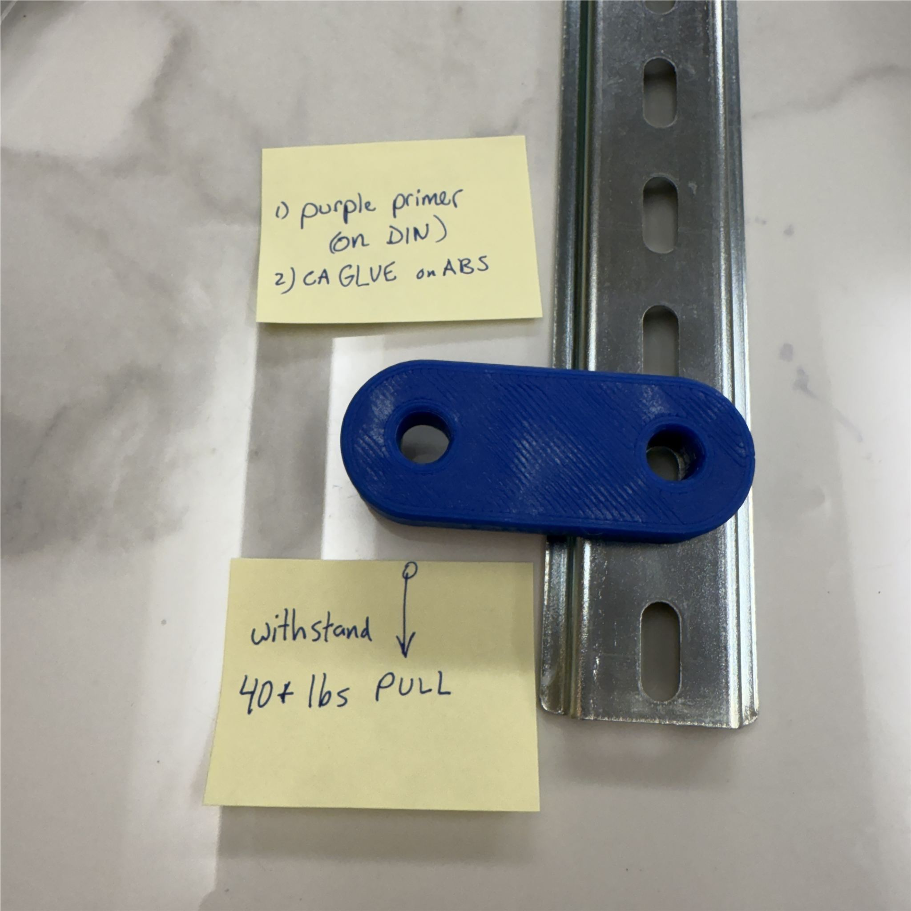
- 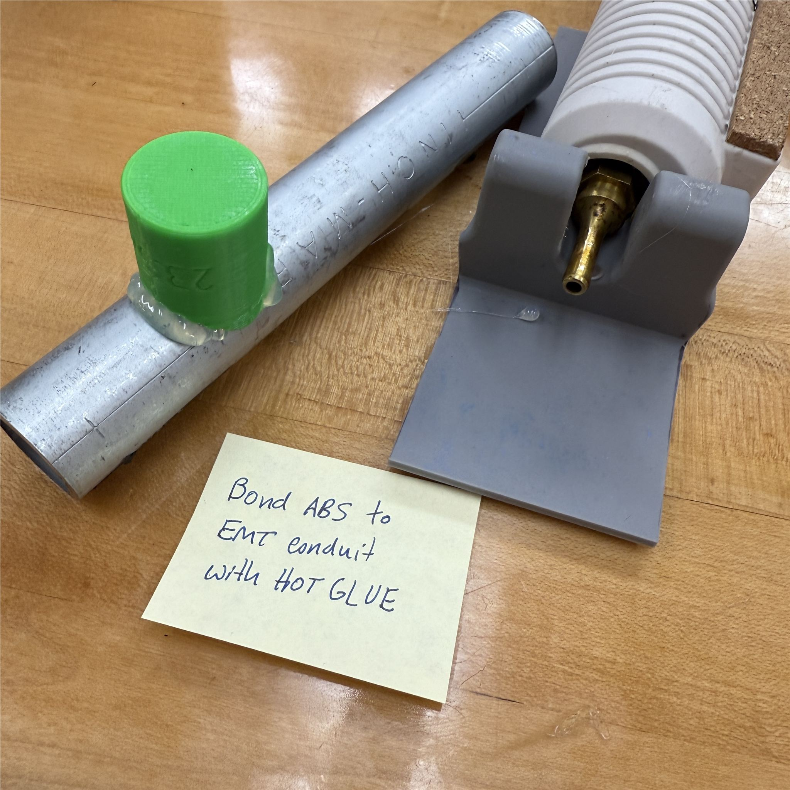
- 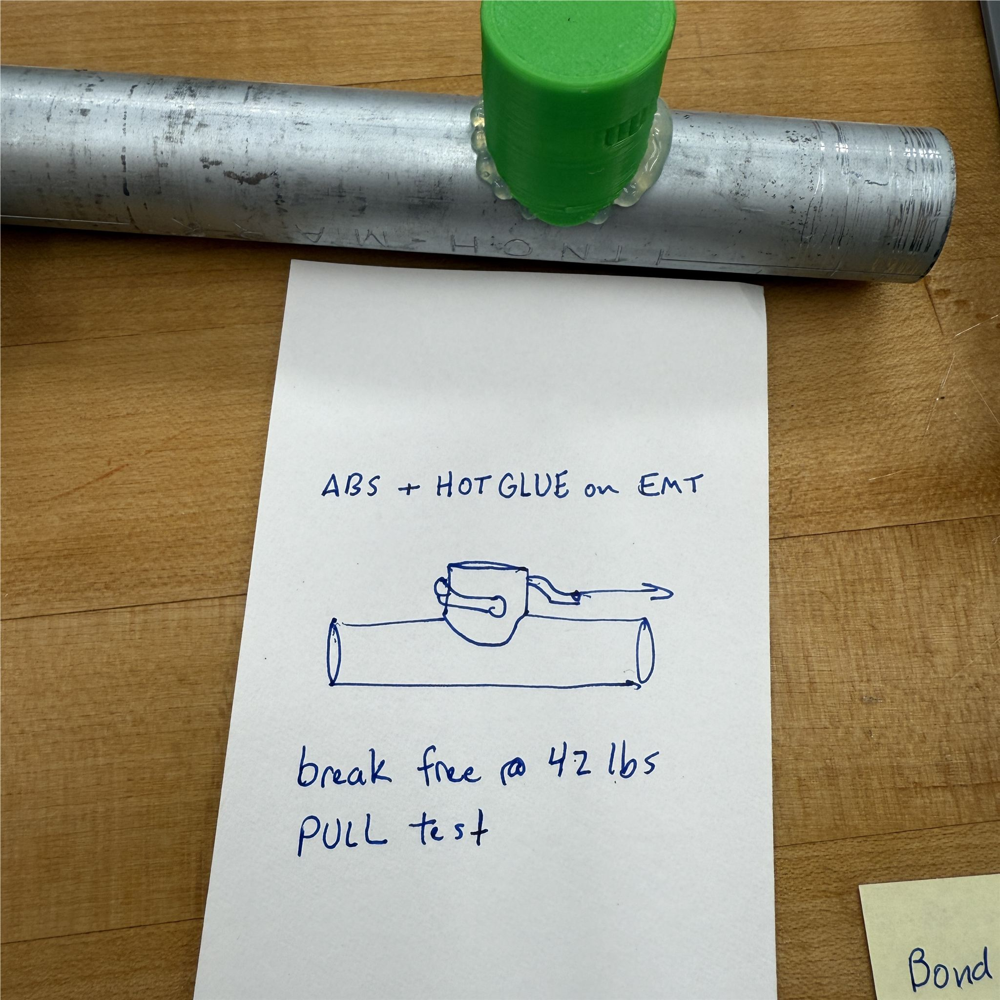
- 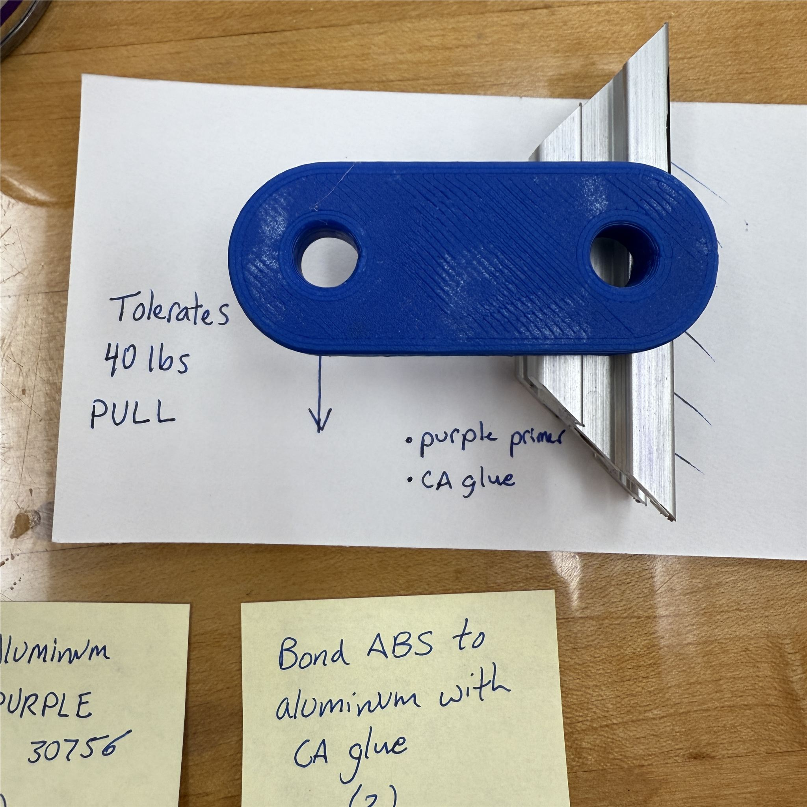

## Holes
The following video spans hole-making for precision and accuracy in almost every material you need to prototype with.  Jump to [How to Make a Hole on YouTube here](https://youtu.be/Xxm6rC0z3ts) or view the embed below.
* An array of cutting tools for holes
* An array of methods that grant precision to hole-cutting
* An array of materials for which a repeatable hole-cutting method is presented.

<iframe width="600" src="https://www.youtube.com/embed/Xxm6rC0z3ts" title="How to Drill a Hole in Metal, Plastic, Wood, and Laminate" frameborder="0" allow="accelerometer; autoplay; clipboard-write; encrypted-media; gyroscope; picture-in-picture; web-share" referrerpolicy="strict-origin-when-cross-origin" allowfullscreen></iframe>
  
#### Intro Video
An introductory level instruction on selecting adhesives, in youtube video.

<iframe width="700" src="https://www.youtube.com/embed/ob6ZYFVlByg?si=XZ-UslSzjGqNhHFL" title="YouTube video player" frameborder="0" allow="accelerometer; autoplay; clipboard-write; encrypted-media; gyroscope; picture-in-picture; web-share" referrerpolicy="strict-origin-when-cross-origin" allowfullscreen></iframe>

## Maintenance
Methods implemented continually for preservation of clean spaces, functioning tools, repeatable daily needs met.

## Corrosion Control
We control the humidity to protect circuits from corrosion and tools from rust.  Here are some pointers.

**My method:** In the sensitive drawers, I add a hygrometer.  Cheap, simple, long battery life and constant readout.  This tells me the moisture control is working, if the drawer humidity is less than the outside.  Usually the room might be 50% RH and the drawer is 40%.  Great.  That means if I drip a little water in the drawer or if a draft opens up in the room during rain, that drawer has capacity to absorb whatever moisture enters before it condenses on the tools.  The drawer contains a moisture absorber of A) silica or B) Calcium Chloride.  Silica is reusable, but it's much harder to trust it's working.  So, we take a year to look for trends.  We can keep the hygrometer together with the absorber, and get a feel for how long it lasts - maybe 1 or 2 months. 

**For bare steel tools** - these are so good at rusting they can almost be indicators of humidity.  I clean it up with abrasive scrubber and BKF, then I dry it and spray some corrosion inhibitor on that.  If I notice a tool rusted, I gather it's friends from the same drawer and give them a spray.  If you rest them on a towel the fluid displaces water, then the water dries.  Hot water heats the tool and enhances this.  I sometimes dry the tool in my 3D printer on preheat - then you guarantee no moisture goes back into the drawer.  Project Farm made an excellent [video on rust](https://youtu.be/lyWHF4NoNVk) with real-world testing, coatings, and WD-40. 
Weight scales help you detect moisture. Weigh the silica bags to check their mass before and after using.  Expect to see 20% weight gain, then replace.

**Corrosion inhibitors** are molecular level agents formulated by whole industries.  Most products are simply lubricant fluids that carry the inhibitors as additives.  I consider SuperLube Corrosion Inhibitor to be the same as WD-40, but with a big dose of inhibitors. It doesn't stop a tool from rusting in the rain, or used daily and splashed - it works great for storage.  If my steel must tolerate rain, then it needs a coat of paint or a heavier wax-like coating. I use CRC as an after-wash spray for any steel parts, screws, or metal that got wet.  Applied Science made a youtube [video that explains corrosion inhibitors](https://youtu.be/VpRrP3sqQLw) in detail.

**Observations:**  
1) The tool chest with 5 drawers and 3 absorbers: They last longer than the toolbox with just one.  The absorber dries it's local drawer significantly and the other drawers a little less.  If they share the job, there's less humidity to absorb.  My toolbox may last 6-12 months with three calcium chloride tubs.
2) Bare steel tools are great at rusting.   Toolboxes with bare steel and with sensitive electronics: (like the sensors box) I add one moisture absorber in a drawer that has space.  It must sit upright.  I've done this 2022 to 2025 and this year I'm testing 100-gram rechargeable bags.
3) Silica gel is hard to gauge. It's common for the new, dry silica product to deviate by 2-5%.  My new, dry, 100g bags range from 100 to 105g.  If it reaches 125g then it maybe still working but I treat it as done.  The drying impact is slower when the bag is near saturated.
4) Calcium chloride is more constant - these product collects fluid at the bottom while the solid particles take on water and dissolve.  with 20% solids remaining, it's still working fine.
5) These products are slow-acting.  In a sealed container, liquid water may take 2 days to evaporate and become absorbed.  That's OK, usually the drying of the air is faster than the moisturizing of the air.

**Amazon Links:**
* [Moisture Absorber, Calcium-Chloride](https://amzn.to/3GjQ7LK) pack of 6 for $21
* [Silica Beads Bag 100g](https://amzn.to/42jTkmg) reusable bags
* [Barkeeper's Friend](https://amzn.to/4m9H2Uw) powdered cleaning agent for rust (excellent)
* [Hygrometer 6-pack](https://amzn.to/40sVaAe) cheap and reliable moisture indicators
* [Superlube 83110](https://amzn.to/3Iko1B5) corrosion inhibitor spray

Photos with my favorite corrosion inhibitor, the rechargeable silica bag, weigh scale, and hygrometer.

* 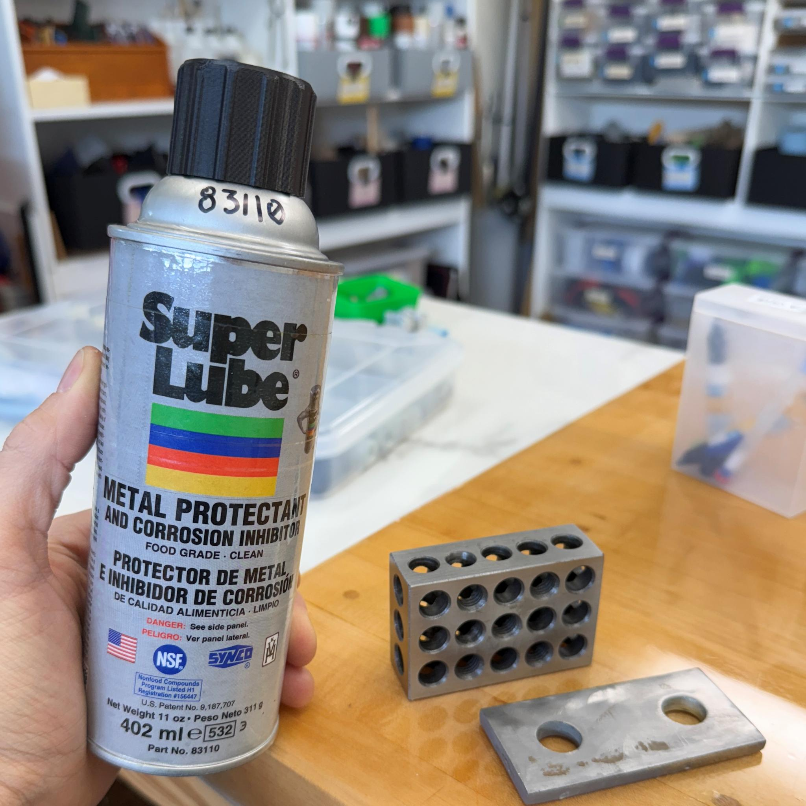
* 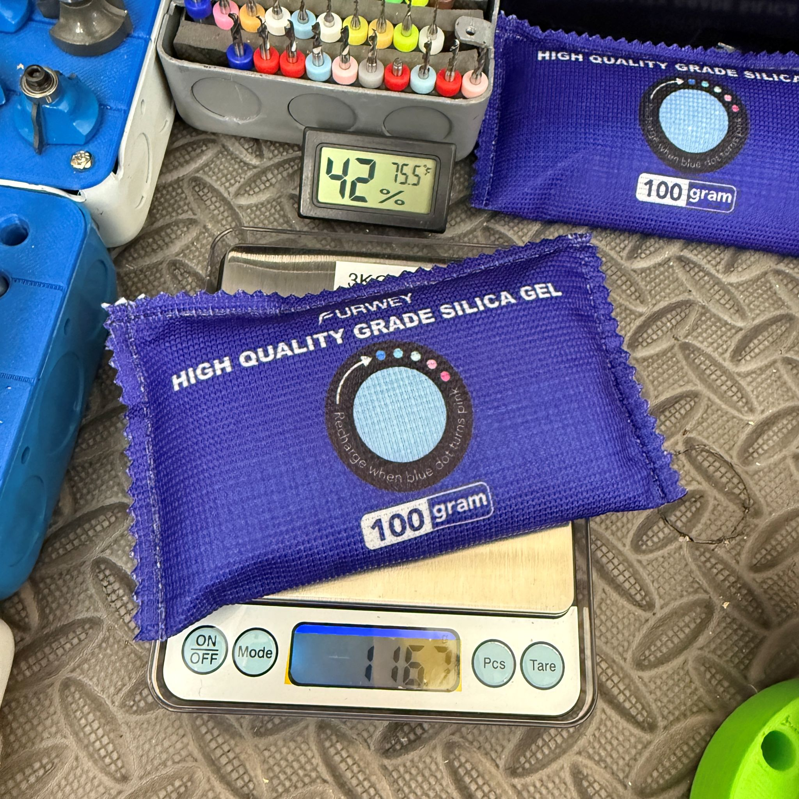
* 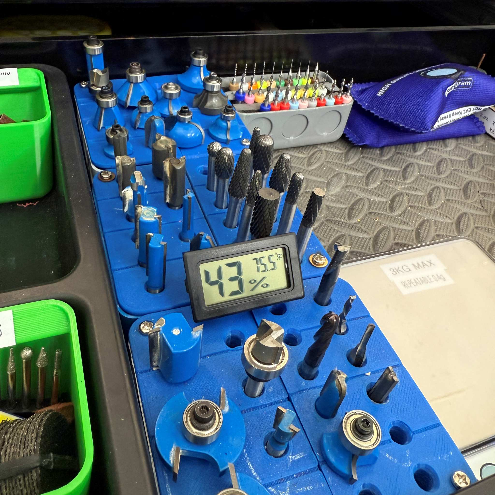

## Benchtop Testing

This is a versatile starting point for your benchtop testing panel.  It is equipped with today's electronics for testing and calibrating actuators, and modified tomorrow for the next task. Right now, probably a million students & researchers have wires sprawled on a desk to test and build electronics.  And for most of those projects, we can eliminate errors & failure modes by structuring our testing.  See the photos below for this assembly design for a benchtop / desktop test panel.  With the help of the global community, we can produce simple designs to quickly 3D print and snap together any test setup in half the time for twice the success, compared with scattered piles of wires on desks.

If this assembly looks complex, our first mission is to educate the world on these basic components which appear everywhere that engineering research is happening: slotted extrusions, 35mm DIN rail, corner brackets and M6 fasteners.  Acquiring these components readies you for making your own test rig, and reusing the same parts for any invention that comes next.

**Download the [CAD model on grabCAD](https://grabcad.com/library/panel-86) for a template benchtop frame.**

* 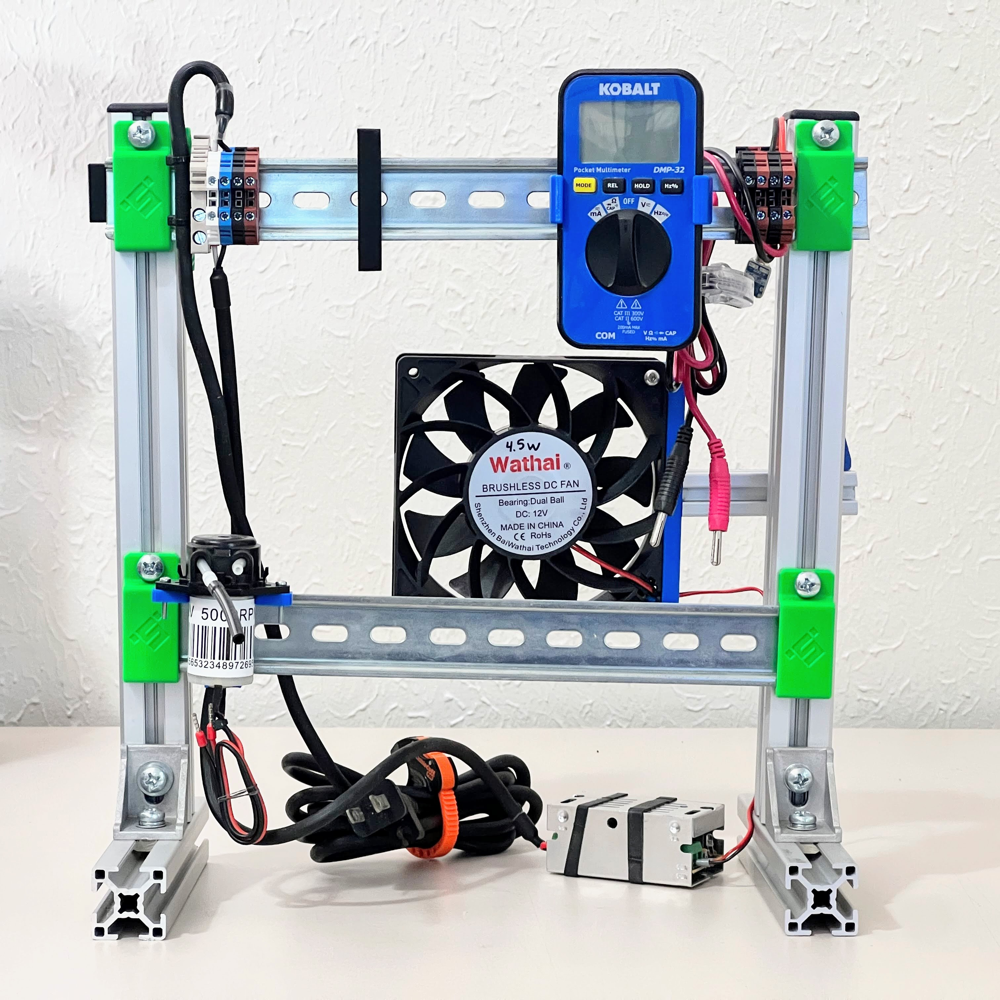
* 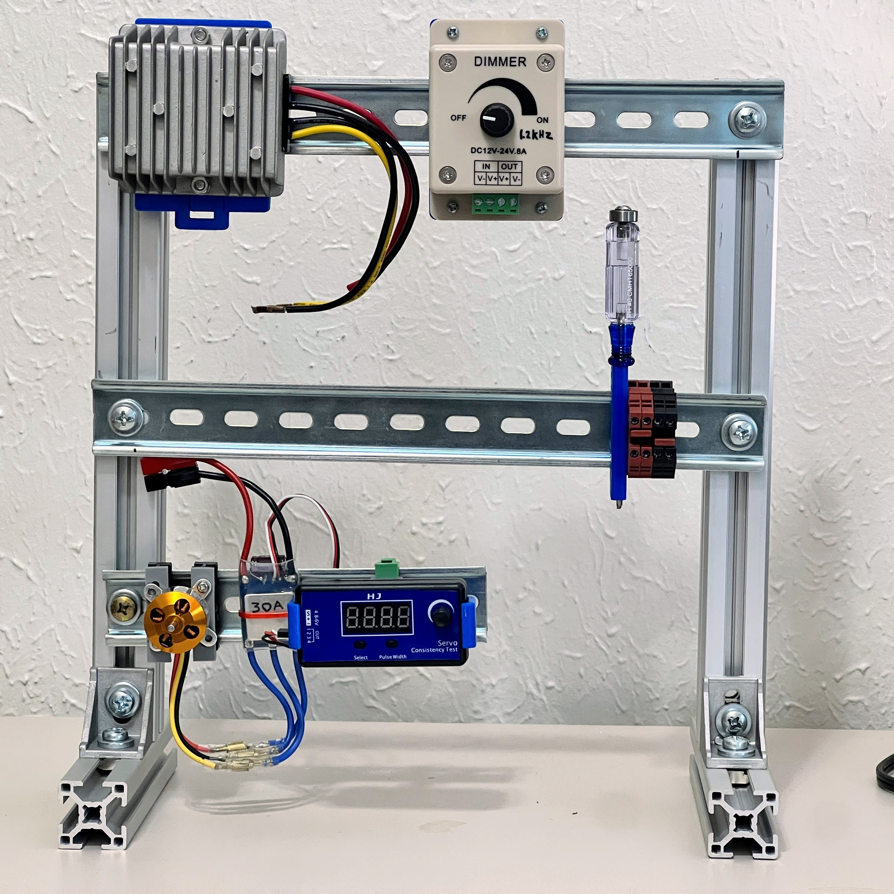
* 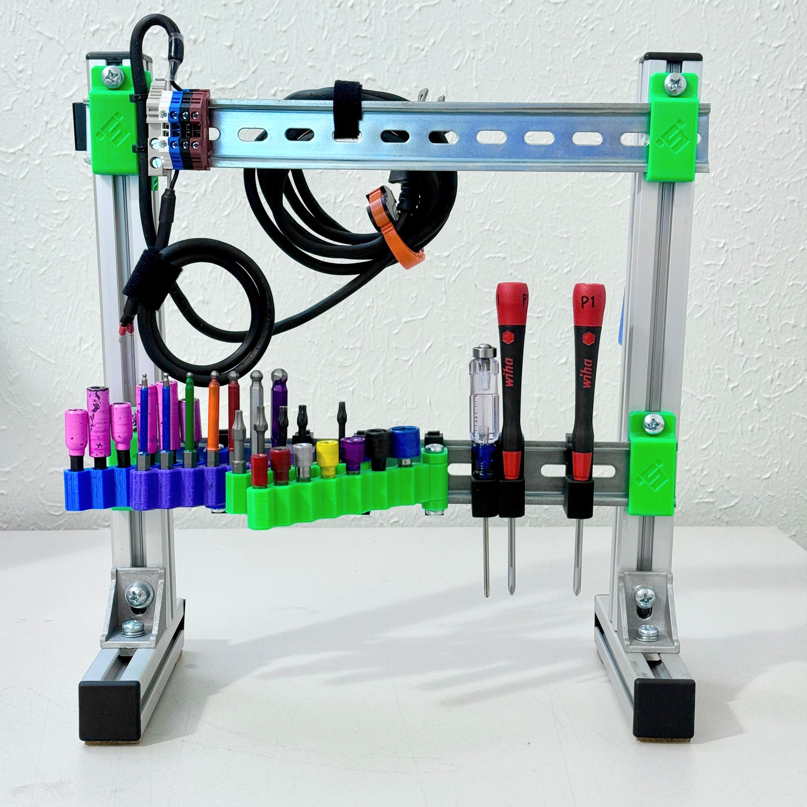
 
