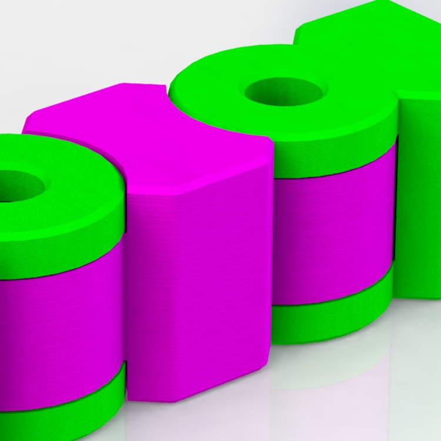
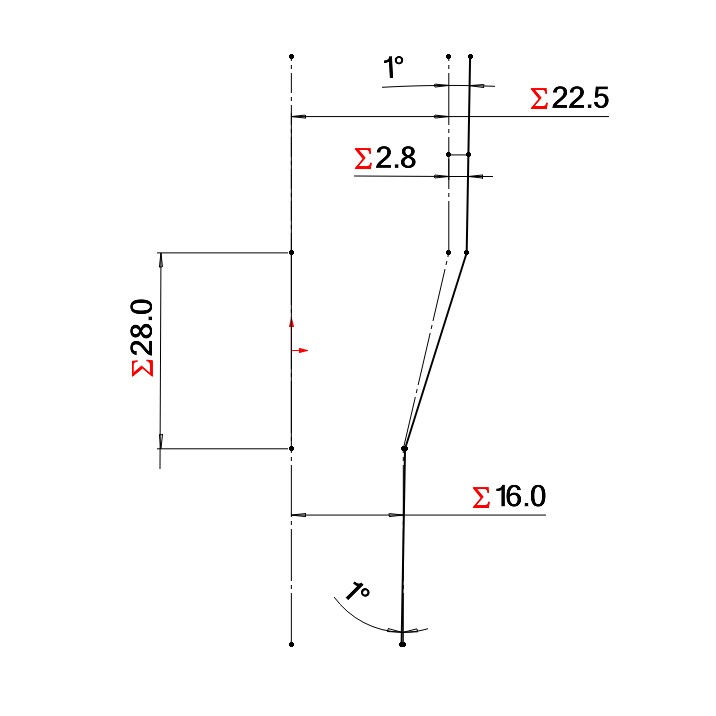

>
> Methods, for engineering, fabricating, and building.  Engineering consists of design, evaluation, benchmarking, parts-research, and documentation. Fabricating consists of constructing parts from raw materials, and building refers to all technician-level activities.  Methods offer standard instructions that can be applied to multiple different actions, in the overall engineering process.
>

## Published
Publications, or published methods: These are whole collections of methods combined into subject-focused reports.  Here I will attach various documents such as workshop slides, instruction sets, or topic research data.  As of Feb 2025, I would like to post all of the relevant information directly in this repository, but this may take years.  To speed up the process, I will upload several publications that I used in the past decade which carry clusters of key info.

### Additive Mfg
**Additive Manufacturing** or AM for short. These slides come from my presentation to an international gathering in Saint Etienne, France in 2019.  The university (ENISE) hosted a 3D printing "summer school" with several speakers and I presented on practical applications for additive manufacturing.
The knowledge up to this point came from about 4 years in FDM printing and 2 years in Metal printing.  My role at Texas A&M included support for undergraduate projects in functional mechatronics devices, and graduate researchers projects in metal sintering, ablating, and melting.

[Slides - AM Practical Applications, 2019](https://github.com/davidmalawey/openLab/blob/c622927094335e10a5a4ff06f1d90047ed1be2ec/docs/2019_AdditiveManufacturingSlides.pdf)
* 56 slides
* methods for design geometry
* postprocessing
* materials selections
* failure modes for metal printing
* brainstorm for viable parts in metal

### Automation
Methods of automation come from industrial side and embedded side.  Embedded automation consists of familiar projects like Arduino circuits.  Industrial automation consists of machines with higher power, more often fixed in place, and usually with wired communication.  These are rarely found together as of 2020, and we want to change that. 

## Industry_4.0
Blended automation or Industry 4.0 are appropriate terms for this category.  For Blended automation we will blend the simple off-the-shelf circuits with the traditional industrial systems for automation, like in Manufacturing plants. This topic deserves a great deal of documentation, but let's start with existing content from 2021.  The video below demonstrates a combination of embedded and industrial automation systems.  As I document further in the OpenLab, it will look more like the video over time.  You should see the piecewise elements (relays, IoT devices, etc) explained until this video is easy to understand from the ground up.

<iframe width="700" src="https://www.youtube.com/embed/30GM4m-Lyec" title="Program a PLC with Conveyor, Arduino and Industrial Robot" frameborder="0" allow="accelerometer; autoplay; clipboard-write; encrypted-media; gyroscope; picture-in-picture; web-share" referrerpolicy="strict-origin-when-cross-origin" allowfullscreen></iframe>

## Recent
In this section, starting 2025 I can begin to write key methods directly into the openLab webpage.  -David M

### MOLLE

Molle is a set of standardized configurations for portable gear, frequently found in military equipment.  Embedded in the MOLLE standards are 99 great ways to solve our lab arrangements, and I have started to learn as of 2025 January.  It's encouraged for community members to discover along with me, how we can use these interfaces (clips, straps, grids, hooks) to solve problems with lab organization.  I have implemented only a little bit of this into the Lab as of today, but it will continue for many years.

Here's the kit I purchased on Amazon first: [molle accessory kit](https://amzn.to/4iDgNov)

_Image of one MOLLE equipment set I purchase on Amazon, November '24_
- 
- 
- 

### Extruded Framing

Aluminum framing is popular in research labs, engineering facilities and academic spaces and has been expanding in use for several decades.  Several of our lab stations are built around 3030 framing, with a profile of 30 x 30 mm.  By 2025 it is available from retailers like Amazon.com but we source it from an industrial supplier.

Industrial vendors like AutomationDirect give more consistency in product specs over time, they maintain a single-source manufacturer, and they offer specifications & CAD models that match the product with a guarantee.  For design engineering it is best to have a full dataset to work with.  I was pleased with AD having extremely fast free shipping in the USA, and free custom cut lengths including 45 degree angles.  If you plan your framing design ahead of ordering, they will make all the cuts for you.  Each supplier may have slightly different profiles that impact a refined design.

For examples, I included a few common designs in one GrabCAD upload to see them side-by-side.  You can see [the models from grabCAD here](https://grabcad.com/library/extrusion-variants-3030-1)

**Product Links**
* Amazon, 1 meter lengths [product for 99 usd](https://amzn.to/41P8K1Y)
* AutomationDirect (preferred) [product with custom cut length](https://www.automationdirect.com/adc/shopping/catalog/structural_frames_-z-_rails/t-slotted_rails/30-3030c)
* McMaster Carr (expensive but reliable) [product with unique geometry](https://www.mcmaster.com/47065T101-47065T412/)

- 
- 
- 
_Left to right: popular extrusion variants, a simple frame built from 3030, and fastener hardware options._

## OTP-Parts
_let's call these parts off-the-print or OTP parts, for future discussion as of feb 2025_

Let's introduce OTP parts and their implementation as an overall method to enhance a lab: There are a few engineered parts in the lab with recurring instances.  The parts have parametric designs, and each instance is unique.  These items, such as a simple load-bearing hinge, are driven by parametric models that allow us to 3D print a new copy for a new need, and rapidly adjust the size & shape for exactly the needs of that assembly.  We get a fully engineered assembly or system that matches a custom design intent, from an engineering effort that was refined in the first copy of the part.   For those designs, I'm publishing our best try at the parametric model suited for general users to copy & reproduce in their own applications.

Using the [hinge_V2](https://grabcad.com/library/hingev2-1) as an example, I can explain the impact on our lab.  This hinge is used in one place on the toolboxes for give us nested racks that add tool storage and convenient access to the box.  (more tools, more available, easier to reach & replace quickly).  The same hinge is used again, with adjusted geometry, to connect the assembly that holds & displays datasheets for taking videos and making notes.    Each location where the hinge is adjusted and re-used, we gain a solution that was not available from off-the-shelf parts. Or, it was impossible to get a result with matching reliability & robustness.

These Model-driven parts meet such wide-ranging needs that they are worth highlighting in discussion, so readers can find and learn how to use them.  The parts can save thousands of dollars or give you access to more space, better safety, better organization, etc.  They also give you control to exact a solution you may need, for your specific space.  I'll just call these parts off-the-print parts, reminiscent of OTS (off-the-shelf) parts because they are similar to OTS in these ways: 1) they're easy to grab-and-go, they are low cost, they have very wide ranges of application for each part, and they are globally available.  Also each part is far from custom in function, and highly custom in your selection available to you.

- 
- 
- 
- 
- 
- 

### Vacuum
This particular design reappears throughout the lab.  It is a simple adapter for vacuum hoses and attachments to allow universal fitment as you need.  Universal fitment comes from your customization of the design, rather than one-size-fits-all.   Download the parts on grabCAD for customizing or printing.  [Link to GrabCAD parts HERE.](https://grabcad.com/library/adapter-52)

- 
- 
- 

To explain all about this adapter I'm recording a youtube video to be embedded below.  It is a simple design but it can be incredibly important, simplifying millions of labs and making things work better.
