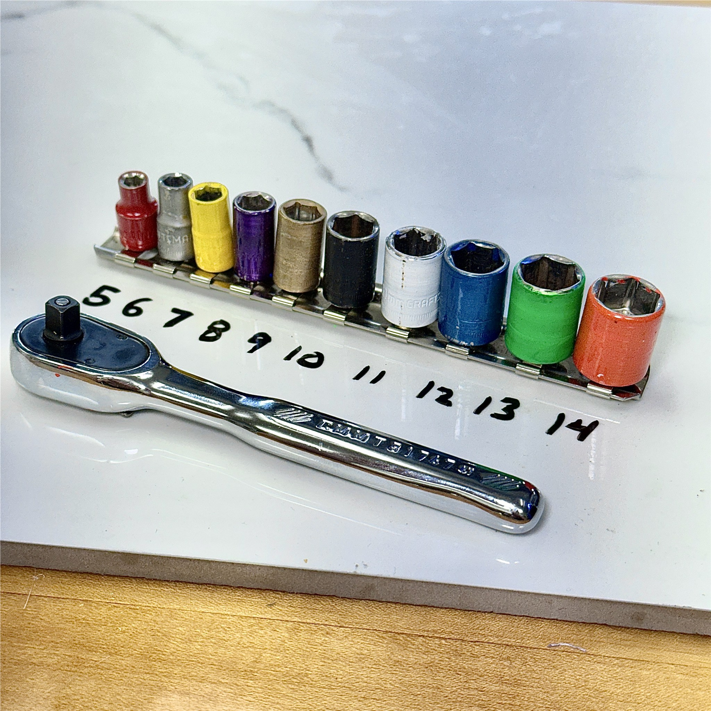
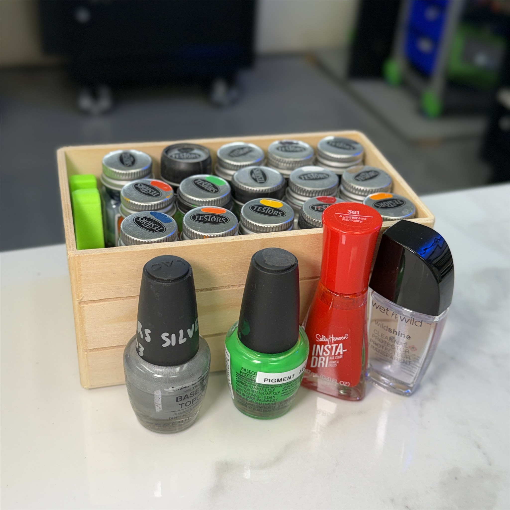
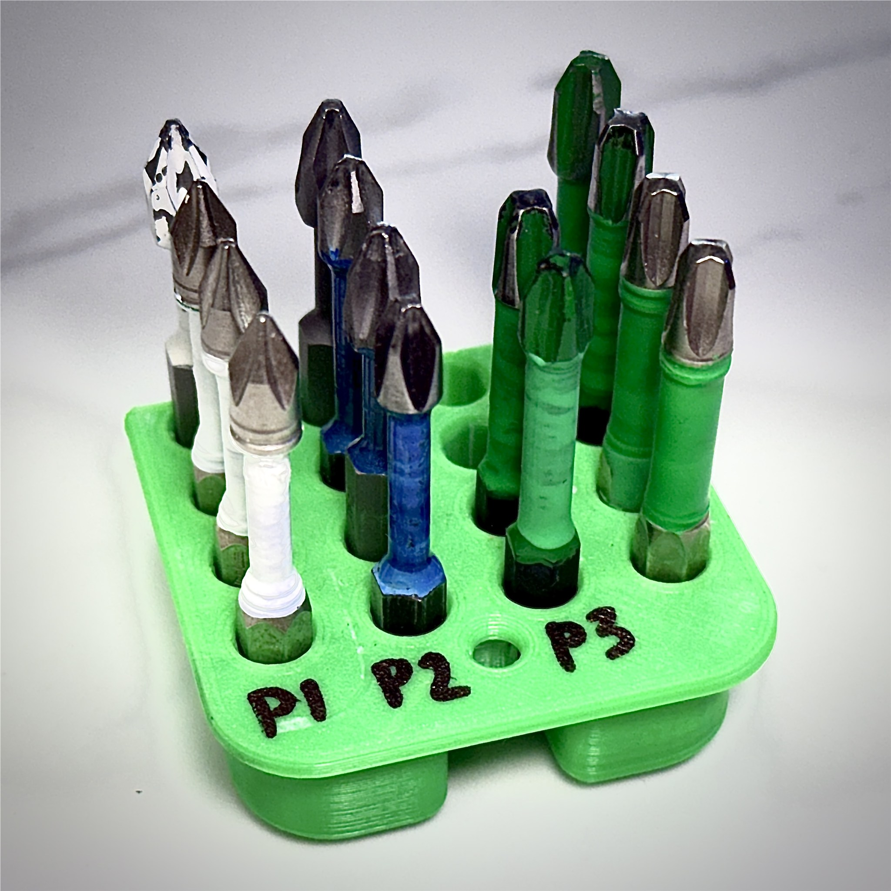
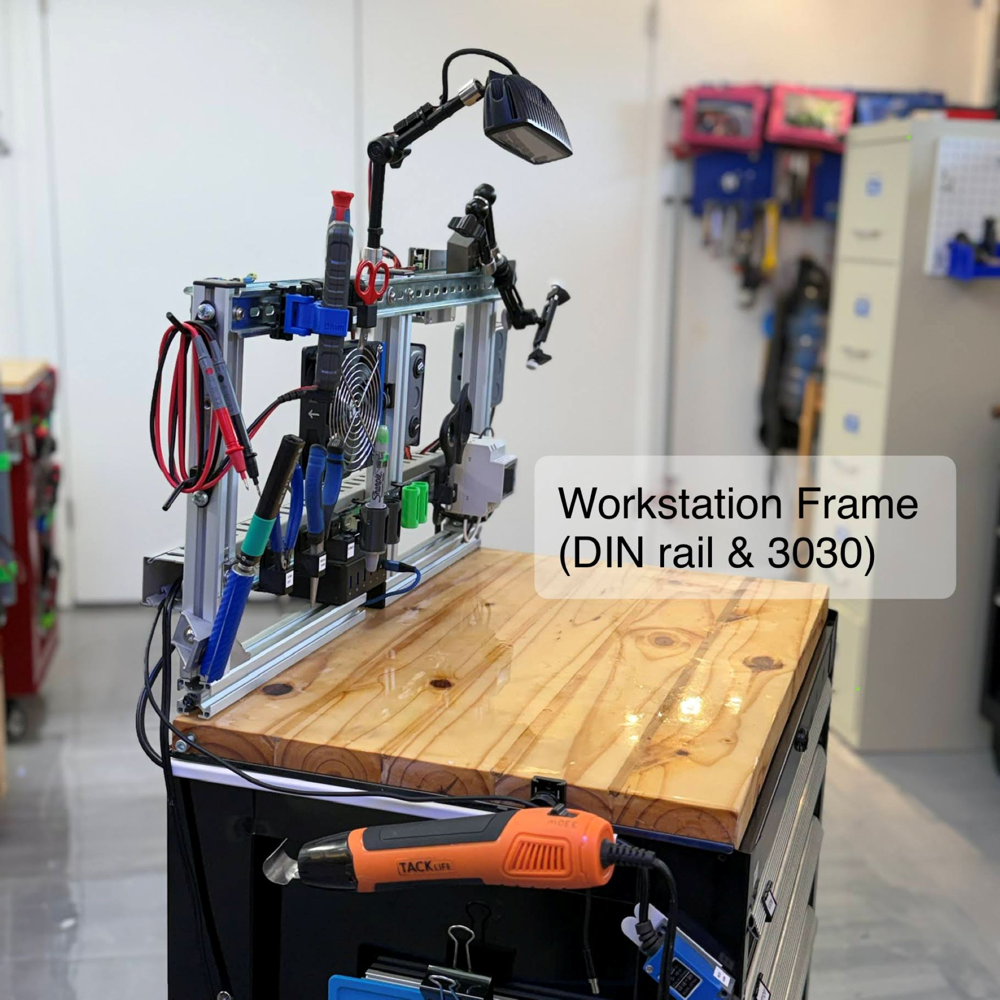
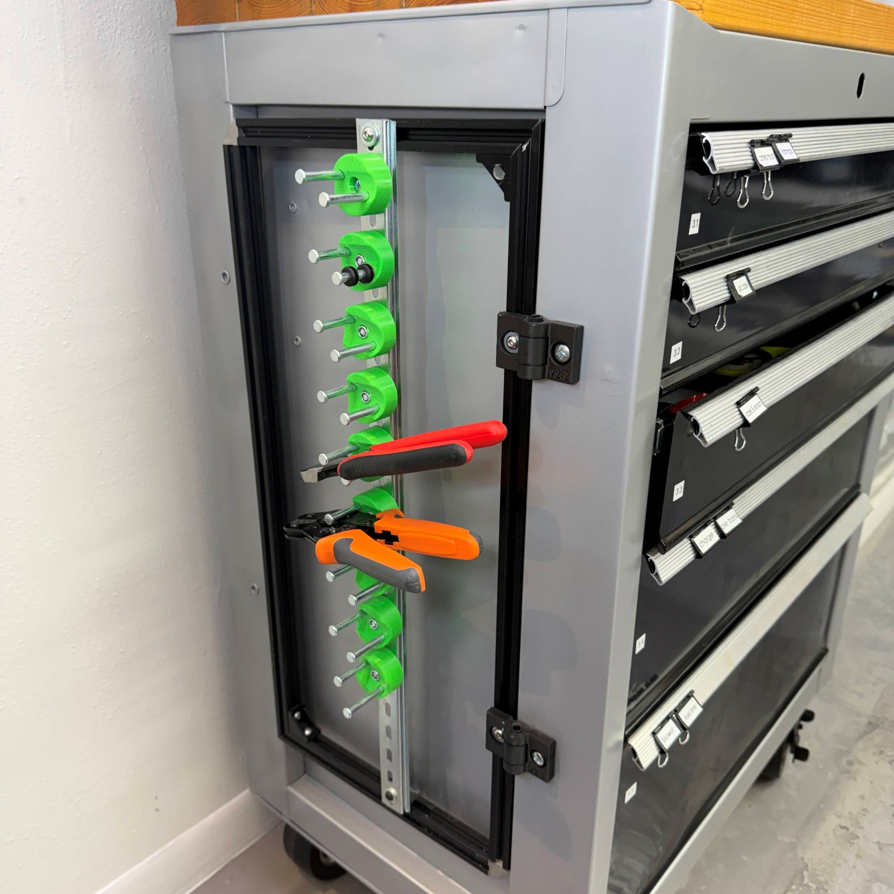
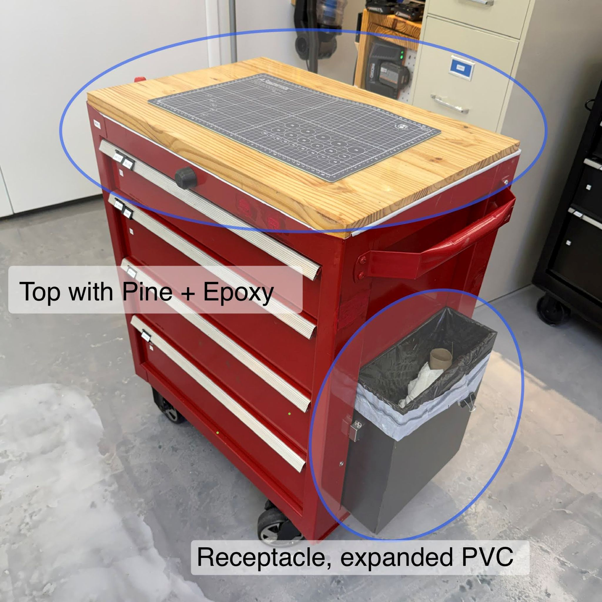

Organizing Strategies for OpenLab

**Color Codes**
Tools and parts are marked as needed with a color code to quickly identify the right tool for a job.  Nail polish can make it quick and easy to label an item on the fly.  The most frequently used tools get a coat of paint and it occassionaly chips which is not a problem, as the color coding still works and saves a great deal of time.  The part is identified by it's last digit such as 13 and 23mm size has the same color (green) as 3mm items.  Below, some of the color coded tools are shown and the box of Testors enamel paints which can be bought individually with a huge number of color choices available online.

- 
- 
- 

The color codes give a simple way to mark tools and quickly identify size.  The color code is as follows:

* 0 is black
* 1 is white
* 2 is blue
* 3 is green
* 4 is orange
* 5 is red
* 6 is silver
* 7 is yellow
* 8 is purple (grape)
* 9 is gold

Color code is applied to items like sockets and hex drivers. The final digit determines the color, so the sockets of 12mm and 22mm are both blue.  It's easy to identify the size difference of 10 milimeters larger.

## Mods
_Modifications for toolboxes and more_

The selected toolboxes are model number CMST-98268-BK and a couple of similar variations.  Since 2010, these boxes held a consistent form factor with minor changes, so the modifications shared here are suitable for plenty of Craftsman models as well as Kobalt, Husky, US General, and more.

>
> **Wood Tops** are easily built from pine 2x4s, bonded with wood glue & (optionally) sealed with 2-part epoxy.
>
> **Swinging Frames** add tool hanging space on the sides, but don't protrude & take floor space.
>
> **Upper Frames** create a workspace for an easy DIY station like soldering or electrical testing.
>
> **Keys** are bonded in a round housing to work like a removable knob. This prevents snags and bent keys.
>
>

* Download the [toolbox CAD Model](https://grabcad.com/library/toolchest-1) to design your own attachments or see how this box fits in your space.
* Learn to drill accurate holes with [this youtube video](https://youtu.be/Xxm6rC0z3ts) for drilling in any material.
* Download the [PDF manual](https://github.com/davidmalawey/openLab/blob/d9d88a53bd458391b65c19579c2a9006a9337a72/docs/2025_manual_RollingToolChest.pdf) for the toolbox containing diagrams, assembly instructions, and other notes by David M
* download the [design markup docs](https://github.com/davidmalawey/openLab/blob/d9d88a53bd458391b65c19579c2a9006a9337a72/docs/2025_toolbox_design_markups.pdf) by David M including hole drilling locations & fabrication notes.

Below, see photos for the wood top, swinging frame, and other mods.
- 
- 
- 

**Key Caps** are 3D printable designs and open sourced as usual.  There are two designs: KeyCap.sldprt for a cabinet key and keyGrip.sldprt for the rolling tool chest.
* Download [CAD Models on grabCAD](https://grabcad.com/library/keycap-2) (posted 2026.04)

- 
- 
- 
