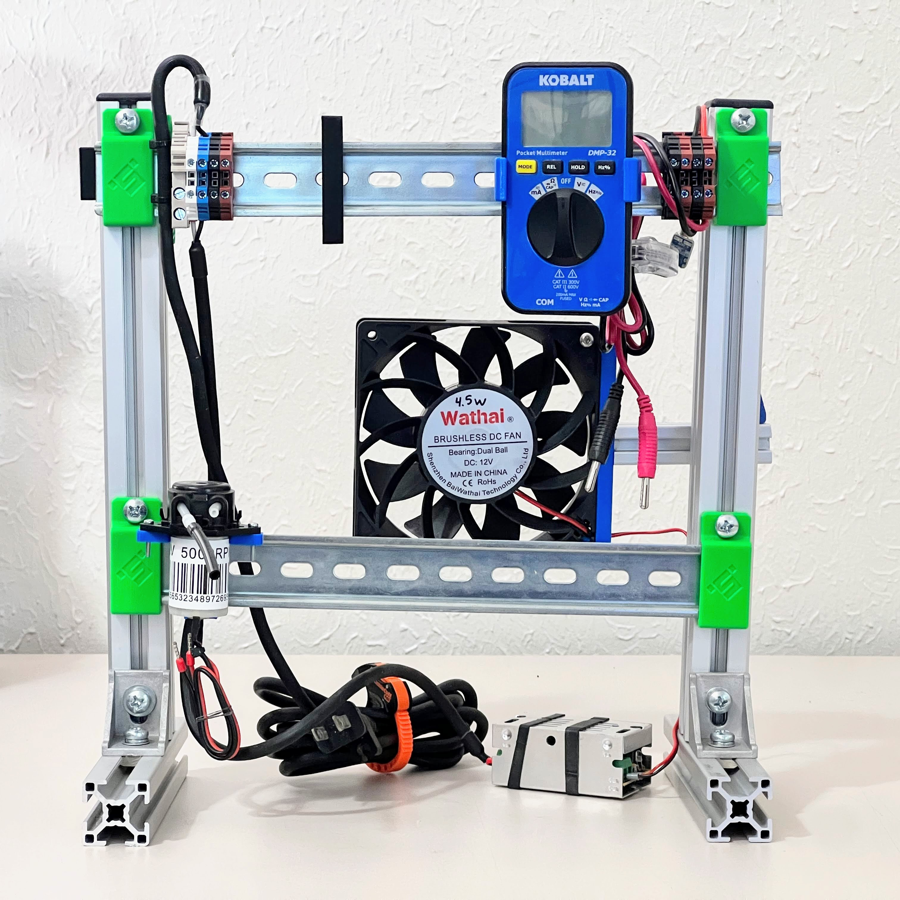
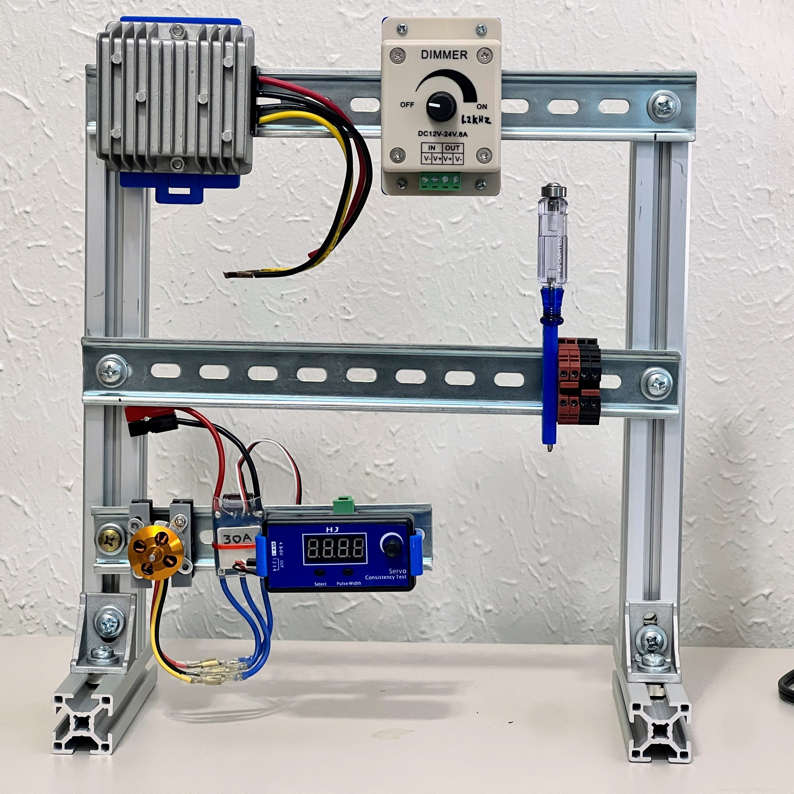
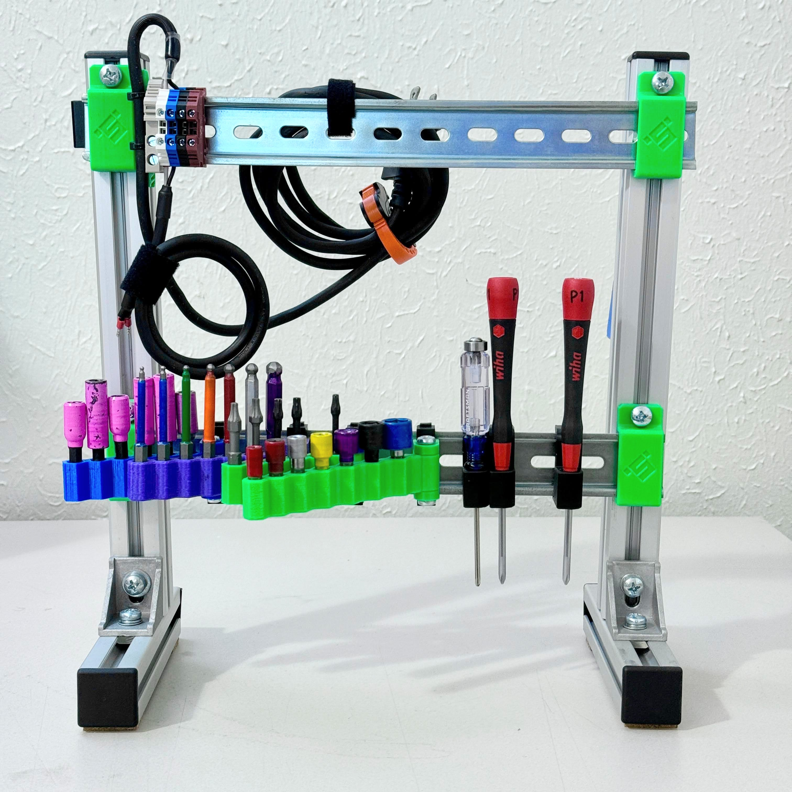

The Power Station is a hub where users can combine electronics aparatus to test mechanical or electronic actuators.
(this page created in 2026.07)

The **Power Station** is made from these basic components, popular in engineering research labs.  Acquire these components & be ready for making your own test rig plus reusing the same parts for your next invention.
* slotted extrusions
* 35mm DIN rail
* corner brackets
* M6 fasteners

---

## Model
**Download the [CAD model on grabCAD](https://grabcad.com/library/panel-86) for a template benchtop frame.**

* 
* 
* 

---

## Build

Build your power station with these rough dimensions:
* Dimension L1 is 305 mm, for the main cut materials
* Horizontal DIN rails = L1 = 305mm
* Horizontal 3030 = 245mm
* Vertical 3030 = L1 = 305mm

_Photos below show the measurements for the simplest station build._

- 
- 
- 

---

## Print
The following printegrated designs make up the brackets to build a power station.

1) [Foot30](https://grabcad.com/library/foot30-1) gives you adjustable leveling feet for extrusions, 3030 size.
2) [Foot30B](https://grabcad.com/library/foot30b-1) is the leveling foot for vertical extrusions.
3) [Corner30](https://grabcad.com/library/corner30-1) is the 90 degree corner bracket to fasten at ends of 3030.

- 
- 
- 

---

## Shop
The preferred fasteners for extrusion framing are listed on this [amazon fasteners list](https://www.amazon.com/shop/davidmalawey/list/FFMW9FI74B3H?ref_=aipsflist)
- 
- 
- 

---

## Videos

Relevant videos to equip you to build a power station:

First, the Extrusions introduction tells what materials are necessary to build with 3030 extrusion, add corners, join aluminum, and select fasteners. 
* [Extrusions Intro Video](https://youtu.be/cLrIE6ltErE)

Next, 18 volt power for your station from a power tool battery.
_This topic includes how to print a battery adapter, add electrical contacts, source the power and route it to outputs: USB and Anderson Connectors, and more._
* [power tool adapter & system video](https://youtu.be/lcV9Wvxn6qk)

Next, a video on fiberglass additions as of 2026 July.  To add strength with minimal cost, you can enhance a frame with diagonal braces using fiberglass rods.  This is demonstrated around 13:00 in the video below.
* [testing parts for extrusion framing](https://youtu.be/quMugovEDo8?t=767)

- 
- 
- 

This is a versatile starting point for your benchtop testing panel.  It is equipped with today's electronics for testing and calibrating actuators, and modified tomorrow for the next task. Right now, probably a million students & researchers have wires sprawled on a desk to test and build electronics.  And for most of those projects, we can eliminate errors & failure modes by structuring our testing.  See the photos below for this assembly design for a benchtop / desktop test panel.  With the help of the global community, we can produce simple designs to quickly 3D print and snap together any test setup in half the time for twice the success, compared with scattered piles of wires on desks.

