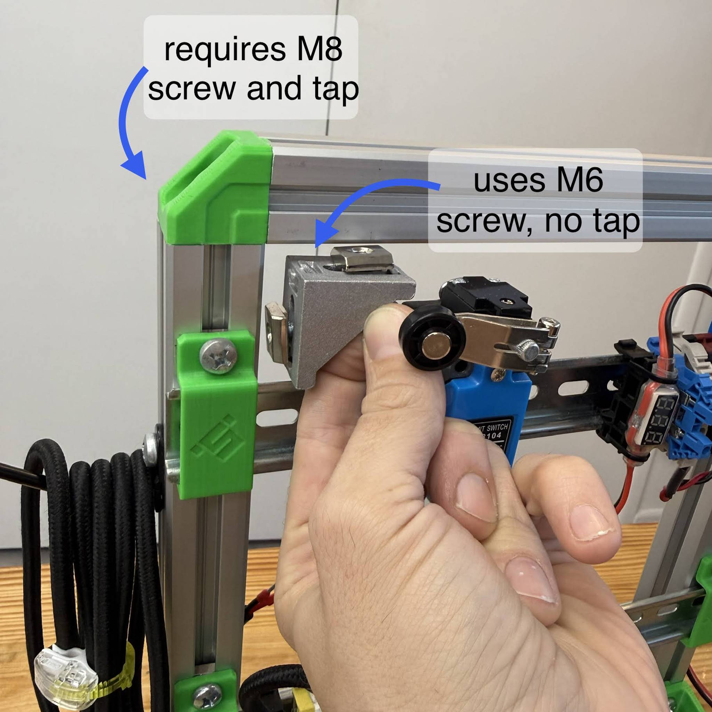
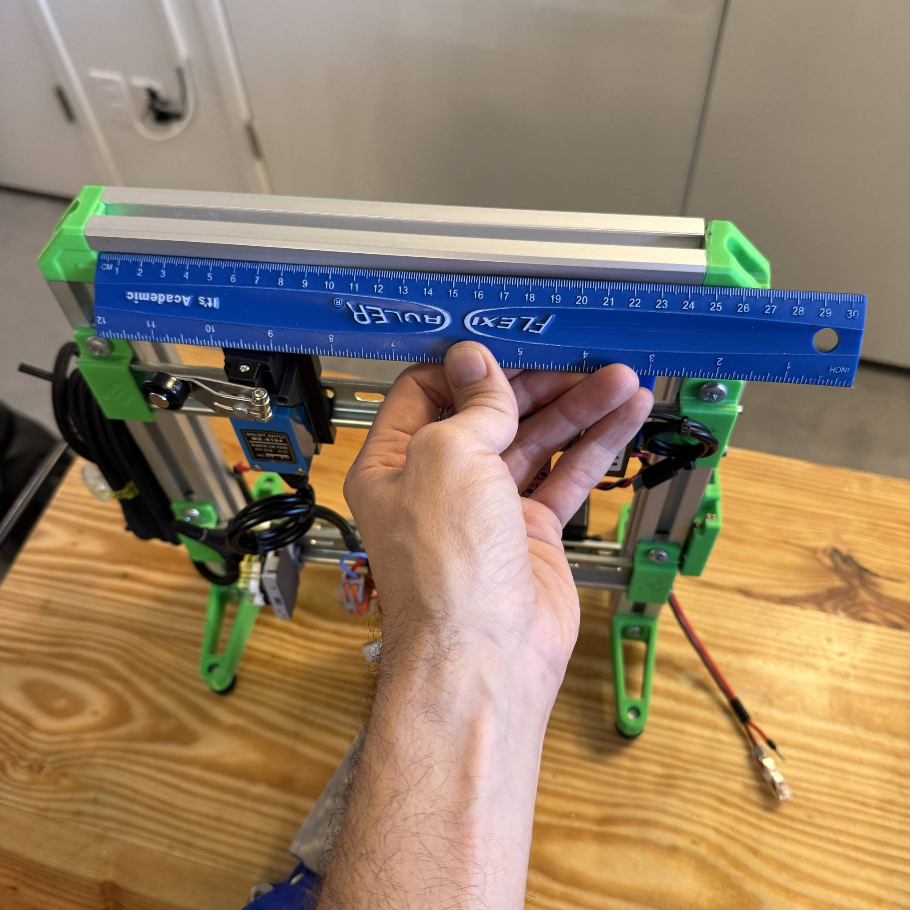
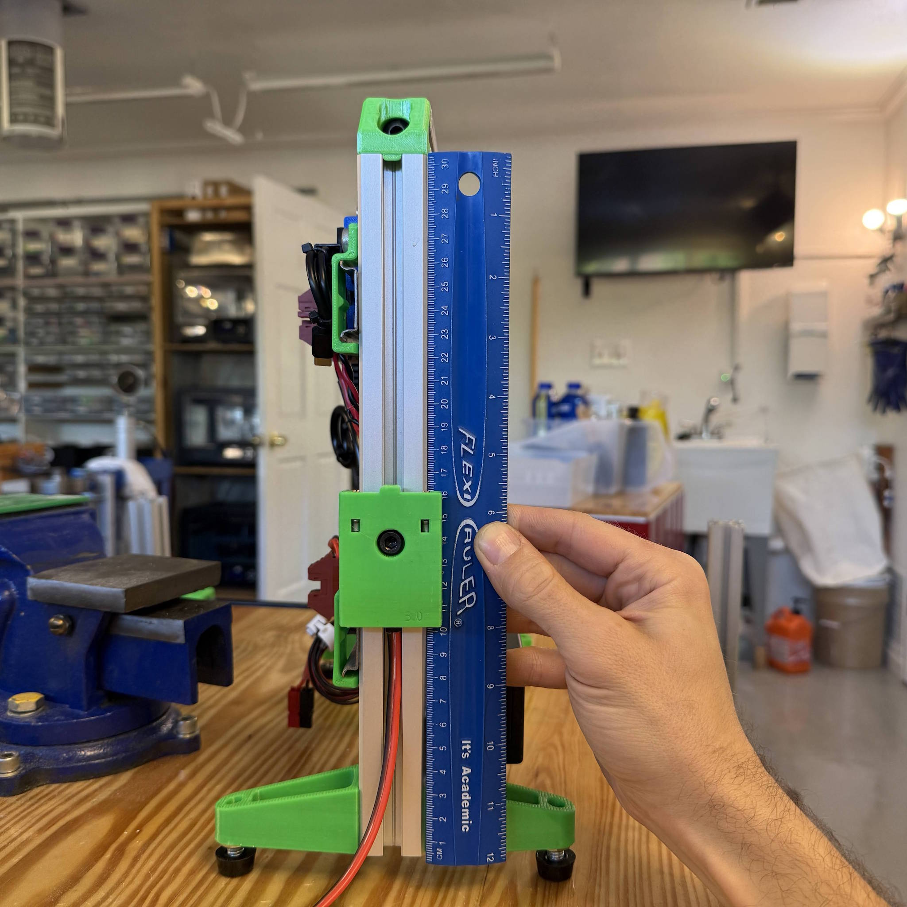
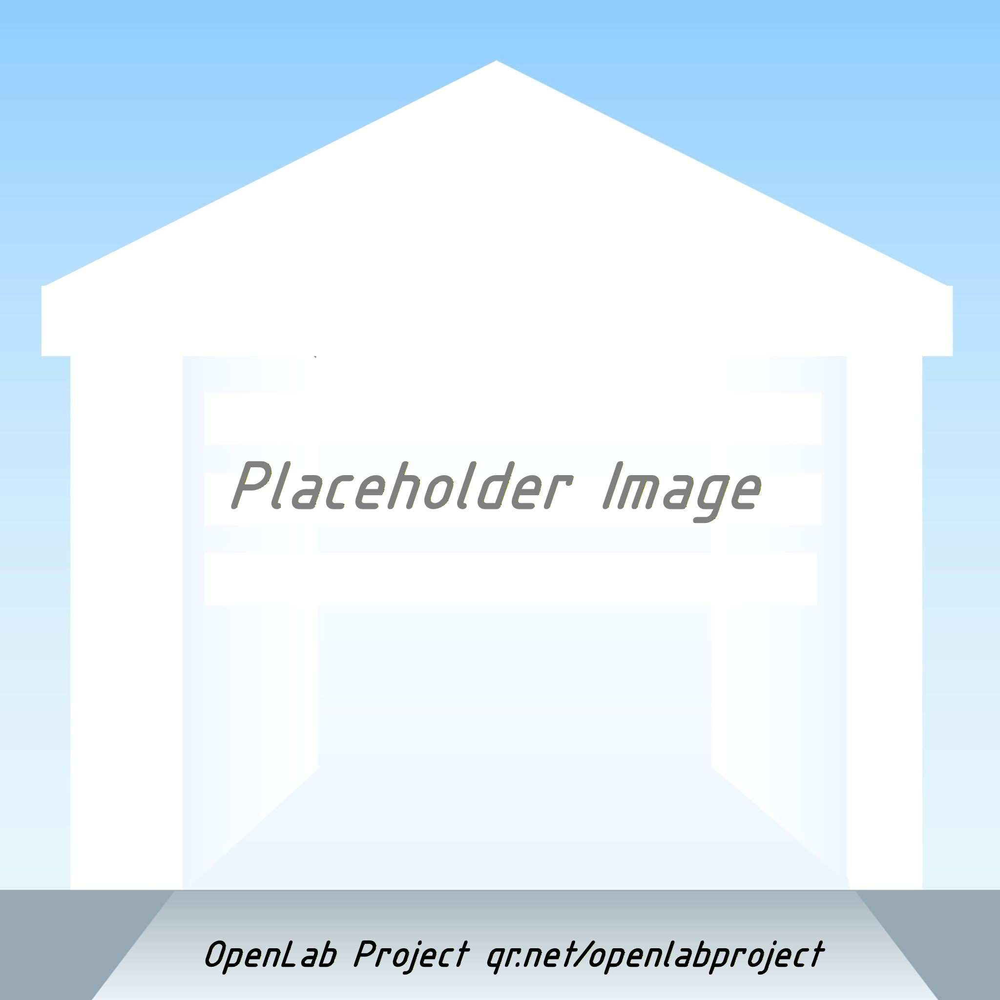

The Power Station is a hub where users can combine electronics aparatus to test mechanical or electronic actuators.

(documentation to begin 2026.07)

## Build

Build your power station with these rough dimensions:
* Dimension L1 is 305 mm, for the main cut materials
* Horizontal DIN rails = L1 = 305mm
* Horizontal 3030 = 245mm
* Vertical 3030 = L1 = 305mm

_Photos below show the measurements for the simplest station build._

- 
- 
- 

## Videos

Relevant videos to equip you to build a power station:

First, the Extrusions introduction tells what materials are necessary to build with 3030 extrusion, add corners, join aluminum, and select fasteners. 
* [Extrusions Intro Video](https://youtu.be/cLrIE6ltErE)

Next, a video on fiberglass additions as of 2026 July.  To add strength with minimal cost, you can enhance a frame with diagonal braces using fiberglass rods.  This is demonstrated around 13:00 in the video below.
* [testing parts for extrusion framing](https://youtu.be/quMugovEDo8?t=767)

- 
- 
- 
