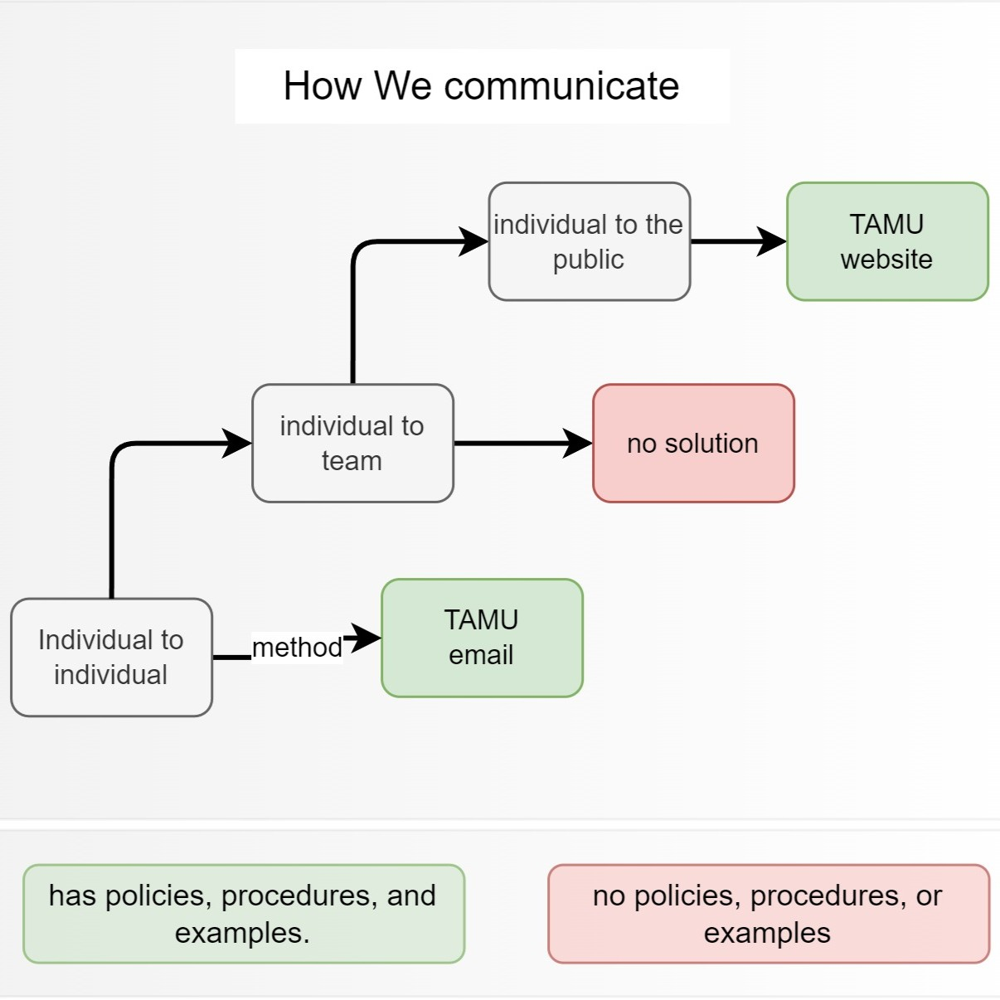
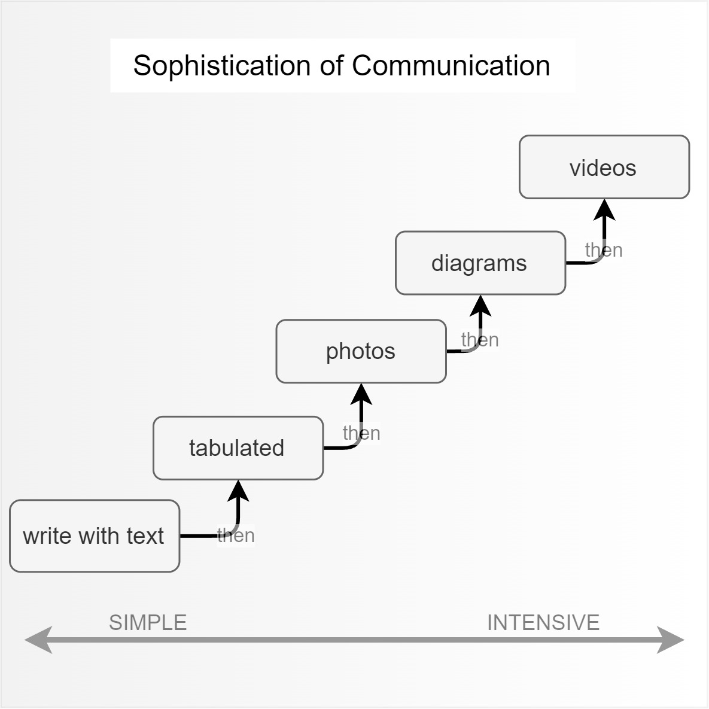
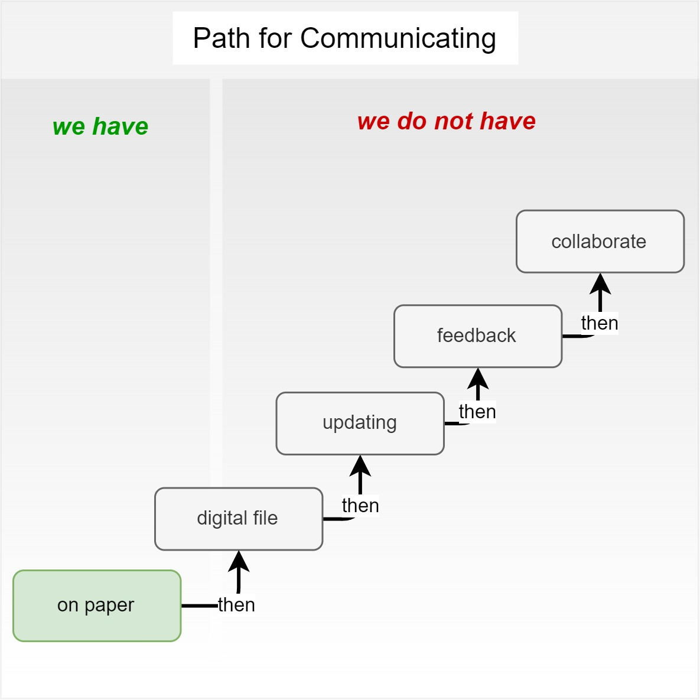
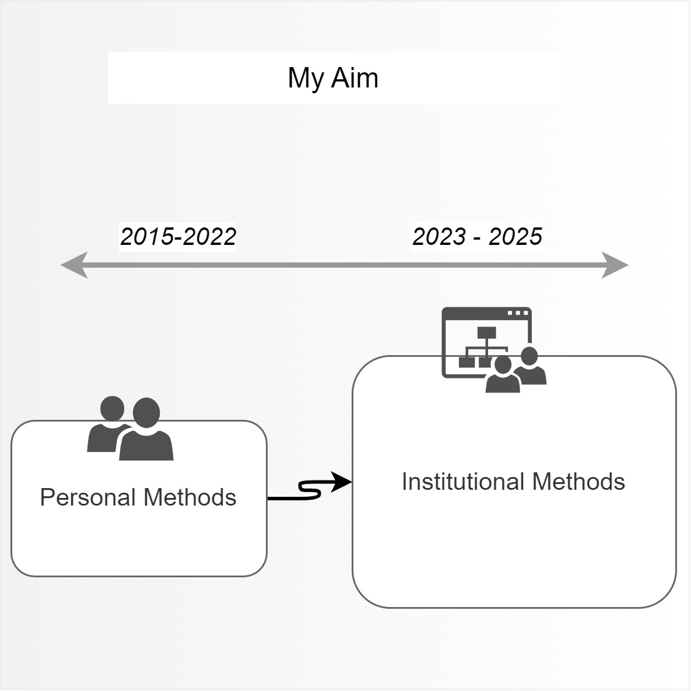
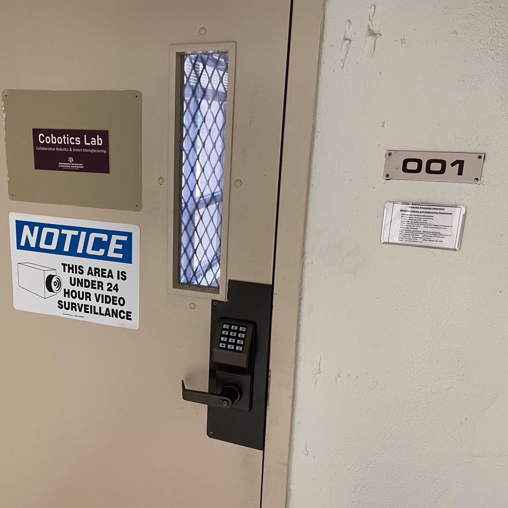
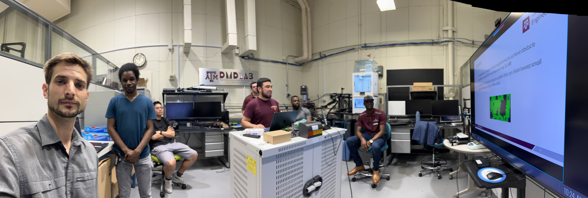

## Texas A&M
This section is for disclosure of my attempts and hopes to improve educational outcomes directly at my workplace at Texas A&M University.  After a decade of working at TAMU, it is understood many improvements lie outside of my control but instead of giving up, I will share some important information by communicating.  The purpose?  If I face problems that are outside of my control then there is zero chance of solving the problem except by communicating.  I may not control the speed or the span of the audience but I think it's dutiful to make this information available.

**memo - Long Term Efforts**
notes my changes in strategies to reach students since my work was discarded over time.  Includes examples of discarded efforts.

**memo - Education Performance**
describes first-hand accounts of our quality degradation in a new bachelors program.

**memo - MXET Fitness**
describes my educational work mishandled and lost, cites a graduating student in debt, includes notion of fraud, waste, abuse.

* [PDF memo longtermefforts](https://github.com/davidmalawey/openLab/blob/c7dde2e5e5d8e858ae442c7371c593522555d68e/docs/2025_memo_LongTermEfforts.pdf)
* [PDF memo MXETfitness](https://github.com/davidmalawey/openLab/blob/c7dde2e5e5d8e858ae442c7371c593522555d68e/docs/2025_memo_MXETFitness.pdf)
* [PDF memo departmentperformance](https://github.com/davidmalawey/openLab/blob/c7dde2e5e5d8e858ae442c7371c593522555d68e/docs/2025_memo_EducationPerformance.pdf)

## Hopes
2025.10.10  I hope to use this web page as a recipe to build a lab at Texas A&M. Yesterday I brought some sample parts into Thompson hall to share with students in the hallway.  My activity precedes a display of parts that parallel the student designs I see each year and provide documentation that helps them improve their designs. One student took an interest but the conversation faded after he asked "do we have a fab shop?"  We don't.  We have no fab shop - we have educational labs for recitation of lab tasks, and we have research labs where individual professors maintain their own equipment for research.  Our department is THE very place on the entire TAMU campus which should have a fab shop -  Engineering Technology is Applied Engineering - the massive tradeoff for not being a pure engineer is so that you can gain hands-on experience and we are failing to offer this.

This is my self-reminder that the OpenLab Project must be the place where I formulate what belongs in our fab shop when we one day convince the University to fund one.  If I can self-fund a shop where I can produce any creation, then surely a university can manage to do this. Earlier this year I communicated to my department head about our need for basic supplies such as rags.  I shared this video which discusses the broader concept of the importance of satisfying fundamental needs for hands-on work.  "If a solution existed for 100 years, then we should have had it for 90 years." It is an embarrasment for me to admit to a student we cannot support prototyping in the most famous university in Texas.

<iframe width="560" src="https://www.youtube.com/embed/gLK1LTlivQw?si=IohEAAssS-fsZYEg" title="YouTube video player" frameborder="0" allow="accelerometer; autoplay; clipboard-write; encrypted-media; gyroscope; picture-in-picture; web-share" referrerpolicy="strict-origin-when-cross-origin" allowfullscreen></iframe>

## Communication
2025: I am recording some notes about institutional communication here that can describe our present state of the art for communicating within our institution.
* Download the [memo-communication PDF HERE](https://github.com/davidmalawey/openLab/blob/07c549c0aef30d2fbe20051d72d7dd83dbc3e3ba/docs/2025_memo_Communication.pdf)
- 
- 
- 
- 
- 

In the last image above, the photo is titled _State of the Art_ for our interdepartment communication.  It is a subtle part of our infrastructure but it's the most exemplary communication work that we have in our department.  If one reviews all of the communication in ETID and asks the following questions as a filter, nearly zero documents will surface besides this set of door labels that we implement.

_What document or communication fulfills these criteria?_
* has been updated routinely for more than 1 year?
* has been printed for viewers but offers traceability to the author?
* is made from inputs from more than three team members?
* offers a pathway, such that a reader can observe & suggest a correction?
* is stored digitally in a location that is accessible to other team members
* contains information that is actively used every week?

Since there is no documentation in my workspace that fulfills these criteria, it would mean:
* We lack a pathway for experts to support each other with improvements.  (Our department has people trained in metallurgy, engineering, data science, electronics, digital communication, information security, electronics prototyping, PCB fabrication, database management, and MUCH more) If collaboration were permitted and convenient, it would mean that any of an individual's works can effectively be reviewed and enhanced by all of these experts, and how incredibly powerful our outcomes would be! Imagine how intensively smart and capable our students would become as they graduated from our program!)
* We lack any communication whatsoever that has a lifespan greater than 1 year for gaining improvements.  That means our 100 year history is rendered impotent and places us at the same level as a first-year institution.
* When documents become highly important or frequently referred to, we ultimately produce hundreds of copies without any version tracking and we drive rework for every expert who touches the file & interacts.
* We frequently respond to outdated information, frequently build on top of irrelevant versions of documents, frequently revisit an engineering equipment or facility space to recollect the source data.
* Given thousands of instruments and machines, we have nearly zero that communicate the machine method, owner, supplies, and status onsite.  When I encounter a specialized lathe or 3D printer, I can ask: who owns this? Who manages it? Who has authority to make adjustments? Can my ESET student have access to operate it?  And zero of the questions can be answered onsite - I must trace down the manager and the last person to operate the tool, and wait for a series of delays between emails.

In summary, the photo of the laboratory door label is both a fantastic effort to praise and a sad symbol of our ineffectiveness as a technology institution.  This is what I hope to improve because I see mountains of possible improvements and reduction in effort with enhancement of results.

## Panoramics

Photo for DMD Lab at TAMU

