This page is for tools & supplies used in the lab, which meet expectations & are recommended for other makers.  Treat this page as an index of parts while the Lab Tour shows how the parts are arranged in the lab and integrated into processes.

## Admin
Admin tools are for typical business administration, but we focus extra on 5S & communication.

Labeler: [dymo 550](https://amzn.to/3Zqdt9n)
* why: several people asked which labeler I use.  It's a dymo 550.
* I like it because it is fast, reliable, & dispenses blanks if I want to write my own.
* I dislike it because when they upgraded from the 450 model, they added a wireless tag into spools, excluding other brands refills.

- 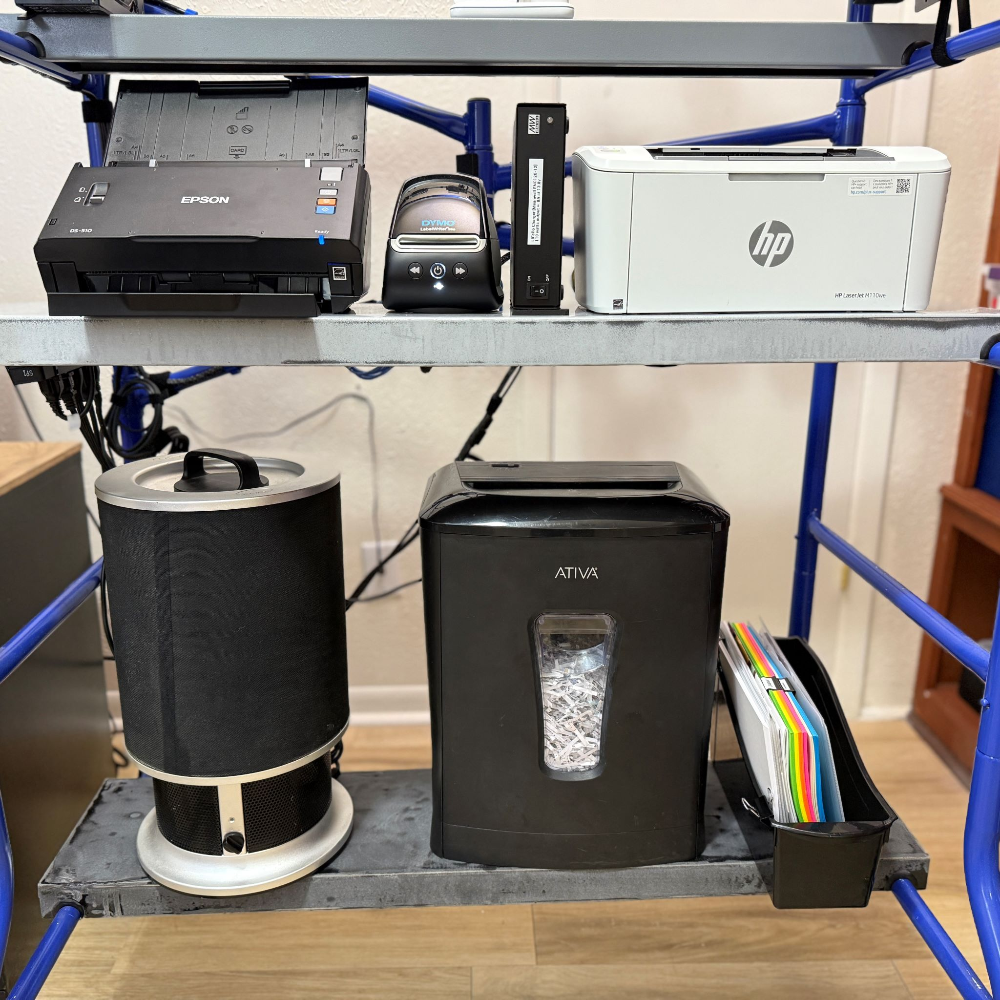
- 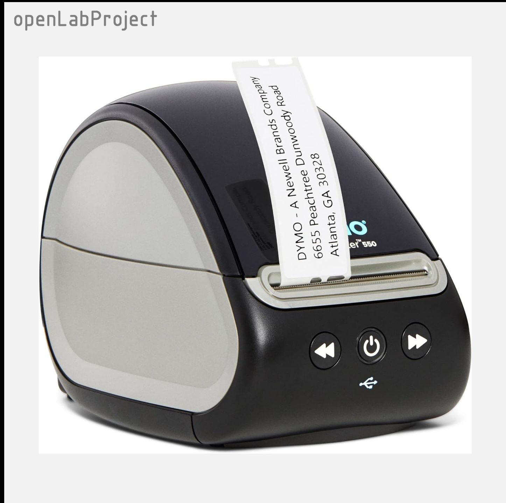
- 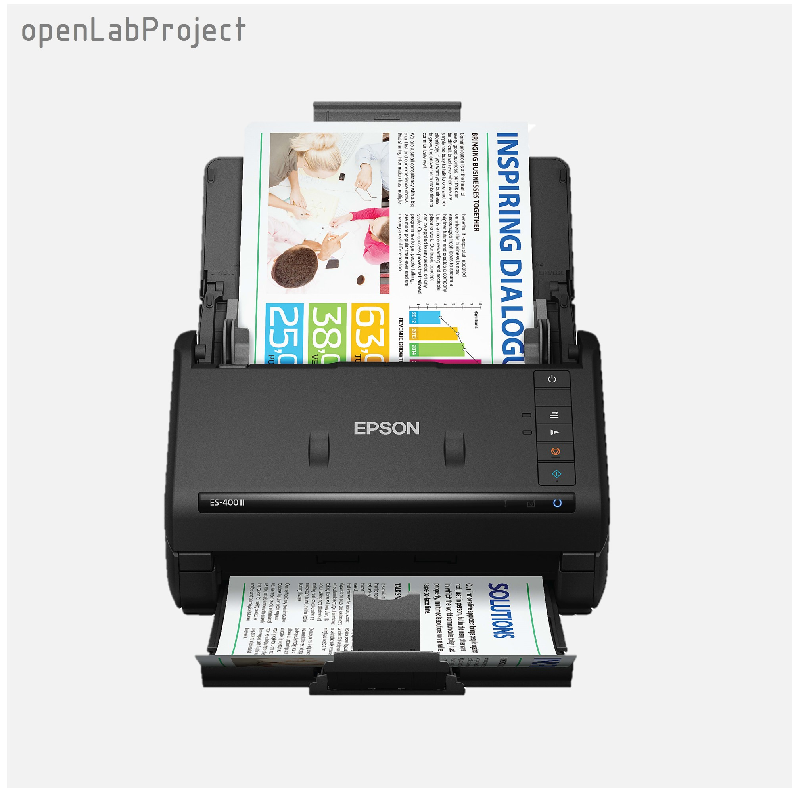
- 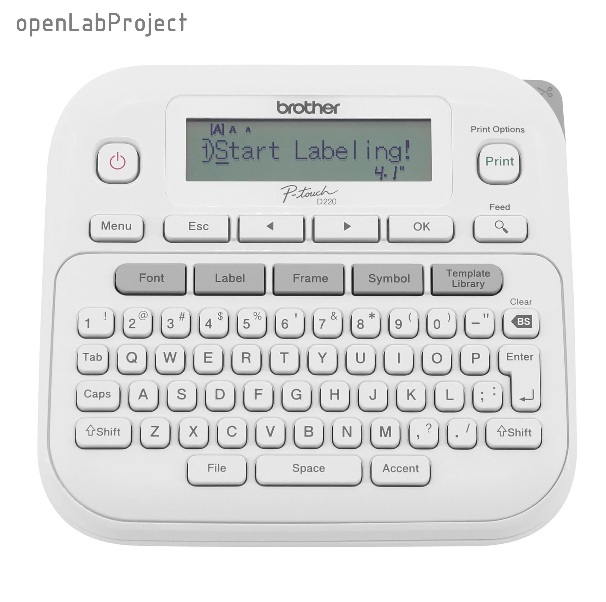
- 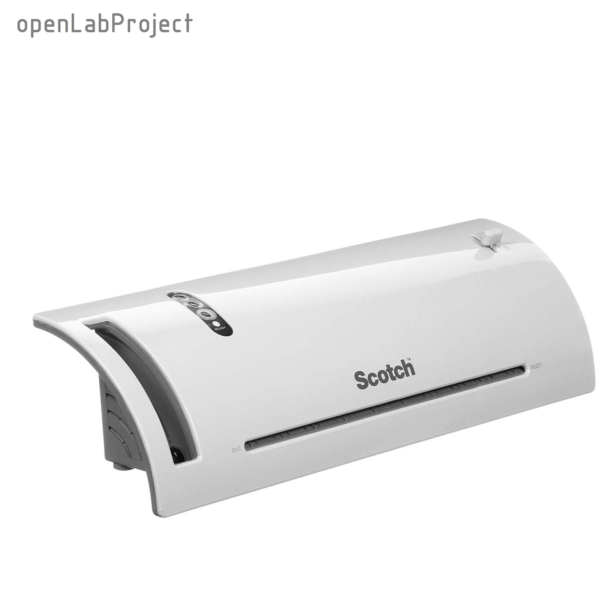

## Software

* NAPS2 - for scanning, and making PDFs. My all-time favorite scanning software.  Free, lightweight, opensource, highly compatible, and simple interface.
 * Get the scanning [software From NAPS2.com](https://www.naps2.com/) for your OS
 * Separately, get drivers for your scanning machine.  [download raw epson drivers here](https://ftp.epson.com/drivers/epson16535.exe) or visit [epson drivers page](https://epson.com/Support/Scanners/WorkForce-Series/Epson-WorkForce-DS-510/s/SPT_B11B209201?review-filter=Windows+10+64-bit)
 * Configure your hardware device inside of NAPS2, and ignore softwares offered by Windows and Epson.  (this is best practice for us)
* Label-Printing
 * For printing with the dymo or similar device, again ignore the softwares offered by Dymo
 * Install only the driver, then print from your selected software.
 * For me, I print directly from MS Excel, using a template I have formatted for the size of my label.
 * CTRL-P executes the print from the Excel file, and the DYMO device is selected in the printers list.

To access a PDF List of Preferred Softwares, [click here](https://github.com/davidmalawey/openLab/blob/8169ce7fe5d406b3bd3b39829b26949f7d1553ea/docs/SoftwaresByTask.pdf)
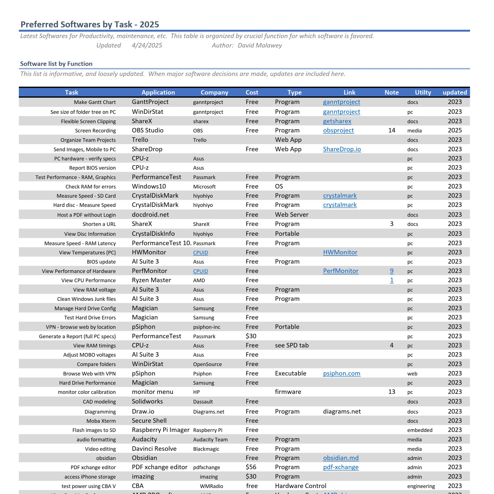

## Soldering
Tools & supplies at the soldering station, as of 2025.02

| Item                | Link |
| ------------------- | -------------------------------------------------- |
| PINECIL             | [https://amzn.to/3EH690Y](https://amzn.to/3EH690Y) |
| iron tips, FEITA    | [https://amzn.to/3Ex3EhU](https://amzn.to/3Ex3EhU) |
| butane torch        | [https://amzn.to/4jUHvdk](https://amzn.to/4jUHvdk) |
| fume extractor      | [https://amzn.to/4jUHvdk](https://amzn.to/4jUHvdk) |
| Kaisi soldering mat | [https://amzn.to/4gQYoTT](https://amzn.to/4gQYoTT) |

## Heavy-Tools

Tools which should last a lifetime, apply to all projects, base-level lab equipment.  These are useful regardless of what type of work you will do - electronics, wood, metal fab, etc.

| Item                | Link |
| ------------------- | -------------------------------------------------- |
| DIN CUTTER          | [amazon din cutter](https://amzn.to/437Bm7Z) |
| Ryobi Drill Press   | [amazon ryobi drill press](https://amzn.to/4i7qPOf)
| Machine Vise        | [amazon machine vise](https://amzn.to/43fRzrs) |
| Cradle Vise         | [amazon]([https://amzn.to/41fviYi) |

_miscellaneous parts photos from the lists without photos_
- 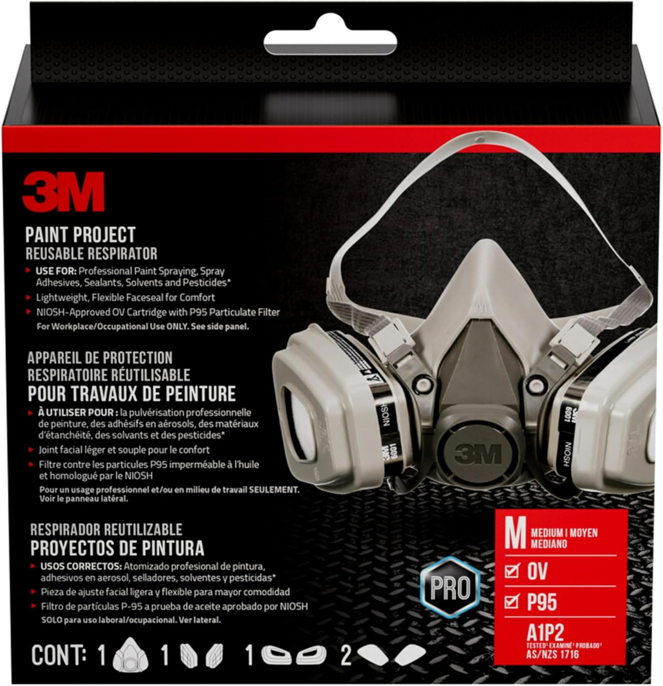
- 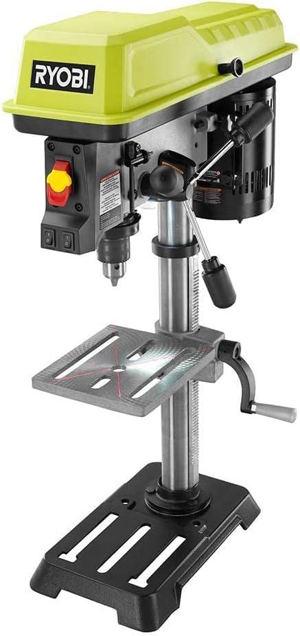
- 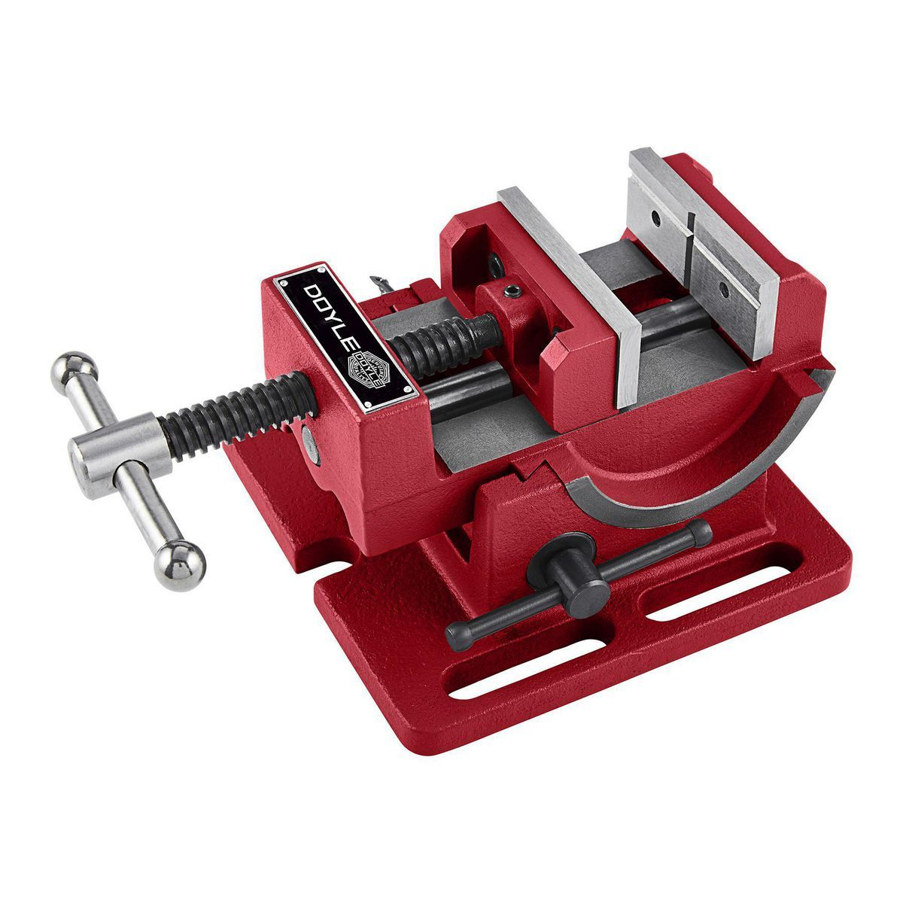

## Supplies
Let's differentiate supplies from tools.  Description of supplies is as follows:

*Supplies are*
~ consumable items that pair with tools (ie, rivets for rivet gun)
~ parts attainable in bulk or unbranded while meeting a specific need. (ie silicone caulk)
~ items which support organization, like bin dividers.
~ items that may be considered a tool, but are used in this lab as a consumable (ie paint stirring stick). 
~ items which are inventoried in a quantity that may overflow.  ie, we have a hand-cleaner dispenser at the sink, but the bulk cleaner is stored elsewhere.

### Tape
My favorite tapes, in one video. Dated 2024.09. The applications are for nearly every project that takes place.

<iframe width="700" src="https://www.youtube.com/embed/W0sAR_jI4b8" title="More than you ever wanted to know about tape" frameborder="0" allow="accelerometer; autoplay; clipboard-write; encrypted-media; gyroscope; picture-in-picture; web-share" referrerpolicy="strict-origin-when-cross-origin" allowfullscreen></iframe>

| type                    | amazon link             |
| ----------------------- | ----------------------- |
| PET (hi temp) tape      | https://amzn.to/3ZkBAX9 |
| Painters tape           | https://amzn.to/4e038FT |
| aluminum foil tape, 3M  | https://amzn.to/4ehrNFN |
| drywall tape            | https://amzn.to/3Tr7oWD |
| drywall tape            | https://amzn.to/3Tr7oWD |
| electrical tape         | https://amzn.to/4gzzJ7p |
| extreme mounting        | https://amzn.to/3B3BsBC |
| filament strapping tape | https://amzn.to/4ejHVGy |
| first aid tape          | https://amzn.to/4dT0die |
| gaffers                 | https://amzn.to/4gwv4D8 |
| grafting tape           | https://amzn.to/3znx1Rl |
| heat press tape         | https://amzn.to/3B1b7nw |
| heavy poly tape         | https://amzn.to/4ehey7P |
| kapton                  | https://amzn.to/3B0pyby |
| kapton tape             | https://amzn.to/4d3CF9l |
| masking, scotch         | https://amzn.to/47mgHwQ |
| mesh nonadhesive tape   | https://amzn.to/3XCEeGI |
| scotch shipping         | https://amzn.to/3MF8vyb |
| silicone self fusing    | https://amzn.to/4eiZVB1 |
| thread seal, PTFE       | https://amzn.to/3z49ipv |
| wire harness            | https://amzn.to/3AVHlAu |

## Safety

A mix of tools and supplies for safety, PPE, and first aid.  Note safety glasses are color coded so when one pair is assigned to a station, it becomes the color allocated to belong there.  

| Item                | Link |
| ------------------- | -------------------------------------------------- |
| DIN CUTTER          | [amazon din cutter](https://amzn.to/437Bm7Z) |
| Headphones          | [runolim headphones $20](https://amzn.to/3RFOOJ2) |
| alcohol wipes       | [alcohol wipes $6](https://amzn.to/3RFOOJ2) |
| safety glasses | [colored safety glasses $14](https://amzn.to/42pCrWB) |

These particular safety glasses are recommended for their color-coding.  They come in a pack of around 12 with 6 colors.  So, we designate a slot at each workstation (soldering, cutting, grinding) where the glasses ought to be used.  Then we mark the slot with the same marking, so they return to their space.  For hanging situations, there's a simple trick with a paperclip and an M2.5 fastener.  (will post a short video to include).

The noise cancelling headphones are more fantastic than expected.  When running a vacuum or high-powered tool, these inexpensive headphones do a marvelous job of cancelling steady, high pitched noise.  At only $20, they compete with regular passive headphones but the comfort is far higher.  For ordinary protective headsets, the padding is more firm and the spring-force is much higher, to create a seal against the head.  But these units have just a gentle squeeze and are so much more enjoyable to wear.  Sometimes I forget to take them off.

- 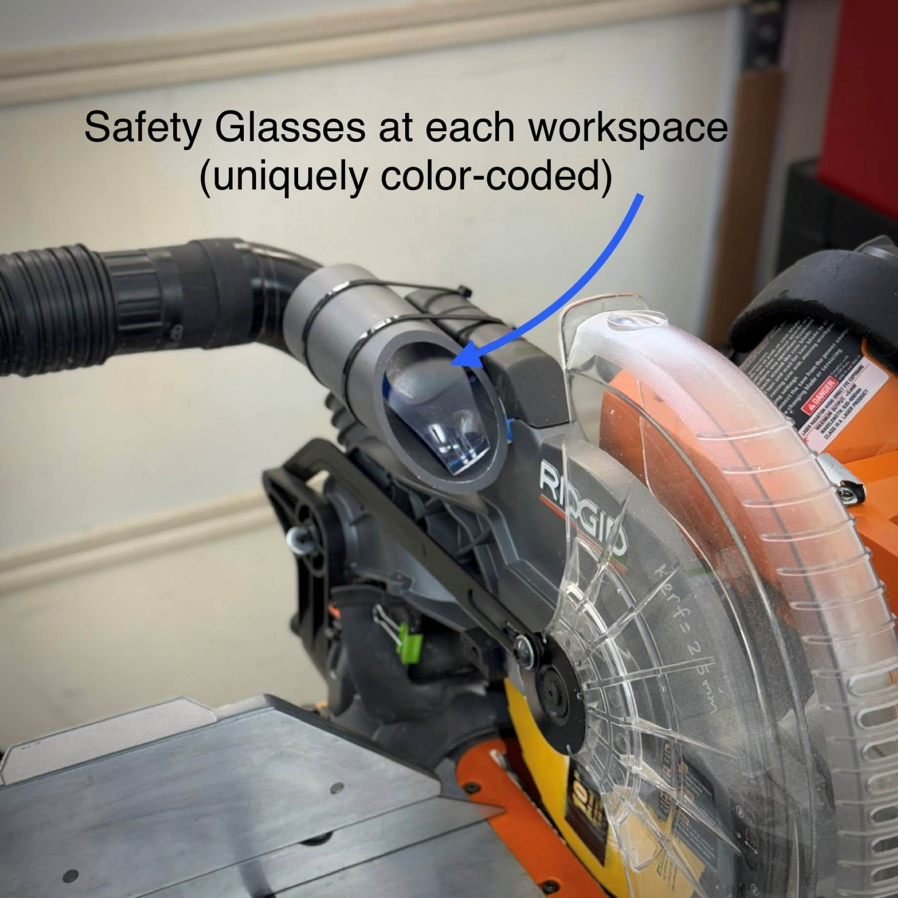
- 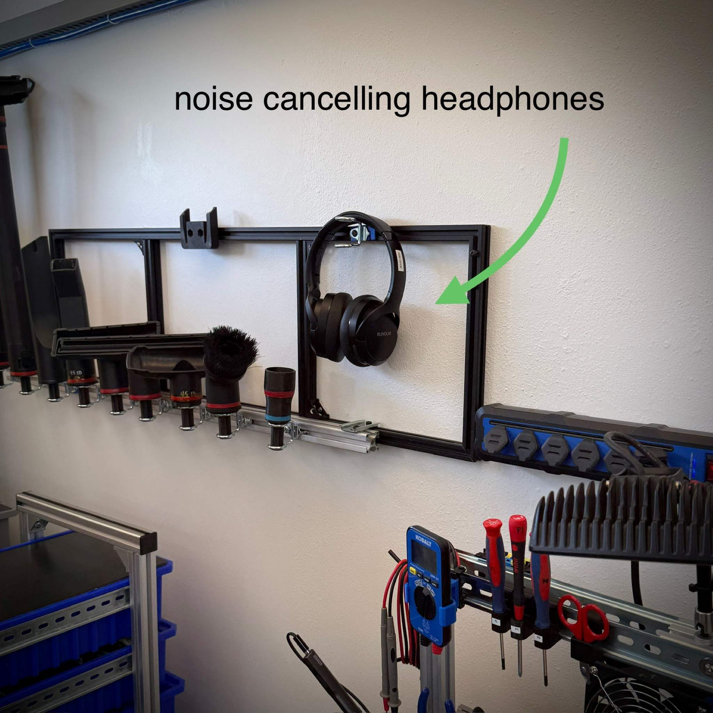
- 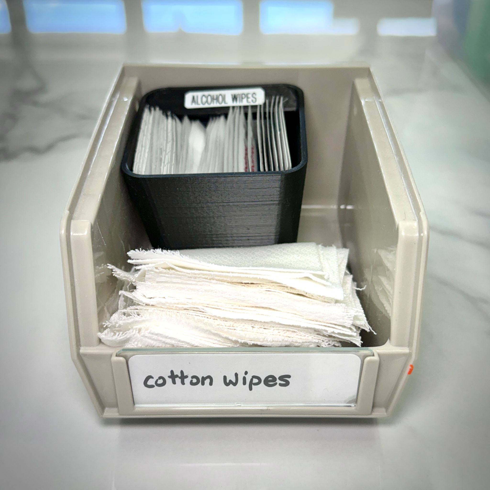

## Bins

The bins deserve a dedicated section since these are part of several projects, and multiple labs.  Each bin is usually $15 each or higher, but they're industrial and intended to last forever.  Options are available at many reputable distributors for the following options:
* transparent top covers that are load-bearing
* interlocking dividers in gray and black
* Electrostatic dissipating variants, with grounding connector

Here are three different suppliers that have near-matching bin dimensions.  They are compatible enough to stack on one another, but you may measure more closely in order to design your own covers and dividers.  We have ordered and validated the ones from Grainger and Uline.  They're also offered at McMaster (we have not compared this option) and the Lewisbins brand is listed here because the company was kind enough to publish accurate CAD models that we can work with.

* [Akro-Mils at Grainger](www.grainger.com/product/AKRO-MILS-Divider-Box-2RV37)
* [Uline brand at Uline distributor](www.uline.com/Product/Detail/S-16976GR/Plastic-Bins/Divider-Box-15-x-9-x-6-Gray)
* [LewisBins brand at Global Industrial](www.globalindustrial.com/p/16-1-2-x-10-7-8-x-6-lewisbins-divider-box-light-blue)
* [LewisBins brand divider](www.globalindustrial.com/p/grid-wall-bin-stackable-11)

From that point - I built some CAD models that are intended for design of mating parts such as bin racks, and covers.   My [design of Bins on GrabCAD](https://grabcad.com/library/divider-bin-1) includes further photos, and notes on details.

- 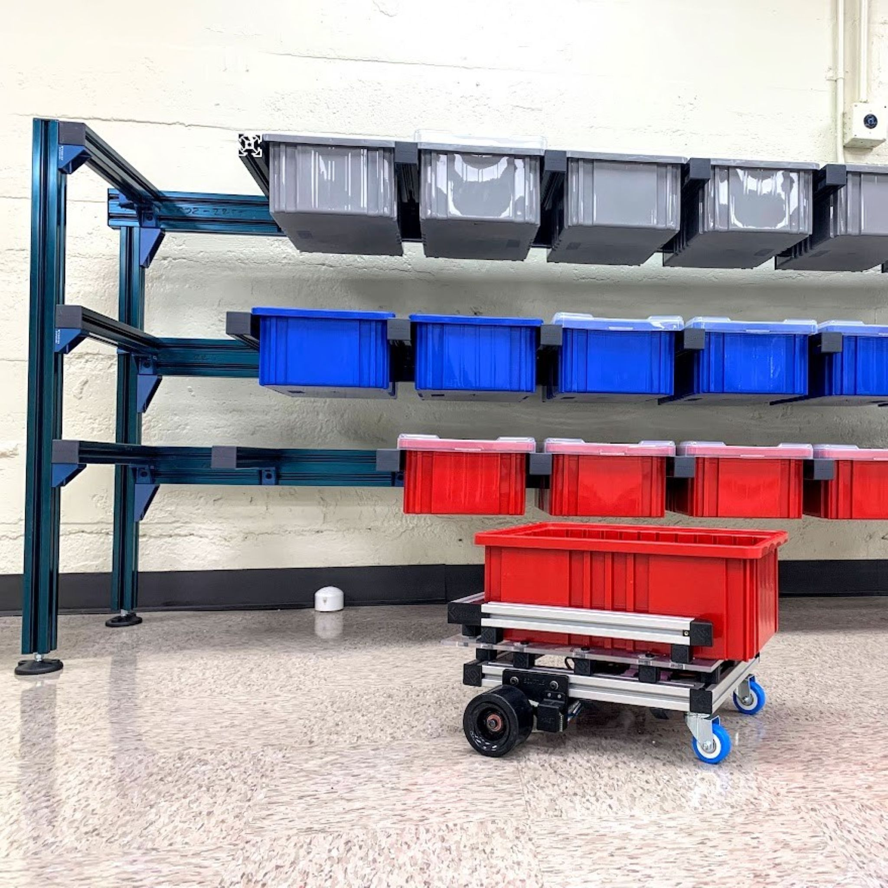
- 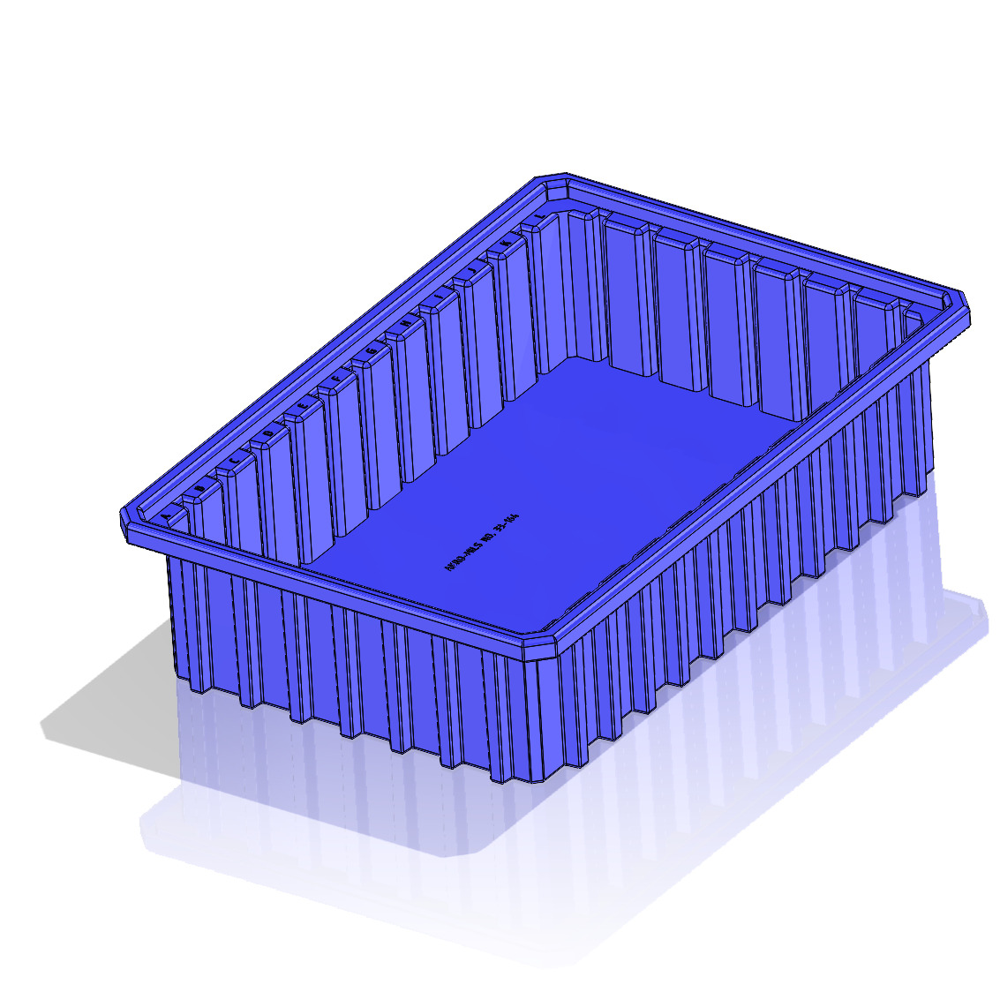
- 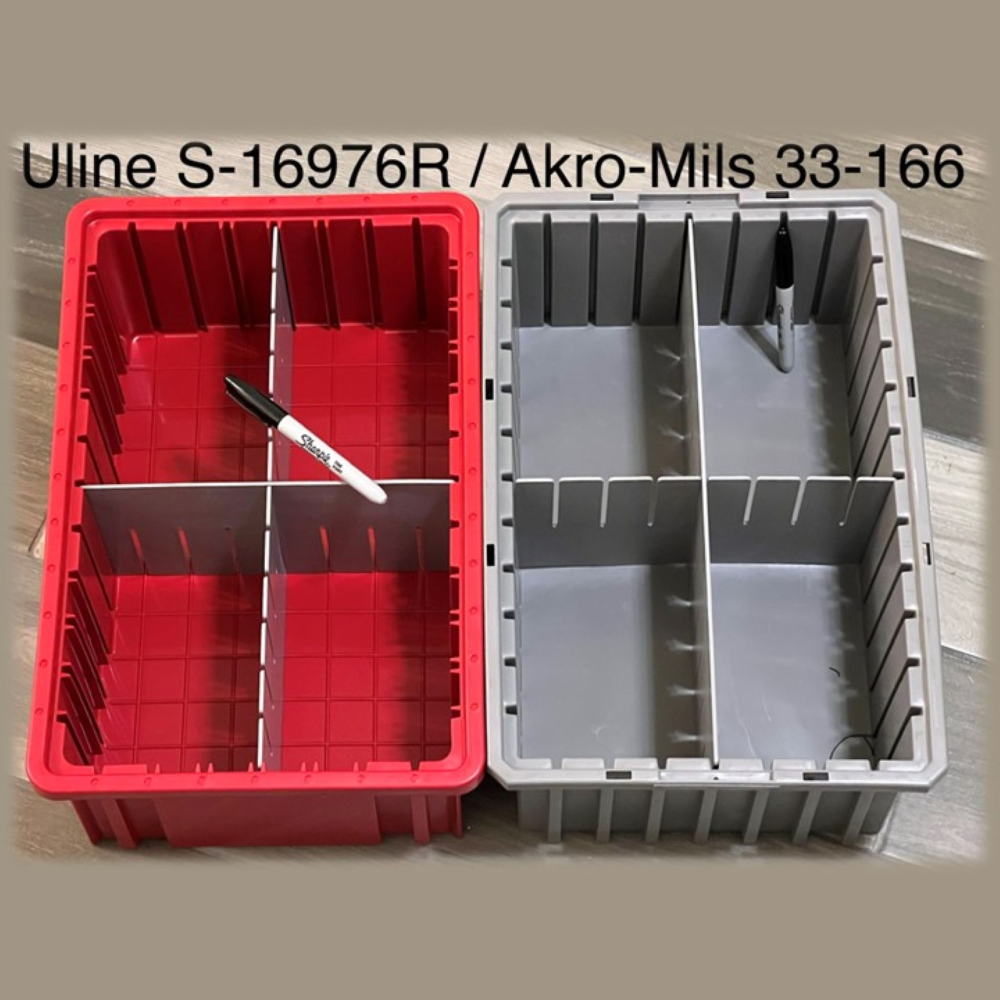

## Lists
Here are links to lists I wrote up for my amazon associates page.  As of 2025 Feb, the above links are mostly for my associates link (please use these links if you buy the product, this generates revenue for the lab.)  Currently this webpage is more primary source than my amazon account but I may update the amazon lists later this year.

* Tapes, as a category:
  * [tapes shopping list](https://www.amazon.com/shop/davidmalawey/list/23JC56RVU5QCD?ref_=cm_sw_r_cp_ud_aipsflist_QDTS3XMR324V5SRFJWMD)
  * [tape video](https://youtu.be/W0sAR_jI4b8) on youtube.
* Organization supplies
  * [shopping list](https://www.amazon.com/shop/davidmalawey/list/3WYDWTJG1O2?ref_=cm_sw_r_cp_ud_aipsflist_QDTS3XMR324V5SRFJWMD_1)   
