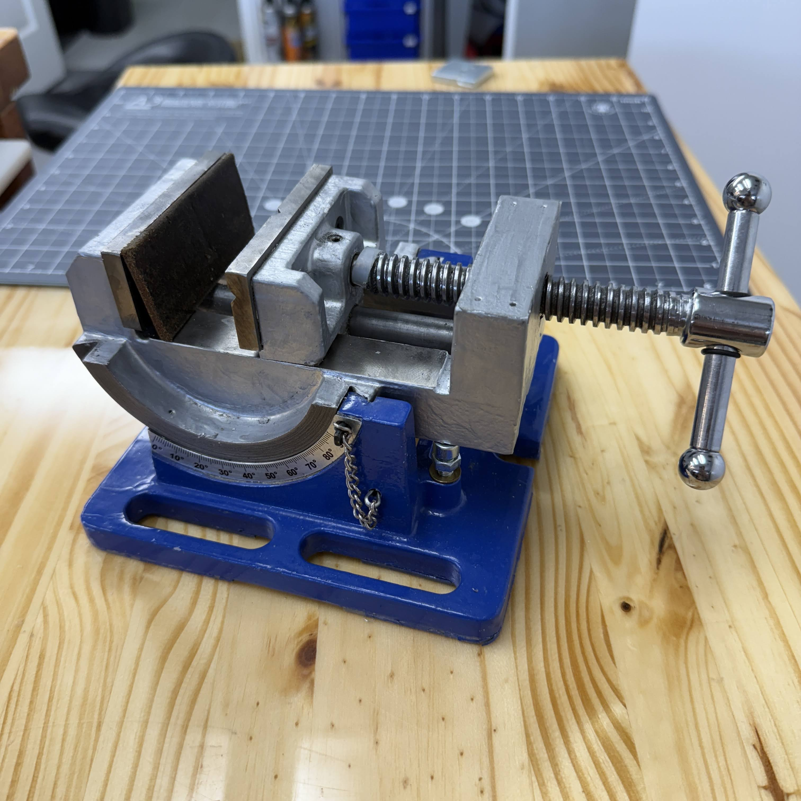
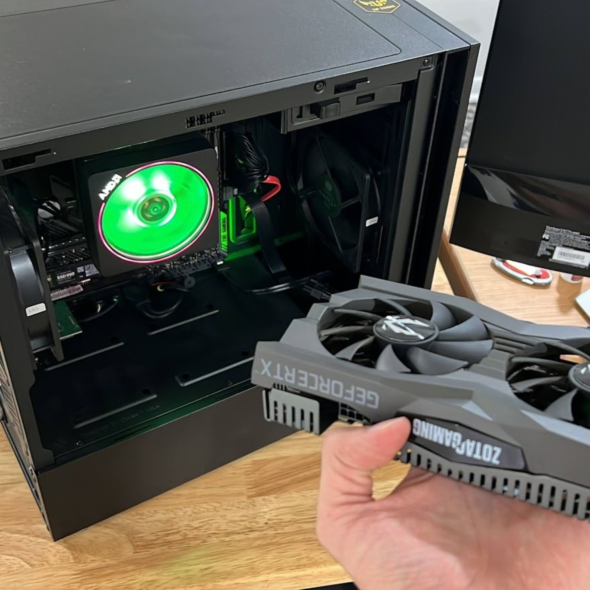

This page is for tools & supplies used in the lab, which meet expectations & are recommended for other makers.  Treat this page as an index of parts while the Lab Tour shows how the parts are arranged in the lab and integrated into processes.

**Full Access**
We want users to have access to exactly the devices & supplies we use in our projects.  In the early stage of this project, I will post documents which contain collections of tools & devices that make up the lab.  In time I hope to raise the accessibility so you can find a specific product label simply with the search function on this page. 

* Get [Tools_Scans_2025](https://github.com/davidmalawey/openLab/blob/a23478e580b18ce3051be14c0ce91f3598161505/docs/2025.06_tools_scans.pdf) PDF
  * Contains 36 pages of tools labels
* Get [Tools Scans 2024](https://github.com/davidmalawey/openLab/blob/a23478e580b18ce3051be14c0ce91f3598161505/docs/2024_tools_scans.pdf) PDF
  * Contains 48 pages of tools
* keywords: (important tools to be listed with keywords soon)

## Admin
Admin tools are for typical business administration, but we focus extra on 5S & communication.  This particular labeler choice is important because it's sold in high volume globally.  It prints incredibly fast and reliably and you can find many cheap distributors of compatible sticker-label-spools.  The downside is Dymo's upgrade from model 450 included addition of an RFID tracking sensor that attempts to lock-down the printer for pricey dymo-only spools.  It's one of the only items that has a performance good enough to tolerate nasty business antics as noted.

* Labeler, Dymo 550 [on amazon for $120](https://amzn.to/3Zqdt9n)
* Scanner, Epson [ES530 for $360](https://amzn.to/4kEvB8y) is the nearest match for my DS-510 that is discontinued.
* Handheld label printer [Brother PTD220 $45 on amazon](https://amzn.to/3XdOtAO) is recommended
* Thermal Laminator, 3M's Scotch [Model TL902 for $60 on amazon](https://amzn.to/41ro0BY) is recommended 

- 
- 
- 
- 
- 

## Software
Information about softwares for the processes in OpenLabProject.  Goal: to focus on the applications which have served for many years.

* NAPS2 - for scanning, and making PDFs. My all-time favorite scanning software.  Free, lightweight, opensource, highly compatible, and simple interface.
 * Get the scanning [software From NAPS2.com](https://www.naps2.com/) for your OS
 * Separately, get drivers for your scanning machine.  [download raw epson drivers here](https://ftp.epson.com/drivers/epson16535.exe) or visit [epson drivers page](https://epson.com/Support/Scanners/WorkForce-Series/Epson-WorkForce-DS-510/s/SPT_B11B209201?review-filter=Windows+10+64-bit)
 * Configure your hardware device inside of NAPS2, and ignore softwares offered by Windows and Epson.  (this is best practice for us)
* Label-Printing
 * For printing with the dymo or similar device, again ignore the softwares offered by Dymo
 * Install only the driver, then print from your selected software.
 * For me, I print directly from MS Excel, using a template I have formatted for the size of my label.
 * CTRL-P executes the print from the Excel file, and the DYMO device is selected in the printers list.

To access a PDF List of Preferred Softwares, [click here](https://github.com/davidmalawey/openLab/blob/c7f163e0c20dbc36414fd6741dfbce369cea4270/docs/SoftwaresByTask.pdf)

## Printing
The 3D printing toolset is focused on reliability over versatility.  This is a setup for ABS Printing, the main material for all the functional example parts.  There are 3 identical printers, Flashforge Creator Pro, stacked vertically on a shelf.  

**recommended printer**
My recommended 3D printer as of 2025 is the flashforge [Adventurer 5M Pro](https://amzn.to/3J1W3KO) due to Flashforge's good reputation, metal frame, enclosure for thermal stability, and balanced overall performance.

## Key Tools

Tools which should last a lifetime, apply to all projects, base-level lab equipment.  These are useful regardless of what type of work you will do - electronics, wood, metal fab, etc.

| Item                | Link | Note |
| ------------------- | ------------------------------------ | ---- |
| DIN CUTTER          | [amazon din cutter](https://amzn.to/437Bm7Z) | bought & recommended |
| Ryobi Drill Press   | [amazon ryobi drill press](https://amzn.to/4i7qPOf) | bought & recommended |
| Machine Vise        | [amazon machine vise](https://amzn.to/43fRzrs) | bought & satisfied, secondary to a bench vise |
| Cradle Vise         | [amazon](https://amzn.to/41fviYi) | bought & recommended, most used vice in the lab |
| Torque Screwdriver | [PDF doc](https://www.grainger.com/ec/pdf/6AAV7_1.pdf) | this is the Wera brand top-quality option, 0-30 in-lbs range |
| Torque Screwdriver | [for $36 on amazon](https://amzn.to/4reL4OS) | by vanpo, opton of interest, not yet purchased, 10-60 in-lbs range |

2025 I'll add photos of tools that are unique or not part of a traditional machine shop, woodshop, etc.  These may be familiar in various labs but we need them together in one lab.

**Caulk Guns** two are included because cylinder-shaped adhesives are used very frequently.  We need a good quality caulk gun - high force to work with thick substances like black urethane glue.
(need to write more yet - DM 2025.10)

- 
- 
- 
- 
- 

**Project Prep**
_Mention of supplies which are used for many different projects, at the immediate workspace_

* fasteners bin, magnetic such as (craftsman 2pack $20) [on amazon](https://amzn.to/4rqCXyI) - have a magnetic base for storage & retaining screws from an assembly/disassembly stage.
* cloth-backed sandpaper rolls, dispenser, 5 grits, 6 meters [on amazon for $16](https://amzn.to/4s8vbtF)

# Supplies
Let's differentiate supplies from tools.  Description of supplies is as follows:

**Supplies are**
~ consumable items that pair with tools (ie, rivets for rivet gun)
~ parts attainable in bulk or unbranded while meeting a specific need. (ie silicone caulk)
~ items which support organization, like bin dividers.
~ items that may be considered a tool, but are used in this lab as a consumable (ie paint stirring stick). 
~ items which are inventoried in a quantity that may overflow.  ie, we have a hand-cleaner dispenser at the sink, but the bulk cleaner is stored elsewhere.

**BinderClips**
These binder-style paperclips are used in organization of panels, hanging of parts, and within several designs with springs embedded for compliance.  
* Get binder clips [data in PDF here](https://github.com/davidmalawey/openLab/blob/2f70e9bd13fef18c8f5869ff8deaa8e5325a2a5b/docs/data_binderClip_2024.pdf)

**Tubing**
This polyethylene tubing is used in hundreds of ways in the lab - it's a constant solution from pneumatics to small hardware.  My choice is 3/8 x 1/4 inch, OD and ID respectively.  This 
1) used as a hinge pin for printed parts
2) cut slivers as washers in M5, M6, M8 hardware assemblies
3) make springs by cutting short lengths
4) compressible feature to fill gaps in an assembly
5) carry pneumatic air in tools or projects up to
6) safe for drinking water or other water pumping
A note on Metric preference: I prefer all materials to come in metric, but this material sometimes accomodates both metric and imperial couplings.   Both items have been found to seal with the new push-to-connect fittings for pneumatics and water systems, The smaller 1/4in size is a match for many 6mm fittings.  Soon I hope to offer documentation about the collection of fittings in OpenLab for all plumbing projects, with the economical and high-performing collection of valves and parts that are compatible.

The two sizes used most often are
* larger [tubing, 3/8 in on amazon](https://amzn.to/3YCALYw) (this is the product I use as of 2026) at $11 per 25ft
* buy smaller [tubing, 1/4in on amazon](https://amzn.to/49BKKSG) (smaller version) at $14 per 40 ft

Below, find some linked photos from the product page:
- 
- 
- 

### Tape
My favorite tapes, in one video. Dated 2024.09. The applications are for nearly every project that takes place.

<iframe width="700" src="https://www.youtube.com/embed/W0sAR_jI4b8" title="More than you ever wanted to know about tape" frameborder="0" allow="accelerometer; autoplay; clipboard-write; encrypted-media; gyroscope; picture-in-picture; web-share" referrerpolicy="strict-origin-when-cross-origin" allowfullscreen></iframe>

| type                    | amazon link             |
| ----------------------- | ----------------------- |
| PET (hi temp) tape      | https://amzn.to/3ZkBAX9 |
| Painters tape           | https://amzn.to/4e038FT |
| aluminum foil tape, 3M  | https://amzn.to/4ehrNFN |
| drywall tape            | https://amzn.to/3Tr7oWD |
| drywall tape            | https://amzn.to/3Tr7oWD |
| electrical tape         | https://amzn.to/4gzzJ7p |
| extreme mounting        | https://amzn.to/3B3BsBC |
| filament strapping tape | https://amzn.to/4ejHVGy |
| first aid tape          | https://amzn.to/4dT0die |
| gaffers                 | https://amzn.to/4gwv4D8 |
| grafting tape           | https://amzn.to/3znx1Rl |
| heat press tape         | https://amzn.to/3B1b7nw |
| heavy poly tape         | https://amzn.to/4ehey7P |
| kapton                  | https://amzn.to/3B0pyby |
| kapton tape             | https://amzn.to/4d3CF9l |
| masking, scotch         | https://amzn.to/47mgHwQ |
| mesh nonadhesive tape   | https://amzn.to/3XCEeGI |
| scotch shipping         | https://amzn.to/3MF8vyb |
| silicone self fusing    | https://amzn.to/4eiZVB1 |
| thread seal, PTFE       | https://amzn.to/3z49ipv |
| wire harness            | https://amzn.to/3AVHlAu |

## Bins
**See-through Storage** are chosen strategically and they are Sterilite Clearview bins, which have been distributed for over a decade without changes and they appear at Target as well as industrial distributors.  Supplies to be grouped in a smaller space, the zipper pouch (like pencil bag) are useful, with hooks that allow hanging

* Sterilite [6quart 12 pack on Amazon](https://amzn.to/3ZuMvfY) for $42
* Sterilite [15-quart 12 pack on Amazon](https://amzn.to/3ZuMvfY) for $53
* Pouches, [zipper pouch 6-pack](https://amzn.to/3MADyie) for $10

See the linked product images below

- 
- 
- 

**Divider Bins** are non-consumer products, only found at industrial suppliers. These are used for more critical inventory storage than the clearview selections.

See [Divider Bin on GrabCAD](https://grabcad.com/library/divider-bin-1) to jump straight to my CAD models, true to the measured dimensions. These designs are intended for design of mating parts such as bin racks, and covers.  The upload includes more photos and design notes.

The bins deserve a dedicated section since these are part of several projects, and multiple labs.  Each bin is usually $15 each or higher, but they're industrial and intended to last forever.  Options are available at many reputable distributors for the following options:
* transparent top covers that are load-bearing
* interlocking dividers in gray and black
* Electrostatic dissipating variants, with grounding connector

Here are three different suppliers that have near-matching bin dimensions.  They are compatible enough to stack on one another, but you may measure more closely in order to design your own covers and dividers.  We have ordered and validated the ones from Grainger and Uline.  They're also offered at McMaster (we have not compared this option) and the Lewisbins brand is listed here because the company was kind enough to publish accurate CAD models that we can work with.

**[Distributors]**
* BRAND  | Distributor | Link
* Akro-Mils | Grainger | [product](https://www.grainger.com/product/AKRO-MILS-Divider-Box-2RV37)
* Uline | Uline | [product](https://www.uline.com/Product/Detail/S-16976GR/Plastic-Bins/Divider-Box-15-x-9-x-6-Gray)
* LewisBins | Global Industrial | [bin product](https://www.globalindustrial.com/p/16-1-2-x-10-7-8-x-6-lewisbins-divider-box-light-blue)
* LewisBins | Global Industrial | [lid product](https://www.globalindustrial.com/p/grid-wall-bin-stackable-11)

- 
- 
- 

**Plano Bins**

These boxes are selected for sorting small parts.  The way they're used:  One bin has as many as 50 different part types, with a category like "M5 fasteners." Open one bin to find any of the M5 screws or nuts. The moment that I access an M5 nut is the moment I likely need a washer, so these all go together. The large divider bin is designated for fasteners and becomes heavy since it's full of metal - so these require a flat shelf for storage.  The small type (3500 series) can be hung vertically on a pegboard.  Small heavy parts risk spiling inside these bins so essentially the mass inside the bin dictates if it can be hung or must be kept flat and upright.  Sourcing these bins can be confusing - they appear on amazon by many different inconsistent vendors.  They are also found in-store at Walmart with fishing tackle.

* Plano Prolatch 3500 Series, 5x9 inches.
* Plano Prolatch 3700 Series, 9x14 inches.
* Metabin fits inside the plano 3700 [download CAD on grabCAD](https://grabcad.com/library/metabin-1)
* for info on variations & corresponding Part Numbers [in the Plano Boxes PDF](docs/Data_PlanoBoxes_2025.pdf)

Images below show the Metabin inside Plano Bins.  The metabin has a shallow and deep variant (16cc) with the volume reduced for accessing tiny parts.

- 
- 
- 

### BinRack

We made a special rack for robotic machines to interact with these bins! You can access this rack design for carrying 21 bins, publicly available from Vention.io.  This rack was a design collaboration with Vention designers and David Malawey for our Cobotics Lab at Texas A&M University.  Vention's innovative online system allows for publishing of full design details (if selected as public).  Below are a couple of snapshots of this design.  

[See design at vention.io](https://vention.io/designs/shelving-tamu-165697) to view the design in 3D, bill of materials, and more info.

Why did we want a custom rack?  It is the simplest configuration for loading and unloading with A) a robotic arm with limited degrees of freedom B) a mobile robot with a simple forklift-style actuator, and for computer-vision systems to view all bins entering and exiting for purposes of inventory tracking or supplies management.

* 
* 
* 

## Soldering
_last updated 2025.05_
Tools found in the soldering station are tabulated below.  This selection is recommended since the tools were good value and have worked for two years or more.   Some devices are not obvious, such as my custom helping hands made from the camera clamp and the 123 block. The clamp can be removed at any time from the 123 block and used separately.  The adjustable LED camera light also mounts on any 1/4-20 thread which is found in camera tripods and devices for microphone, lighting, and accessories for filming.

* 
* 
* 
* 
* 
* 
* 

**About Soldering Irons:**  
My recommendation is to seek these properties:  To heat up in less than 30 seconds, we want 80 watts of power or more.  Both the Pinecil and TS100 are great on this.  Pinecil can draw power directly from a USB-c cable if you have a PD rated adapter with 20 volts and 80 watts available.  With the TS100 iron (which I had for 4 years before buying Pinecil) you can get a fast heatup and high power with any DC adapter.  It can run on 12vDC using the barrel plug but it's better to find an adapter with 20v, which comes along with most of these iron kits.  Then you want replaceable iron tips, and at least 1 replacement on-hand.  These two irons have a tip which includes the heating element and thermocouple embedded, which gives high accuracy on the temperature reading and a nice localized heating near the tip.  So, I recommend pinecil, with TS100 in second place.  

|item|brand                 |amazon link            |purchased?|added    |category |price|
|----|----------------------|-----------------------|----------|---------|---------|-----|
|1   |PINECIL               |https://amzn.to/3EH690Y|2025      |2/23/2025|soldering|$40  |
|2   |iron tips, FEITA      |https://amzn.to/3Ex3EhU|2025      |2/23/2025|soldering|$36  |
|3   |butane torch          |https://amzn.to/4jUHvdk|2023      |2/23/2025|soldering|$22  |
|4   |fume extractor        |https://amzn.to/43iztES|2023      |2/23/2025|soldering|$30  |
|5   |Kaisi soldering mat   |https://amzn.to/4gQYoTT|2022      |2/23/2025|soldering|$9   |
|6   |usb power 120W        |https://amzn.to/44rLE3k|2024      |5/6/2025 |soldering|$19  |
|7   |solder, 0.8mm,        |https://amzn.to/3EQZIZV|2022      |5/7/2025 |soldering|$10  |
|8   |flux pen              |https://amzn.to/3GYpSub|2021      |5/7/2025 |soldering|$8   |
|9   |flush cutter, IGAN 330|https://amzn.to/436JSlY|2024      |5/7/2025 |soldering|$8   |
|10  |brass mesh tip cleaner|https://amzn.to/3RT3ftt|2021      |5/7/2025 |soldering|$10  |
|11  |usb-c cable, PD       |https://amzn.to/4k83BbG|2023      |5/7/2025 |soldering|$6   |
|12  |pivot clamp (lamp)    |https://amzn.to/3EIhLl1|2023      |5/7/2025 |soldering|     |
|13  |camera light, aluminum|https://amzn.to/3GEWVTZ|similar   |5/7/2025 |soldering|$20  |
|14  |steel 123 block       |https://amzn.to/439QLTC|2023      |5/7/2025 |soldering|$17  |

## Computing

I'm beginning a section as of 2025.05 to post info about the PC workstation for CAD modeling and other compute-intensive tasks.  PCpartpicker is a great place to document our community builds & assist each other in upgrades. The build linked above is partly outdated, but good to access thumbnails & specs for key parts.

* Access the [Workstation Build Documentation](https://github.com/davidmalawey/openLab/blob/d839ea37850840eac63a235f3625c2dce64fc0c0/docs/2025_PC-Build.pdf) in PDF.
* Visit [PCpartPicker](https://pcpartpicker.com/list/3Jy6Fg) to see my last documented build. 

- 
- 
- 
- 
- 

**Recommended PC Components from My Build (updated 2025.05)**
Half of these parts I gathered overseas or at brick-and-mortar stores but I've collected amazon links for the matching parts to share.  If you use my affiliate links, it helps generate a small revenue.

| Component | Brand        | Model                        | Vendor                                            |
| --------- | ------------ | ---------------------------- | ------------------------------------------------- |
| CPU       | AMD          | Ryzen 7 3700x                | [Amazon 🔗](https://amzn.to/4kjf0Go)              |
| SSD       | Samsung      | SSD 980 Pro, M.2             | [Amazon 🔗](https://amzn.to/3YZGXKH)              |
| mobo      | ASUS         | PRIME B550M-A/CSM (ATX)      | [Amazon 🔗](https://amzn.to/43x6iNk)              |
| WiFi      | TP-Link      | AX3000, Archer TX50E(UN)     | [Amazon 🔗](https://amzn.to/4dx94H3)              |
| graphics  | AMD          | Raedon Pro WX4100            | [Amazon 🔗](https://amzn.to/4kBpRep)              |
| SSD       | Samsung      | SSD 980, NVME                | [Amazon 🔗](https://amzn.to/43xmuhI)              |
| PSU       | Corsair      | RM750x                       | [Amazon 🔗](https://amzn.to/3ZtWqmb)              |
| RAM       | Corsair      | Vengeance RGB Pro 3200       | [Amazon 🔗](https://www.amazon.com/dp/B081XWLQKS) |
| monitor   | HP           | 27h                          | [Amazon 🔗](https://amzn.to/43xF09N)              |
| monitor   | HP           | 27h                          | [Amazon 🔗](https://amzn.to/43xF09N)              |
| keyboard  | Logitech     | MK540 Keyboard               | [Amazon 🔗](https://amzn.to/3ZBcHG2)              |
| USB Panel | EZDIY-FAB    | Ezdiy 5.25in 10GB/s Gen2 Hub | [Amazon 🔗](https://amzn.to/43g1fly)              |
| case      | coolermaster | Silencio S400                | [Amazon 🔗](https://amzn.to/43LABBd)              |
| mouse     | Logitech     | M720                         | [Amazon 🔗](https://amzn.to/43ca9AA)              |

## Safety

A mix of tools and supplies for safety, PPE, and first aid.  Note safety glasses are color coded so when one pair is assigned to a station, it becomes the color allocated to belong there.  

| Item                | Link |
| ------------------- | -------------------------------------------------- |
| DIN CUTTER          | [amazon din cutter](https://amzn.to/437Bm7Z) |
| Headphones          | [runolim headphones $20](https://amzn.to/3RFOOJ2) |
| alcohol wipes       | [alcohol wipes $6](https://amzn.to/3RFOOJ2) |
| safety glasses | [colored safety glasses $14](https://amzn.to/42pCrWB) |
| fume extractor | [amazon $30](https://amzn.to/4qMpkZX) |
| xytronic fume extr | [amazon $60](https://amzn.to/4rCM6nB) |

These particular safety glasses are recommended for their color-coding.  They come in a pack of around 12 with 6 colors.  So, we designate a slot at each workstation (soldering, cutting, grinding) where the glasses ought to be used.  Then we mark the slot with the same marking, so they return to their space.  For hanging situations, there's a simple trick with a paperclip and an M2.5 fastener.  (will post a short video to include).

The noise cancelling headphones are more fantastic than expected.  When running a vacuum or high-powered tool, these inexpensive headphones do a marvelous job of cancelling steady, high pitched noise.  At only $20, they compete with regular passive headphones but the comfort is far higher.  For ordinary protective headsets, the padding is more firm and the spring-force is much higher, to create a seal against the head.  But these units have just a gentle squeeze and are so much more enjoyable to wear.  Sometimes I forget to take them off.

Two fume extractor listed above were compared in the lab and they both perform similarly - the Xytronic brand (purchased 2017) is a high-class brand in electronics labs but the no-name brand (Purchased 2023) seems to offer similar performance and take up less space in the lab, so a low-cost choice is recommended.

* 
* 
* 

The above images of the PC build at different stages.  One big lesson was the removal of the big fancy RTX2060, a high performance video card for graphics, in favor of the AMD Radeon WX4100 card, a purpose-built GPU for professional CAD design.  This selection reduces cost, reduces power consumption, and improves performance by large margins for CAD modeling.  One image depicts the PC case with an included small monitor (I tried it out for a few months) which is sold as a photography display, and can easily source power from the 12v bus on the PC power supply.  For some time this monitor was used to display PC performacne metrics or CAD rendering status.  In the long term it was not necessary.  See also a simple neat deskspace for designing 3D models in our prototyping workflow.
