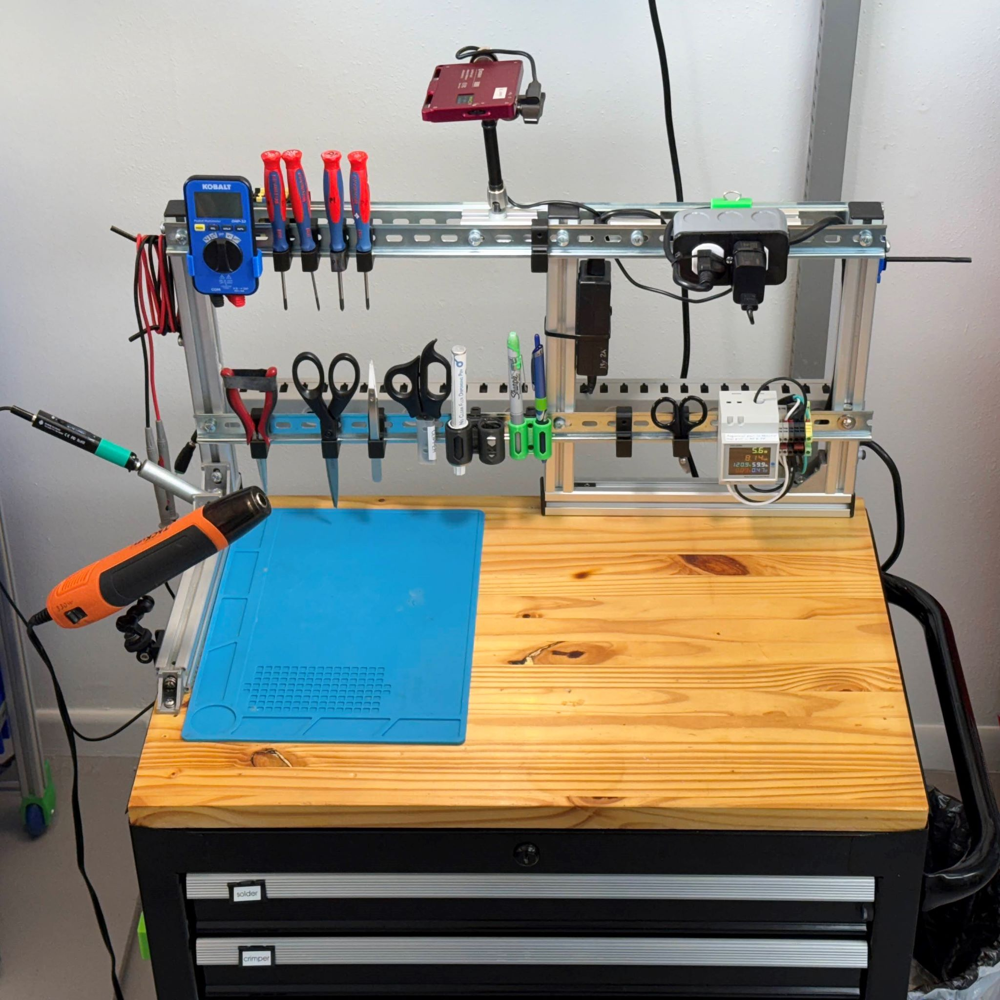
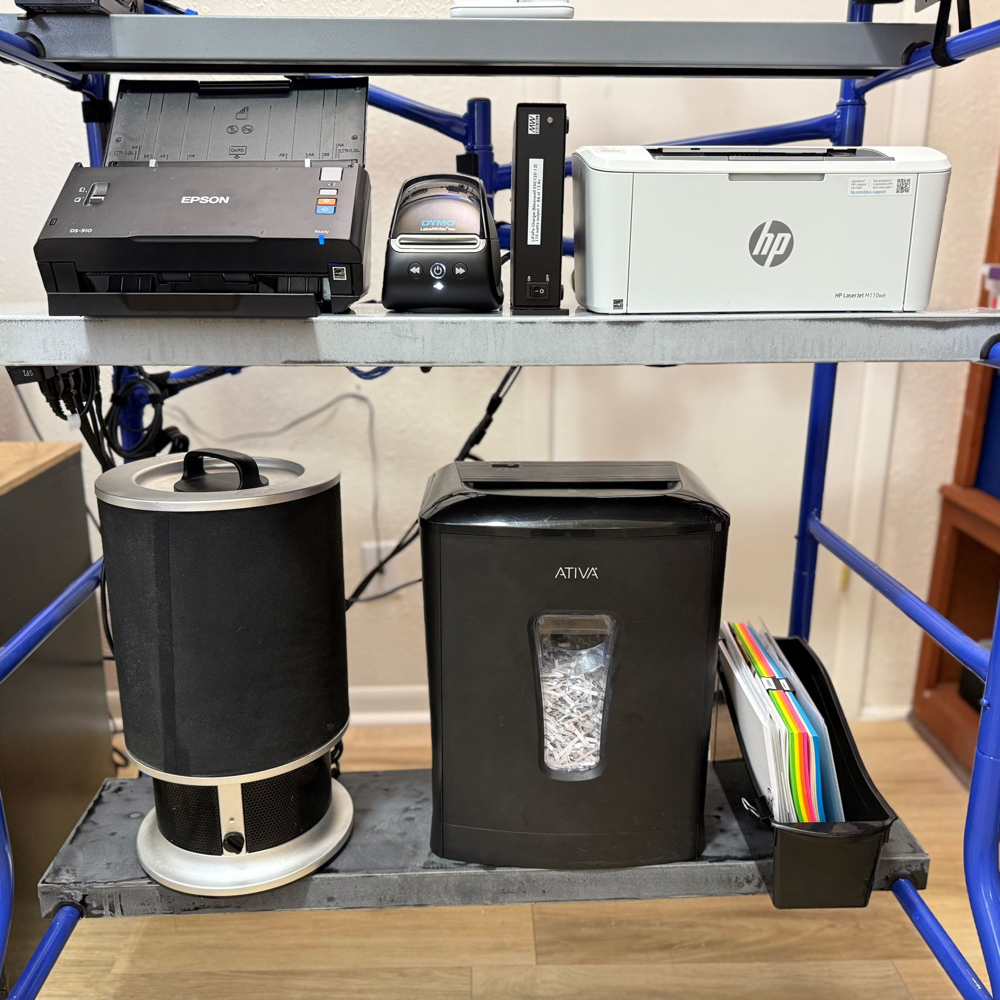
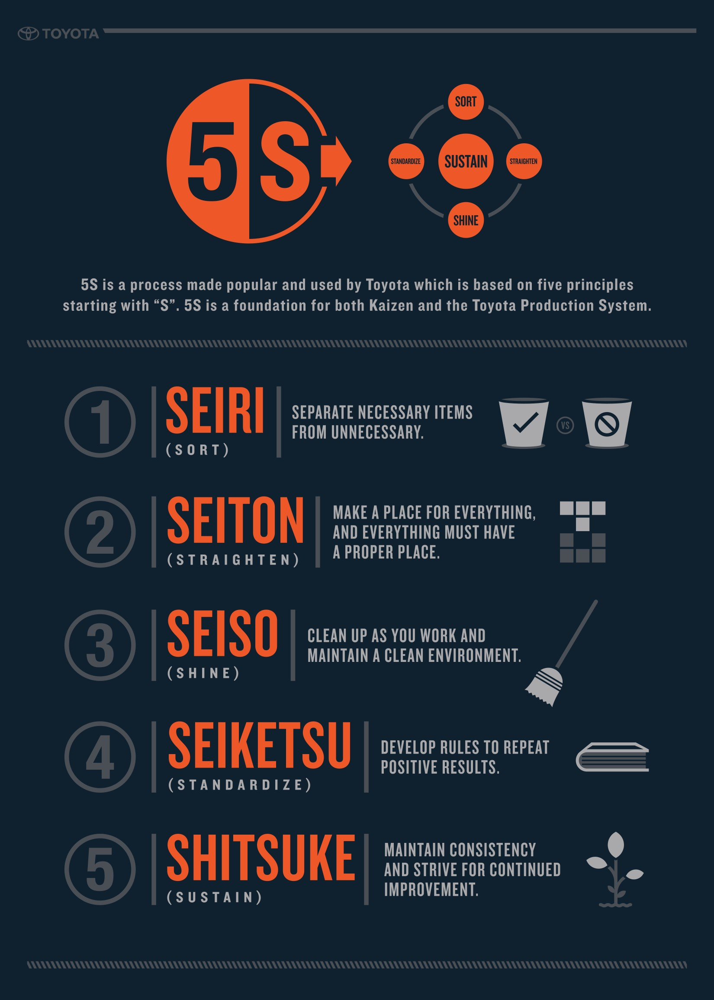

>
> Which tools do we use?  How are workspaces arranged? Why did we choose each supply? What model is the device from David's youtube video? See the lab, the machines, the inventory.  Discover how it is organized, and what drives successful projects.
>

- 
- 
- 
  
_panoramic photos of the lab as of 2025.02_

## Stations
A space which has both storage and workspace, together.

### Cutting-Box

Let's call this the cutting box.  It's featured in the video about how to drill a hole, and short videos which use the oscillating tool.   Photos from Feb 2025.

- 
- 
- 
- 
- 

### Charge-Station
Wall station for charging.

This small shelf is for quickly charging usb-powered handheld tools, or mobile phones, or battery cells.  It's been a great backup when the tabletops are filled with project materials and there is no space to set aside a device for charging.

- 
- 
- 
- 
- 

The wall outlet was installed to reduce the number of plug-in usb adapters.  We need the station to support micro USB and USB-C male plug types, with QC, PD, and ordinary 5v USB charging protocols. This outlet was installed 2024 and delivers up to 45W DC power.  The cord organizer keeps the cables organized on the wall, and the plugged-in adapter is the QC type adapter from our battery charger unit.  

I found the XTAR battery charger to work great for these functions:  charging or discharging cells to 3.6v for storage, measuring capacity with a discharge test, and measuring energy input to the cells when they are recharged.  Measuring each cell independently allows me to test other appliances.  For example, I can discover if a tool is maintaining balance between two cells after it has been discharged and charged for some time.  If my headlamp battery does not seem to last very long, I can discover if the cell's capacity has degraded.  For a quick trial, I can sit the charger in the blue rack, but of course it is safer to set up trials on a flat surface.

For portable charging, the 2-cell power bank works together with the charging station.  In the photo shown, the xtar PB2S is delivering a charge to a portable light.  Unlike most power banks, it is modular and you can swap out the individual cells.  I can set the PB2S in the charging station to receive a charge rapidly (using PD), and then bring it to my workspace outside of the lab, or set it in a drawer together with the tool that needs a charge.  The PB2S displays the amount of current entering the unit (when charging) and the amount of current exiting the unit (when discharging).  It is capable of delivering

Communications come in through the Echo dot (alexa) such as shipments arriving, or important notifications.  It's also great for verbally checking a math problem, and hearing the answer audibly over the speaker.  When we don't need communication, the dot plays music through the speaker, which frees up the mobile phone to be used for voice chats, discord, and communication with Siri, etc.  It's especially useful for taking videos with the iPhone since the Camera App cannot simultaneously record video and play sounds.

Parts:
* [micmi USBC outlet, $18](https://amzn.to/436Ye7F)
* [Roland 30W monitor. CM-30](https://amzn.to/415gYCO)
* [usbC cable with power meter, $8](https://amzn.to/415gYCO)
* [echo dot bracket, Gen3, printed](https://grabcad.com/library/dot_bracket-1)
* [cord organizer, similiar](https://amzn.to/3QbFX1i)
* [battery charger for 18650, Xtar VC4](https://amzn.to/3EssvTP)
* [portable charger, xtart PB2S](https://amzn.to/41bTRFN)

### Solder-station

**Soldering Station** ► This station is for all fine work such as soldering or pick-and-place of electronics on small boards.  The rack is made from 30mm extrusion and DIN rail, with holders for the most frequently needed tools.  Debris gets swept off the tabletop to a trash receptacle on the right hand.  The soldering iron rests in a safe tube near the back, where it is insulated.  Then the iron remains hot without wasting power, and the user avoids a burn risk.  120v powered devices like the heat gun can plug in directly to the station power and we can measure the power level of the device in this way.   The whole station plugs into any 120vac outlet, and then measures with the DIN-mounted meter, and distributes power to the 3-prong receptacle mounted at the upper right.

### Power-Panel
The power panel is first of several panel-style stations.  It is mostly storage, and periodically given an active function.

Preview some panels in the images below.

- 
- 
- 

** Power Panel** ► Ridgid brand is chosen for our lithium power tools for one reason: the **lifetime warranty & free replacement.**  The Ridgid battery performance competes with leading brands like DeWalt, Bosch, Milwaukee, etc.  However, only Ridgid gives us a free replacmeent for any registered tool that fails.  When we run tests on motors, power adapters, or any high-current DC equipment, the 18v packs are the starting point.  For quantitative design work I use a pre-characterized pack.  So, the battery pack will be tested on our CBA power testing machine to verify it matches the normal values for capacity and current ratings.  Then, the battery is ready to support measurement or calibration of a DC-driven actuator.  

### Tape-Panel
**Tapes Panel** ► Tapes are organized here.  The tapes are explained in my video from 2024.07, embedded below.   List of tape supplies is included in the shopping lists section under tools►shopping.  Jump to (tools).

<iframe width="800" src="https://www.youtube.com/embed/W0sAR_jI4b8" title="More than you ever wanted to know about tape" frameborder="0" allow="accelerometer; autoplay; clipboard-write; encrypted-media; gyroscope; picture-in-picture; web-share" referrerpolicy="strict-origin-when-cross-origin" allowfullscreen></iframe>

---

## Storage
A space which has stored materials and no workspace.

### Shelf

Two large shelving units, subdivided into spaces for fasteners and categorized parts for fast retrieval.  The goal is to collect or return any part in 10 seconds.   There are probably 1,000 unique parts altogether in one shelving unit.  This space does NOT include tools, only supplies.  These photos date from 2025.02 and I think they will maintain 80% accuracy for at least 3 years.  (Estimating based on continual improvements in the lab and the past year's changes).

- 
- 
- 

### BinRack

The rack design is modular and easy to modify to suit your needs.  It looks simple but it's more than 10 years of decision making embedded in a shelf.  Design goals: easy to roll, adjust reail heights for various bin depth, build from standard supplies, minimal weight, and sufficient rigidity to support heavy bins full of hardware.

- 
- 
- 
- 
- 
- 

> The components are:
> * extrusions, 3030 metric style
> * corner brackets, aluminum, or concealed corner brackets, from steel
> * steel DIN rail, 35mm height, standard electrical DIN bar
> * fasteners, M6x12mm for most screws, philips head, wide diameter
> * bins, standard industrial parts bins, hdpe, rugged & divider-friendly
>
>   You can build most of this rack without any CAD model, so there was no need to create a solidworks assembly.  If you wish to build this rack and want further documentation, just reach out and please let me know what you need!  Everyone has a different level of readiness to copy a design straight form photos.  I am happy to post docs of the exact part numbers if others wish to actually order the same parts (which is recommended but not the most affordable way to go).
>
> The bin tops
> are made from 1/4in expanded PVC material, easily cut with a utility blade.  This version has rigidity, is lightweight, and easy to clean off.  The tops protect fine parts from collecting dust from the lab space.  You can use the same material for making your own dividers.
>
> The wheels
> are made from outdoor sports wheels, fully documented on grabCAD with the 3D printed adapter bracket. Download the 3D print design at [grabcad under roller_bracket](https://grabcad.com/library/roller_bracket-1)
>
> The DIN rail
> is cut just long enough to reach from the front columns to the back columns.  Use steel rail, found on amazon in packs of 10 at 1 meter length each.  The DIN rail cutter is also a great investment that will last a lifetime.
> [amazon din rail 10-pack](https://amzn.to/437Bm7Z)
> [amazon din cutting tool](https://amzn.to/4k7jZtP)
>
> The fasteners
> use a variety of M6 parts but you can almost exclusively use M6x12mm screws, and drop-in nuts or slide-in nuts, featured on several other lab inventions.  The drop-in nuts are recommended for all areas except corners, where maximum strength is desired and the larger slide-in nuts give more strength.  Washers may be used to adjust fine spacing, such as clearance from the screw to the base of the extrusion groove, or gaps between the din rail and the bins.
>
> 

## Admin
Storage or working spaces relating to administrative functions.

Let's call this the admin station.  The tools here are interwoven with the processes of the rest of the lab, so it cannot be excluded.  The most key part here is the scanner, necessary for digitizing manuals, shippers, etc.  There must be seamlessness between the world of data and the material world in the lab.  The closest match to the Epson DS-510 presently offered is the newer [Epson ES-400](https://amzn.to/3Qj0EIl).  I've been using the DS-510 from 2016(now it's 2025) with no complaints, and gradually building more sophisticated processes to get our PDFs refined for minimal document size, best clarity, and managment of colors.

### Banners

We follow after Toyota for many methodologies in SCUTTLE robotics and other engineering work. Posting these graphics on display creates opportunities to interlink 100 years of wisdom into our everyday tasks & design efforts.  Collectively, the key methodologies in the Toyota work culture are called the "toyota way" and they have been adopted by thousands of engineering companies in pursuit of excellence.  For example, modern manufacturing leader refer to "lean manufacturing" which originated as a collection of best practices in the Toyota manufacturing system, including "just-in-time manufacturing."  

- 
- 
- 
- 
- 

## Components
Key components are used throughout all stations, panels, and storage.  CAD Models are posted on grabCAD, with descriptions and some instructions for implementation. On grabCAD, see [models all in one place](https://grabcad.com/library?page=1&time=all_time&sort=recent&query=openlab) by visiting the library and searching keyword: openlab.

### Overview
Components such as the hex-rack and battery adapters get many questions on my social media, so I'm providing the base-level parts which comprise the lab solutions. The images below are just some previews of invented parts, functioning in the lab.
- 
- 
- 
