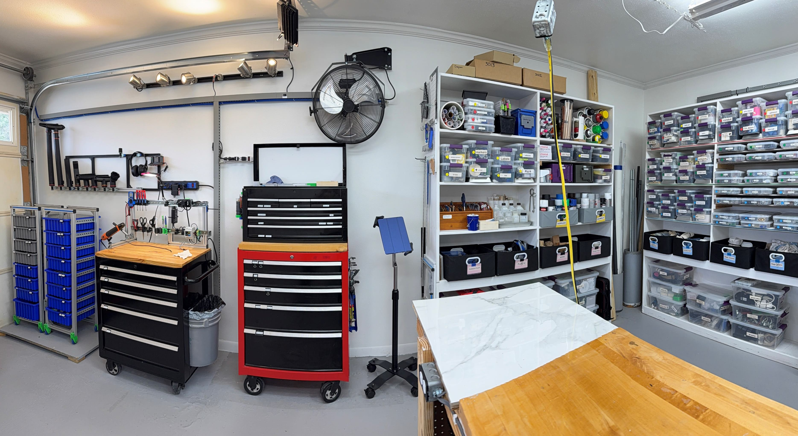

# ►Tour
See what's in the lab, how it is organized, and what strategies drive successful projects.

- 
- 
- 
  
_panoramic photos of the lab as of 2025.02_

## Boxes

### Box1, Cutting

Let's call this the cutting box.  It's featured in the video about how to drill a hole, and short videos which use the oscillating tool.   Photos from Feb 2025.

- 
- 
- 
- 
- 

## Charging Station
This small shelf is for quickly charging usb-powered handheld tools, or mobile phones, or battery cells.  It's been a great backup when the tabletops are filled with project materials and there is no space to set aside a device for charging.

- 
- 
- 
- 
- 

The wall outlet was installed to reduce the number of plug-in usb adapters.  We need the station to support micro USB and USB-C male plug types, with QC, PD, and ordinary 5v USB charging protocols. This outlet was installed 2024 and delivers up to 45W DC power.  The cord organizer keeps the cables organized on the wall, and the plugged-in adapter is the QC type adapter from our battery charger unit.  

I found the XTAR battery charger to work great for these functions:  charging or discharging cells to 3.6v for storage, measuring capacity with a discharge test, and measuring energy input to the cells when they are recharged.  Measuring each cell independently allows me to test other appliances.  For example, I can discover if a tool is maintaining balance between two cells after it has been discharged and charged for some time.  If my headlamp battery does not seem to last very long, I can discover if the cell's capacity has degraded.  For a quick trial, I can sit the charger in the blue rack, but of course it is safer to set up trials on a flat surface.

For portable charging, the 2-cell power bank works together with the charging station.  In the photo shown, the xtar PB2S is delivering a charge to a portable light.  Unlike most power banks, it is modular and you can swap out the individual cells.  I can set the PB2S in the charging station to receive a charge rapidly (using PD), and then bring it to my workspace outside of the lab, or set it in a drawer together with the tool that needs a charge.  The PB2S displays the amount of current entering the unit (when charging) and the amount of current exiting the unit (when discharging).  It is capable of delivering

Communications come in through the Echo dot (alexa) such as shipments arriving, or important notifications.  It's also great for verbally checking a math problem, and hearing the answer audibly over the speaker.  When we don't need communication, the dot plays music through the speaker, which frees up the mobile phone to be used for voice chats, discord, and communication with Siri, etc.  It's especially useful for taking videos with the iPhone since the Camera App cannot simultaneously record video and play sounds.

Parts:
* [micmi USBC outlet, $18](https://amzn.to/436Ye7F)
* [Roland 30W monitor. CM-30](https://amzn.to/415gYCO)
* [usbC cable with power meter, $8](https://amzn.to/415gYCO)
* [echo dot bracket, Gen3, printed](https://grabcad.com/library/dot_bracket-1)
* [cord organizer, similiar](https://amzn.to/3QbFX1i)
* [battery charger for 18650, Xtar VC4](https://amzn.to/3EssvTP)
* [portable charger, xtart PB2S](https://amzn.to/41bTRFN)

## Admin
Let's call this the admin station.  The tools here are interwoven with the processes of the rest of the lab, so it cannot be excluded.  The most key part here is the scanner, necessary for digitizing manuals, shippers, etc.  There must be seamlessness between the world of data and the material world in the lab.  The closest match to the Epson DS-510 presently offered is the newer [Epson ES-400](https://amzn.to/3Qj0EIl).  I've been using the DS-510 from 2016(now it's 2025) with no complaints, and gradually building more sophisticated processes to get our PDFs refined for minimal document size, best clarity, and managment of colors.

## Banners

We follow after Toyota for many methodologies in SCUTTLE robotics and other engineering work. Posting these graphics on display creates opportunities to interlink 100 years of wisdom into our everyday tasks & design efforts.  Collectively, the key methodologies in the Toyota work culture are called the "toyota way" and they have been adopted by thousands of engineering companies in pursuit of excellence.  For example, modern manufacturing leader refer to "lean manufacturing" which originated as a collection of best practices in the Toyota manufacturing system, including "just-in-time manufacturing."  

- 
- 
- 
- 
- 

## Panels
This section displays storage and workstations broken down into panels, for ease of photography.  The soldering station consists of a whole toolbox full of supplies but the documentation here starts with just exterior photos.

- 
- 
- 

### Power Panel

Ridgid brand is chosen for our lithium power tools for one reason: the lifetime warranty & free replacement.  The ridgid battery performance is competitive with other brands like DeWalt, Bosch, Milwaukee, etc.  However, only Ridgid gives us a free replacmeent for any registered tool that fails.  When we run tests on motors, power adapters, or any high-current DC equipment, the 18v packs are the starting point.  For quantitative design work I use a pre-characterized pack.  So, the battery pack will be tested on our CBA power testing machine to verify it matches the normal values for capacity and current ratings.  Then, the battery is ready to support measurement or calibration of a DC-driven actuator.  

### Tape Storage
Tapes are organized here.  The tapes are explained in my video from 2024.07, embedded below.   List of tape supplies is included in the shopping lists section under tools►shopping.  Jump to (tools).

<iframe width="800" src="https://www.youtube.com/embed/W0sAR_jI4b8" title="More than you ever wanted to know about tape" frameborder="0" allow="accelerometer; autoplay; clipboard-write; encrypted-media; gyroscope; picture-in-picture; web-share" referrerpolicy="strict-origin-when-cross-origin" allowfullscreen></iframe>

### Solder Station

This station is for all fine work such as soldering or pick-and-place of electronics on small boards.  The rack is made from 30mm extrusion and DIN rail, with holders for the most frequently needed tools.  Debris gets swept off the tabletop to a trash receptacle on the right hand.  The soldering iron rests in a safe tube near the back, where it is insulated.  Then the iron remains hot without wasting power, and the user avoids a burn risk.  120v powered devices like the heat gun can plug in directly to the station power and we can measure the power level of the device in this way.   The whole station plugs into any 120vac outlet, and then measures with the DIN-mounted meter, and distributes power to the 3-prong receptacle mounted at the upper right.

## Components
Key components will be described and linked for download.

### Hex Rack - for holding 1/4in hex bits

[find on grabCAD](https://grabcad.com/library/hexrack-1)

## Assemblies
Key assemblies may be made of just off-the-shelf parts but still solve a specific problem.  Assemblies can be treated as their own designs in such case and they can be listed & documented here.
